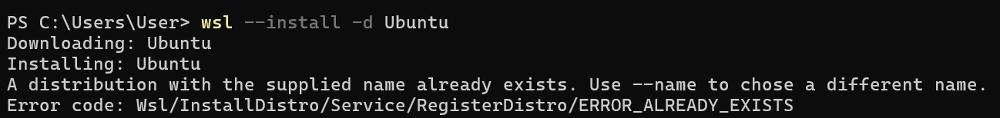
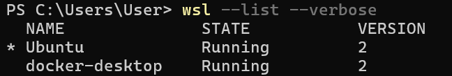
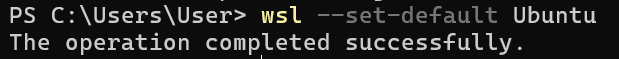
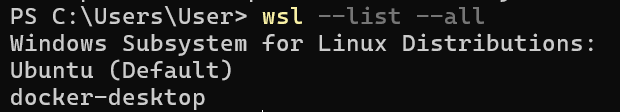
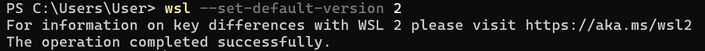
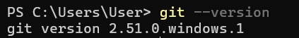

# Experiment 0: Windows Subsystem for Linux (WSL) Configuration

---

## Table of Contents

1. [Objective](#objective)
2. [Prerequisites](#prerequisites)
3. [Implementation Steps](#implementation-steps)
4. [Verification](#verification)
5. [Troubleshooting](#troubleshooting)
6. [Conclusion](#conclusion)

---

## Objective

Establish a functional Linux development environment on a Windows host using Windows Subsystem for Linux (WSL2) and install Git for version control. This setup provides the necessary foundation for running DevOps tools, containerization engines (Docker), and Linux-based development environments natively on Windows.

---

## Prerequisites

- **OS:** Windows 10 (Build 19041+) or Windows 11
- **Hardware:** Virtualization capability enabled in BIOS
- **Permissions:** Administrator access to PowerShell
- **Disk Space:** Minimum 5GB free storage

---

## Implementation Steps

### Step 1: Install WSL and Ubuntu Distribution

Open **PowerShell as Administrator** and execute the installation command.

**Command:**
```powershell
wsl --install --distribution Ubuntu
```

**Important Note:** A system restart is required after this command completes. Save all work before proceeding.



---

### Step 2: Restart the System

After running the installation command, restart your computer to allow Windows to initialize the WSL2 kernel and virtual machine platform.

```powershell
Restart-Computer
```

### Step 3: Verify WSL Installation and Version

Once the system has rebooted, verify the installation.

**Command:**
```powershell
wsl --list --verbose
```



---

### Step 4: Set Ubuntu as Default Distribution

**Command:**
```powershell
wsl --set-default Ubuntu
```



---

### Step 5: Configure WSL 2 as Global Default

**Command:**
```powershell
wsl --set-default-version 2
```



---

### Step 6: Install and Configure Git

#### 6.1: Update Package Manager
```bash
sudo apt update
```

#### 6.2: Install Git
```bash
sudo apt install -y git
```

#### 6.3: Verify Git Installation
```bash
git --version
```



---

#### 6.4: Configure Git User Information
```bash
git config --global user.name "Your Name"
git config --global user.email "your.email@example.com"
```

#### 6.5: Configure Git for WSL Integration
```bash
git config --global core.autocrlf input
```

---

## Verification

### Verify WSL2 Installation
```powershell
wsl --list --verbose
```

### Check Ubuntu Version
```bash
lsb_release -a
```

### Update Package Manager
```bash
sudo apt update && sudo apt upgrade -y
```



---

## Troubleshooting

| Issue | Solution |
| :--- | :--- |
| **"Virtual Machine Platform not enabled"** | Enable it in Windows Features: `Settings > Apps > Apps & features > Optional features > Virtual Machine Platform` |
| **"Virtualization not enabled in BIOS"** | Restart computer, enter BIOS (Del/F2), enable VT-x (Intel) or AMD-V (AMD) |
| **WSL1 instead of WSL2** | Run `wsl --set-default-version 2` and convert existing instances |
| **Slow WSL2 performance on network drives** | Store projects in WSL's native file system (`/home/username/`) instead of `/mnt/c/` |
| **"Distribution not found"** | Run `wsl --install --distribution Ubuntu` again or download from Microsoft Store |

---

## Performance Comparison

| Feature | WSL 1 | WSL 2 |
| :--- | :---: | :---: |
| **File System Performance** | Native Windows | Virtual Machine |
| **Linux Compatibility** | ~80% | 100% |
| **Docker Support** | Limited | Full |
| **Memory Usage** | Low | Medium |
| **Boot Time** | Instant | ~3-5 seconds |

**Recommendation:** WSL2 is strongly preferred for DevOps and containerization work.

---

## Conclusion

You have successfully established a fully functional Linux development environment on Windows. This environment is now ready for version control, containerization (Docker), Kubernetes, and advanced DevOps tooling.

**Next Steps:** Proceed to Experiment 1 to install Docker and containerization tools.

---

## Additional Resources

- [WSL Official Documentation](https://docs.microsoft.com/en-us/windows/wsl/)
- [Git Documentation](https://git-scm.com/doc)
- [Ubuntu on WSL Guide](https://ubuntu.com/wsl)
