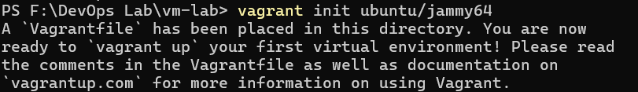
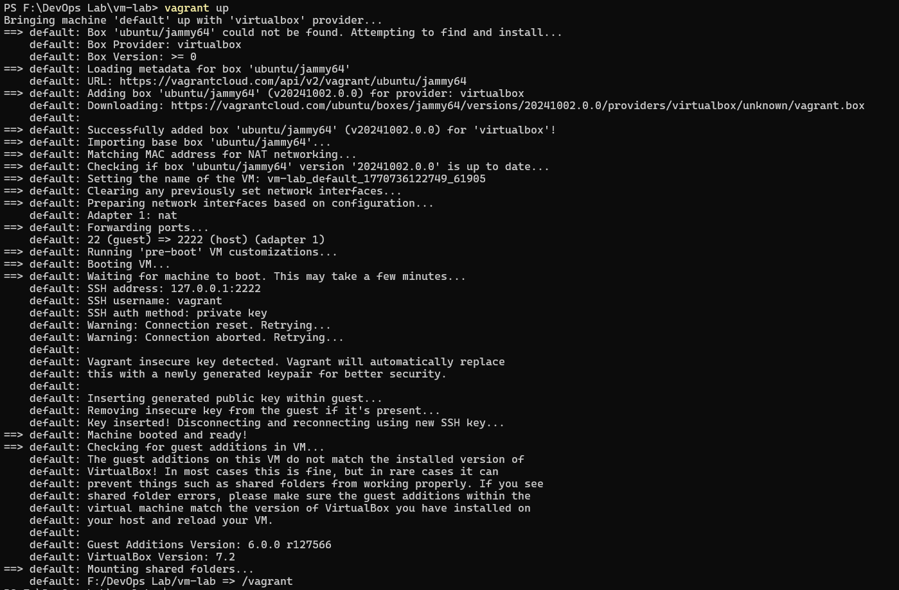
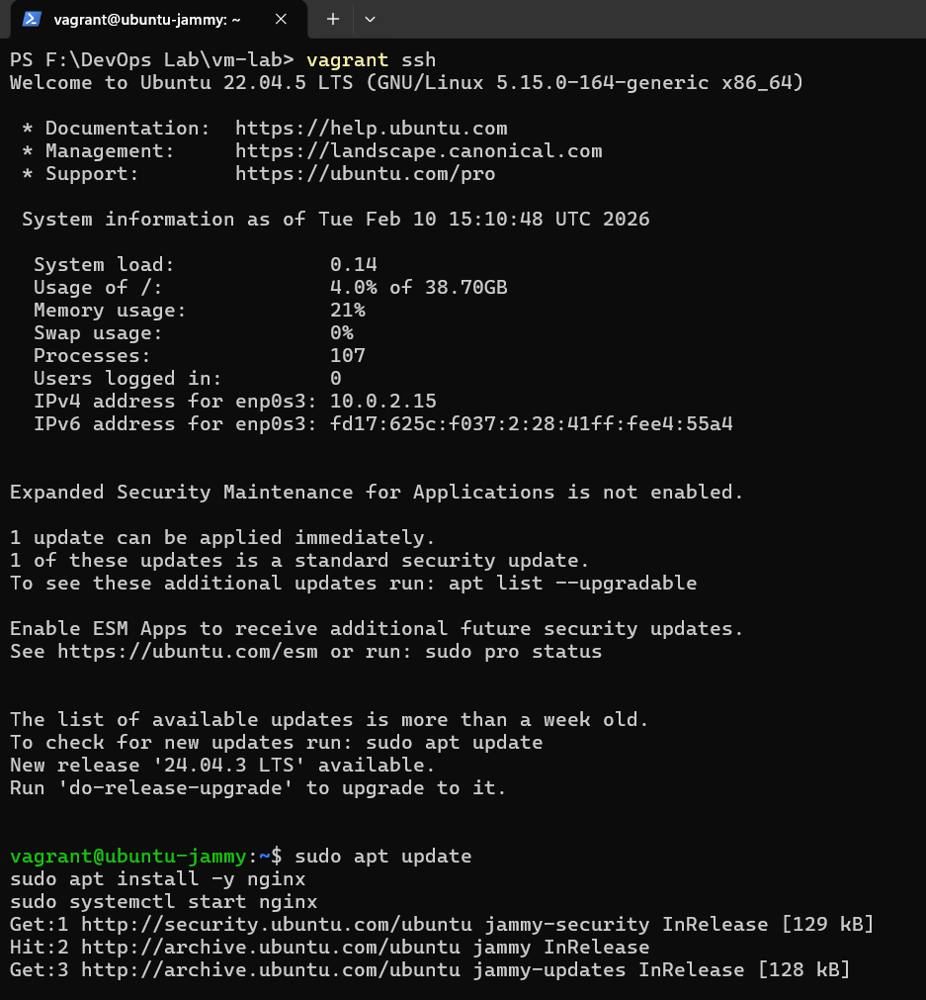
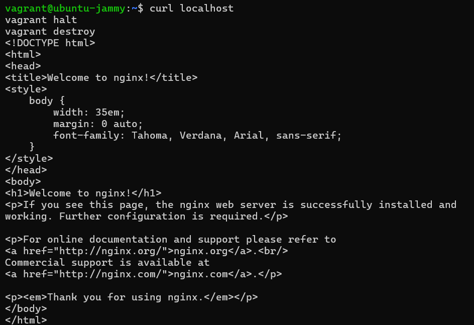
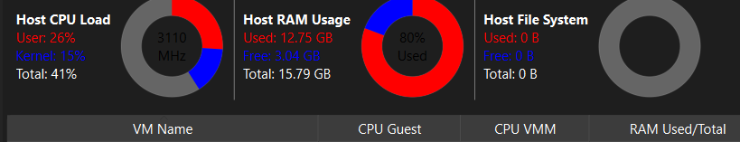
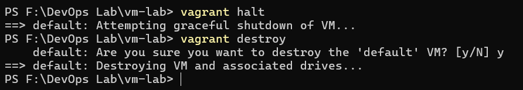
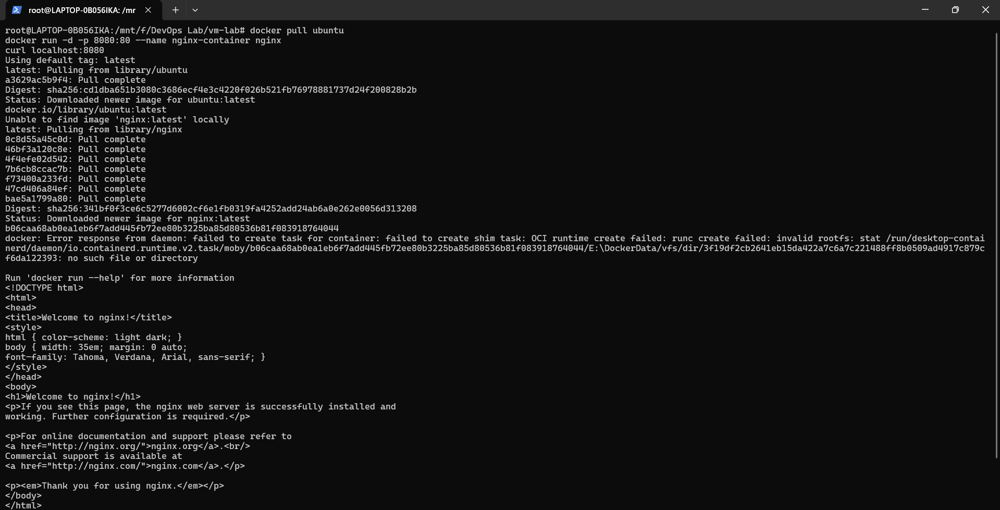
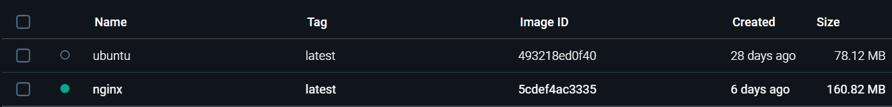

# Experiment 1: Comparison of Virtual Machines (VMs) and Containers

---

## Table of Contents

1. [Objective](#objective)
2. [Prerequisites](#prerequisites)
3. [Virtual Machines (VMs) Implementation](#virtual-machines-vms-implementation)
4. [Containers Implementation](#containers-implementation)
5. [Resource Utilization Analysis](#resource-utilization-analysis)
6. [Comparison & Conclusion](#comparison--conclusion)

---

## Objective

Understand and practically compare the conceptual and architectural differences between Virtual Machines (VMs) and Containers through hands-on deployment. This experiment evaluates performance metrics, resource utilization, and use case suitability of both virtualization approaches.

**Expected Outcomes:**
- Successfully deploy a full virtual machine using VirtualBox and Vagrant
- Deploy containerized applications using Docker in WSL
- Compare boot times, memory usage, and resource overhead
- Understand when to use VMs vs. Containers in DevOps workflows
- Analyze isolation levels and performance characteristics

---

## Prerequisites

- **Windows OS:** Windows 10 (Build 19041+) or Windows 11
- **WSL2:** Fully configured with Ubuntu (from Experiment 0)
- **Git:** Installed and configured (from Experiment 0)
- **VirtualBox:** Version 7.0 or later
- **Vagrant:** Version 2.3 or later
- **Docker:** Will be installed during this experiment
- **Disk Space:** Minimum 20GB free storage
- **RAM:** Minimum 8GB (16GB recommended)

---

## Virtual Machines (VMs) Implementation

### Part A: VirtualBox and Vagrant Setup

Virtual Machines provide full OS-level isolation by emulating complete hardware through a hypervisor.

#### Step 1: Install VirtualBox

Download and install Oracle VirtualBox from [virtualbox.org](https://www.virtualbox.org).

**Installation Verification:**
```powershell
VBoxManage --version
```

**Expected Output:**
```
7.0.14r161095
```

#### Step 2: Install Vagrant

Download and install Vagrant from [vagrantup.com](https://www.vagrantup.com).

**Installation Verification:**
```powershell
vagrant --version
```

**Expected Output:**
```
Vagrant 2.4.1
```


#### Step 3: Create VM Project Directory

Organize your project structure for VM deployment:

```powershell
mkdir vm-lab
cd vm-lab
```

#### Step 4: Initialize Vagrant with Ubuntu

Initialize a Vagrant environment using the official Ubuntu Jammy 64-bit box:

```powershell
vagrant init ubuntu/jammy64
```

This command creates a `Vagrantfile` with default configurations for the Ubuntu image.



#### Step 5: Deploy the Virtual Machine

Launch the virtual machine (this may take 5-10 minutes for the first download):

```powershell
vagrant up
```

**Expected Output:**
```
Bringing machine 'default' up with 'virtualbox' provider...
==> default: Box 'ubuntu/jammy64' could not be found locally...
==> default: Adding box 'ubuntu/jammy64' (v20240101.0.0) from Vagrant Cloud...
...
==> default: Machine booted and ready for use.
```



#### Step 6: Access the Virtual Machine

Connect to the running VM via SSH:

```powershell
vagrant ssh
```



---

#### Step 1: Update Package Manager

```bash
sudo apt update
```

#### Step 2: Install Nginx

```bash
sudo apt install -y nginx
```

**Expected Output:**
```
Reading package lists... Done
Setting up nginx (1.18.0-6ubuntu14.4) ...
Processing triggers for man-db (2.10.2-1) ...
```

#### Step 3: Start Nginx Service

```bash
sudo systemctl start nginx
sudo systemctl enable nginx
```

#### Step 4: Verify Nginx is Running

```bash
sudo systemctl status nginx
```

**Expected Output:**
```
● nginx.service - A high performance web server and a reverse proxy server
   Loaded: loaded (/lib/systemd/nginx.service; enabled; vendor preset: enabled)
   Active: active (running) since Mon 2026-02-10 10:30:25 UTC; 5s ago
```

---

### Part A: Resource Monitoring in VM

Test the Nginx server:

```bash
curl localhost
```

**Expected Output:**
```html
<!DOCTYPE html>
<html>
<head>
<title>Welcome to nginx!</title>
...
</html>
```



Monitor VM resource consumption while running:

```bash
# Check RAM usage
free -h

# Check CPU usage
top -b -n 1 | head -20

# Check disk usage
df -h
```

**Expected Output (Memory):**

| Type | Total | Used | Free |
| :--- | :--- | :--- | :--- |
| **Memory** | 1.9 GiB | 340 MiB | 1.2 GiB |



### Part A: Cleanup

Exit the SSH session and terminate the VM:

```bash
exit
vagrant halt
vagrant destroy -f
```



---

## Containers Implementation

### Part B: Docker Installation in WSL

Containers provide lightweight virtualization by sharing the host OS kernel while isolating applications.

#### Step 1: Update WSL Ubuntu

Open WSL Ubuntu terminal and update packages:

```bash
sudo apt update && sudo apt upgrade -y
```

#### Step 2: Install Docker Engine

Install Docker and its dependencies:

```bash
sudo apt install -y docker.io docker-compose
```

**Expected Output:**
```
Setting up docker.io (24.0.7-1~ubuntu.22.04~jammy) ...
Processing triggers for man-db (2.10.2-1) ...
```

#### Step 3: Enable Docker Service

Start the Docker daemon and enable it for auto-start:

```bash
sudo systemctl start docker
sudo systemctl enable docker
```

#### Step 4: Configure User Permissions

Add your user to the docker group to avoid using `sudo` for every command:

```bash
sudo usermod -aG docker $USER
newgrp docker
```

#### Step 5: Verify Docker Installation

Check Docker version and test functionality:

```bash
docker --version
docker run hello-world
```

**Expected Output:**
```
Docker version 24.0.7, build afdd53b

Hello from Docker!
This message shows that your installation appears to be working correctly.
```



### Part B: Nginx Container Deployment

#### Step 1: Pull Nginx Image

Download the official Nginx Docker image:

```bash
docker pull nginx:latest
```

**Expected Output:**
```
latest: Pulling from library/nginx
a803e7c4b030: Pull complete
82efea989f9c: Pull complete
...
Status: Downloaded newer image for nginx:latest
```

#### Step 2: Run Nginx Container

Launch an Nginx container with port mapping:

```bash
docker run -d -p 8080:80 --name nginx-container nginx:latest
```

**Parameters Explained:**
- `-d`: Run in detached mode (background)
- `-p 8080:80`: Map host port 8080 to container port 80
- `--name nginx-container`: Assign a friendly name
- `nginx:latest`: Image to deploy

**Expected Output:**
```
7a8c9d2e4f5a6b7c8d9e0f1a2b3c4d5e6f7a8b9
```


#### Step 3: Verify Container is Running

List running containers:

```bash
docker ps
```

**Expected Output:**
```
CONTAINER ID   IMAGE          COMMAND                  CREATED         STATUS         PORTS                  NAMES
7a8c9d2e4f5a   nginx:latest   "/docker-entrypoint.…"   10 seconds ago   Up 9 seconds   0.0.0.0:8080->80/tcp   nginx-container
```



#### Step 4: Test Web Server Access

Access the Nginx container through the mapped port:

```bash
curl localhost:8080
```

**Expected Output:**
```html
<!DOCTYPE html>
<html>
<head>
<title>Welcome to nginx!</title>
...
</html>
```

### Part B: Container Resource Monitoring

Monitor container resource usage in real-time:

```bash
docker stats nginx-container
```

**Expected Output:**

| Container ID | Name | CPU % | Mem Usage / Limit | Mem % | Net I/O |
| :--- | :--- | :--- | :--- | :--- | :--- |
| `7a8c9d2e4f5a` | `nginx-container` | 0.02% | 12.5MiB / 2GiB | 0.61% | 1.2MB / 890kB |


#### Stop and Remove Container

```bash
docker stop nginx-container
docker rm nginx-container
```

---

---

## Resource Utilization Analysis

### Comparison Metrics

Based on practical measurements from both deployments:

| Metric | Virtual Machine | Container | Winner |
| :--- | :--- | :--- | :---: |
| **Boot Time** | 30-60 seconds | < 1 second | Container |
| **Memory Usage (Idle)** | 512MB - 1GB | 5-15MB | Container |
| **Memory Usage (Running)**| 800MB - 1.2GB | 25-50MB | Container |
| **CPU Overhead** | 5-10% | < 1% | Container |
| **Disk Space** | 2-3GB per VM | 100-300MB per image| Container |
| **Startup Time** | 30-60 seconds | 100-500ms | Container |
| **OS Isolation** | Complete | Process-level | VM |
| **Deployment Speed** | Minutes | Seconds | Container |

### Performance Characteristics

#### Virtual Machines
**Advantages:**
- Complete isolation and security
- Support for different OS types
- Suitable for legacy applications
- Full resource dedication possible

**Disadvantages:**
- High memory overhead
- Slow boot times
- Larger disk footprint
- Resource-intensive for simple workloads

#### Containers
**Advantages:**
- Minimal resource overhead
- Extremely fast startup
- Portable across platforms
- Ideal for microservices
- Easy orchestration and scaling

**Disadvantages:**
- Process-level isolation (not OS-level)
- All containers share host OS kernel
- Less suitable for GUI applications
- Requires container orchestration for complex deployments

---

## Comparison & Conclusion

### Use Case Recommendations

**Use Virtual Machines when:**
- You need complete OS isolation
- Running multiple different operating systems
- Legacy application compatibility required
- Full security boundary needed
- Compliance regulations demand OS-level isolation

**Use Containers when:**
- Building microservices architectures
- Rapid deployment and scaling needed
- Resource optimization is critical
- Consistent environments across dev/prod
- DevOps and CI/CD pipelines

### Key Findings

1. **Resource Efficiency:** Containers consume 50-100x less memory than VMs for similar workloads
2. **Boot Time:** Containers start in milliseconds vs. minutes for VMs
3. **Scalability:** Containers allow running dozens of instances where VMs allow only a few
4. **Management:** Container orchestration (Docker, Kubernetes) simplifies deployment and scaling
5. **Architecture:** Modern DevOps favors containers for application deployment while VMs remain valuable for infrastructure management

### Conclusion

This experiment demonstrates that **containers are the preferred choice for modern DevOps workflows** due to their efficiency, speed, and scalability. However, Virtual Machines remain essential for scenarios requiring complete OS isolation or specific operating system requirements.

For most cloud-native and microservices-based applications, **Docker containerization is the industry standard**, supported by orchestration platforms like Kubernetes.

---

## Additional Resources

- [Docker Official Documentation](https://docs.docker.com/)
- [VirtualBox Manual](https://www.virtualbox.org/manual/)
- [Vagrant Documentation](https://www.vagrantup.com/docs)
- [Docker Hub](https://hub.docker.com/)
- [Kubernetes Official Site](https://kubernetes.io/)
- [Cloud Native Computing Foundation](https://www.cncf.io/)
