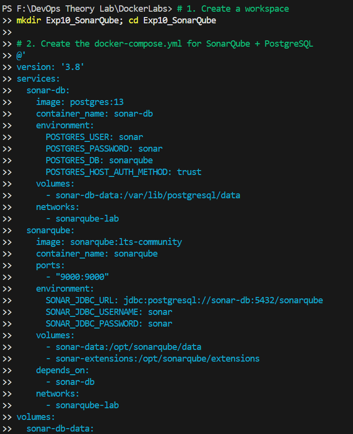
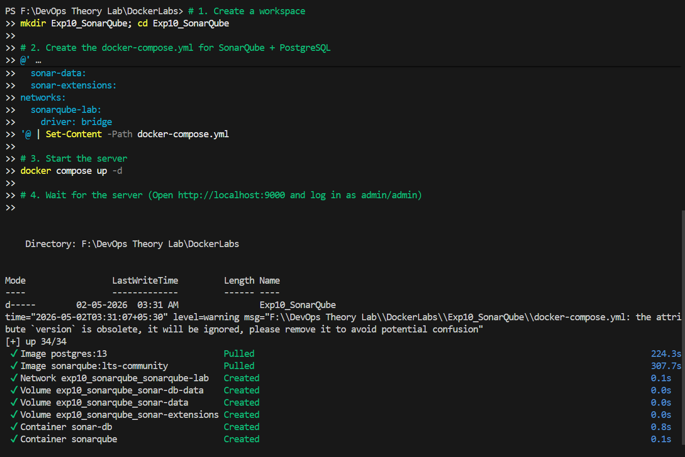
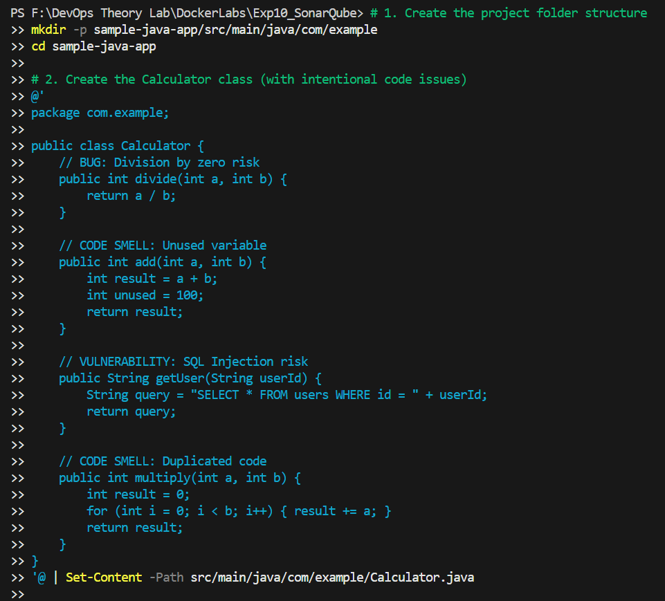
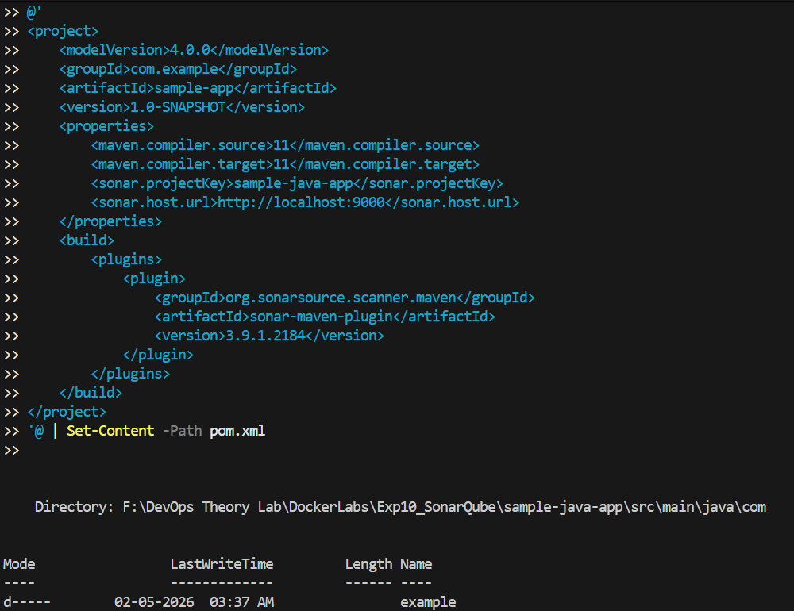
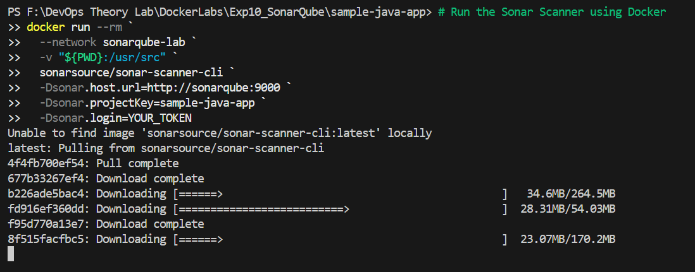
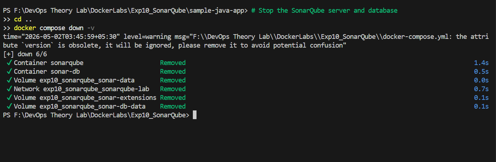

# Experiment 10: SonarQube — Static Code Analysis

---

## Table of Contents

1. [Theory](#1-theory)
2. [Lab Architecture](#2-lab-architecture)
3. [Hands-on Lab](#3-hands-on-lab)
4. [Integration & Best Practices](#4-integration--best-practices)
5. [Conclusion](#best-practices)
6. [Additional Resources](#additional-resources)

---

## 1. Theory

### What is SonarQube?
SonarQube is an open-source platform that automatically scans source code for **bugs**, **security vulnerabilities**, and **maintainability issues**. This is known as **Static Application Security Testing (SAST)**.

### Key Concepts
| Term | Description |
| :--- | :--- |
| **Quality Gate** | Rules that code must pass before deployment. |
| **Bug** | Code likely to break at runtime. |
| **Vulnerability** | A security weakness. |
| **Code Smell** | Poorly written code that is hard to maintain. |
| **Technical Debt**| Time required to fix all current issues. |

---

## 2. Lab Architecture

1.  **SonarQube Server ("The Brain")**: A web app that receives reports and applies rules.
2.  **Sonar Scanner ("The Worker")**: A CLI tool that reads code and sends reports to the server.

**Flow**: `Your Code` → `Sonar Scanner` → `SonarQube Server` → `Dashboard`.

---

## 3. Hands-on Lab

### Step 1: Start the SonarQube Server
Create a `docker-compose.yml` file:
```yaml
version: '3.8'
services:
  sonar-db:
    image: postgres:13
    environment:
      POSTGRES_USER: sonar
      POSTGRES_PASSWORD: sonar
  sonarqube:
    image: sonarqube:lts-community
    ports:
      - "9000:9000"
    depends_on:
      - sonar-db
```
**Start**: `docker-compose up -d`



### Step 2: Generate Token
Access the SonarQube UI to generate an analysis token.



### Step 2: Run the Scanner
Run analysis using the Maven plugin:
```bash
mvn sonar:sonar -Dsonar.login=YOUR_TOKEN
```


### Step 3: View Results
Open `http://localhost:9000` to see the report.


---

## 4. Integration & Best Practices

### CI/CD Integration (Jenkins)
```groovy
stage('SonarQube Analysis') {
    steps {
        withSonarQubeEnv('SonarQube') {
            sh 'mvn clean verify sonar:sonar'
        }
    }
}
```

### Best Practices
- **Scan Early**: Scan every Pull Request.
- **Enforce Quality Gates**: Block deployments if rules fail.
- **Zero Technical Debt**: Fix issues immediately.
- **Security**: Use secret managers for tokens.

---

## Additional Resources

- [SonarQube Documentation](https://docs.sonarqube.org/)
- [SonarScanner CLI Guide](https://docs.sonarqube.org/latest/analysis/scan/sonarscanner/)
- [OWASP Static Code Analysis Guide](https://owasp.org/www-community/controls/Static_Code_Analysis)
- [Clean Code Principles](https://www.sonarsource.com/resources/clean-code/)

---
