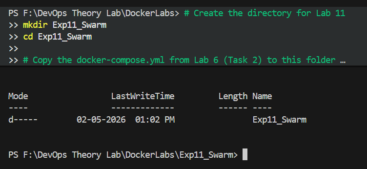
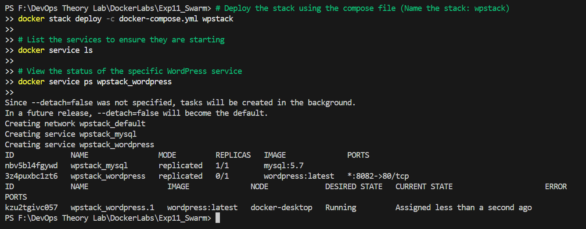
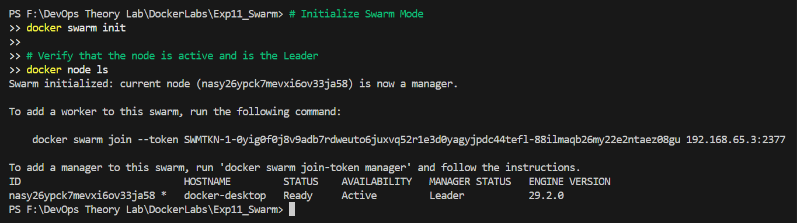
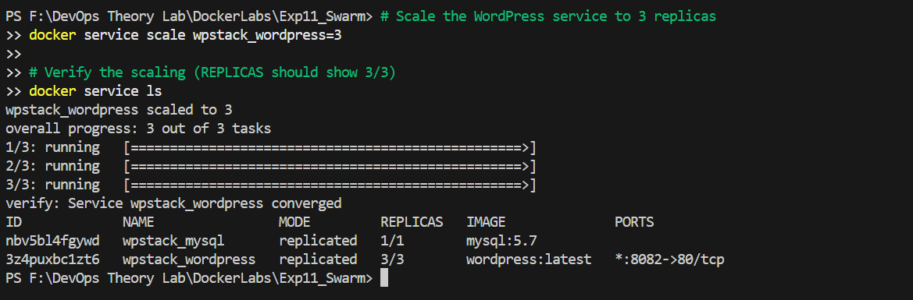
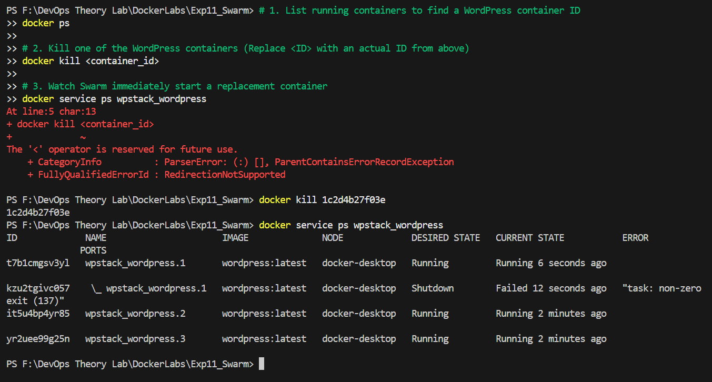
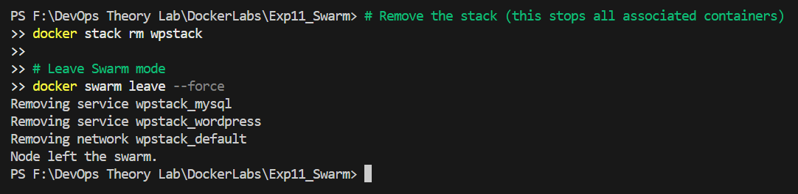

# Experiment 11: Orchestration using Docker Swarm

---

## Table of Contents

1. [Theory: Concept Continuation](#1-theory-concept-continuation)
2. [Practical Tasks](#2-practical-tasks-extension-of-experiment-6)
3. [Analysis: Compose vs Swarm](#3-analysis-compose-vs-swarm)
4. [Important Observations](#4-important-observations)
5. [Additional Resources](#additional-resources)

---

## 1. Theory: Concept Continuation

### What is Orchestration?
Orchestration is the **automatic management of containers**. It handles:
- **Scaling**: Adjusting the number of running containers.
- **Self-healing**: Replacing failed containers.
- **Load balancing**: Distributing traffic.

### The Progression Path
`docker run` → `Docker Compose` → `Docker Swarm` → `Kubernetes`

---

## 2. Practical Tasks

### Task 1: Initialize Docker Swarm
Turn your machine into a **Manager Node**:
```bash
docker swarm init
```
*Verify Swarm is active:*
```bash
docker node ls
```



### Task 2: Deploy as a Stack
Deploy a group of services using a Compose file:
```bash
docker stack deploy -c docker-compose.yml wpstack
```


### Task 3: Scale the Application
Scale WordPress to 3 replicas:
```bash
docker service scale wpstack_wordpress=3
```
**Verification**:
```bash
docker service ls                # Notice REPLICAS 3/3
```


### Task 4: Test Self-Healing
1. Kill a container: `docker kill <container-id>`.
2. Swarm immediately starts a new one to maintain the desired state.




---

## 3. Analysis: Compose vs Swarm

| Feature | Docker Compose | Docker Swarm |
| :--- | :--- | :--- |
| **Scope** | Single host | Multi-host cluster |
| **Scaling** | Manual | Declarative |
| **Self-healing** | Minimal | Built-in |
| **Load Balancing** | External needed | Built-in |

---

## 4. Important Observations

- **Reuse**: The same Compose file works for both local dev and Swarm orchestration.
- **Services**: You manage **Services**, while Swarm manages the **Containers**.
- **IaC**: Swarm maintains the **desired state** automatically.

---

## Additional Resources

- [Docker Swarm Mode Overview](https://docs.docker.com/engine/swarm/)
- [Docker Stack Deploy Guide](https://docs.docker.com/engine/reference/commandline/stack_deploy/)
- [High Availability in Docker Swarm](https://docs.docker.com/engine/swarm/raft/)
- [Service Discovery and Load Balancing](https://docs.docker.com/engine/swarm/networking/)
