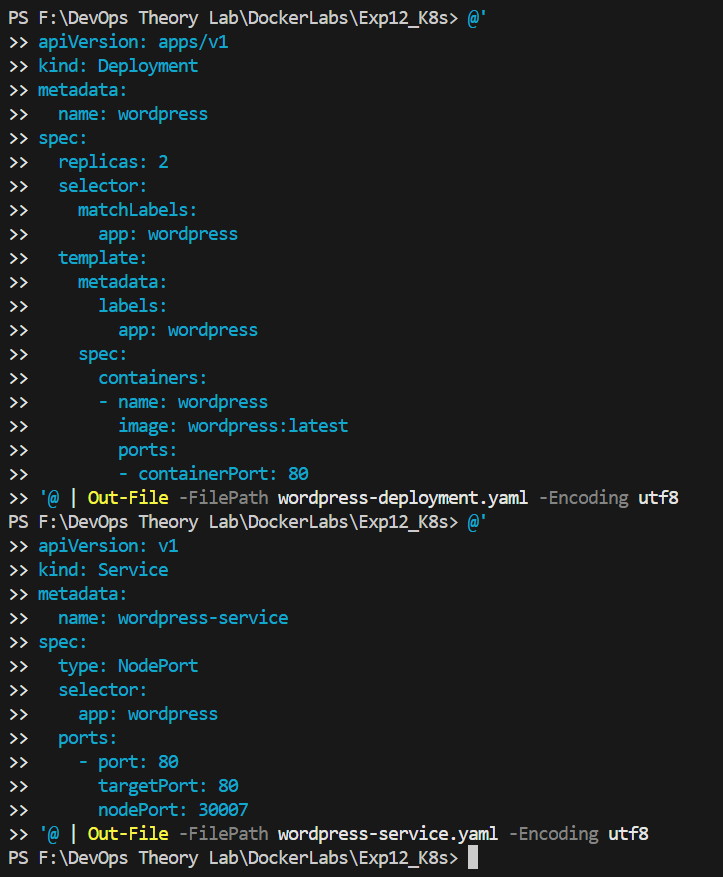
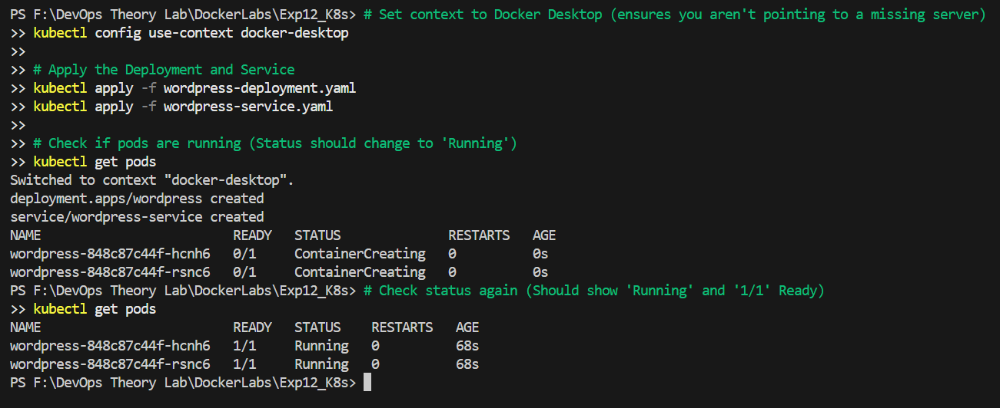
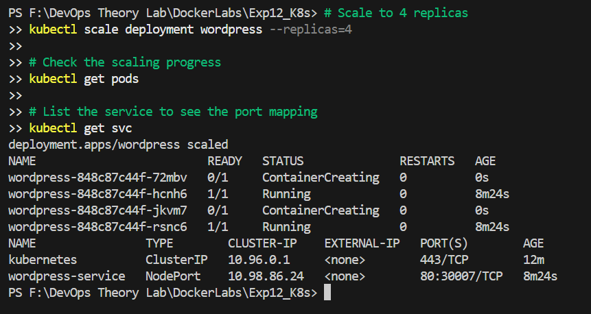
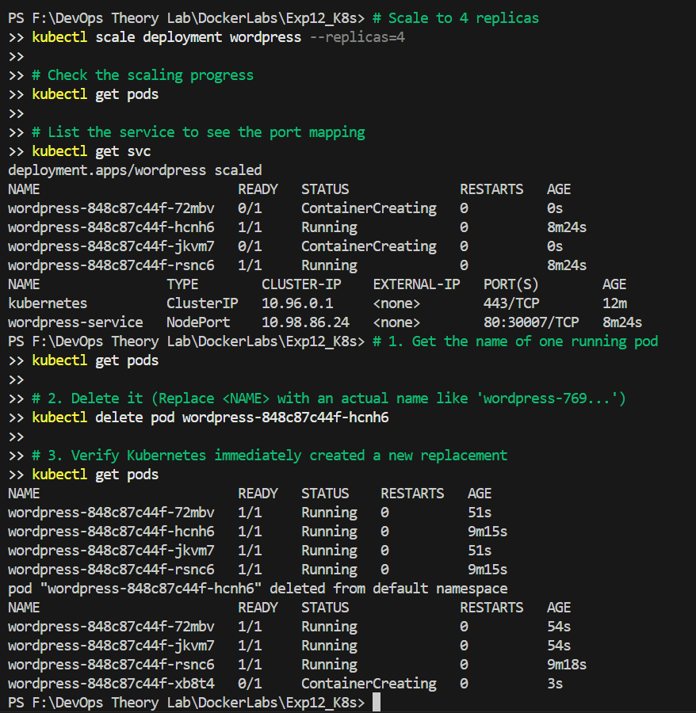
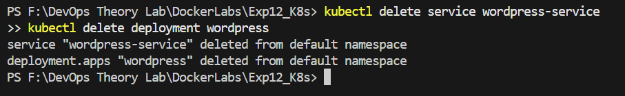

# Experiment 12: Container Orchestration using Kubernetes

---

## Table of Contents

1. [Objective](#1-objective)
2. [Theory: Why Kubernetes?](#2-theory-why-kubernetes)
3. [Core Concepts Mapping](#core-concepts-mapping)
4. [Hands-On Lab](#hands-on-lab)
5. [Summary of Commands](#5-summary-of-commands-cheat-sheet)
6. [Conclusion](#6-conclusion)
7. [Additional Resources](#additional-resources)

---

## 1. Objective
To understand why Kubernetes is used, learn its core concepts, and implement deployment, scaling, and self-healing through a hands-on lab using `kubectl`.

---

## 2. Theory: Why Kubernetes?
While Docker Swarm is simple, **Kubernetes (K8s)** is the industry standard for production environments due to its advanced feature set.

| Reason | Explanation |
| :--- | :--- |
| **Industry Standard** | Most enterprises and cloud providers use Kubernetes. |
| **Powerful Scheduling**| Automatically determines the best node to run your application. |
| **Cloud-Native** | Native integration with AWS (EKS), Google Cloud (GKE), and Azure (AKS). |

---

## Core Concepts Mapping
| Docker Concept | Kubernetes Equivalent | Description |
| :--- | :--- | :--- |
| **Container** | **Pod** | The smallest unit in K8s. |
| **Compose Service**| **Deployment** | Describes the desired state. |
| **Load Balancing** | **Service** | Exposes your app to the outside world. |

---

## 3. Hands-On Lab

### Task 1: Create a Deployment
A deployment defines which image to use and how many copies should run.

**wordpress-deployment.yaml**:
```yaml
apiVersion: apps/v1
kind: Deployment
metadata:
  name: wordpress
spec:
  replicas: 2
  selector:
    matchLabels:
      app: wordpress
  template:
    metadata:
      labels:
        app: wordpress
    spec:
      containers:
      - name: wordpress
        image: wordpress:latest
        ports:
        - containerPort: 80
```
**Apply**: `kubectl apply -f wordpress-deployment.yaml`



### Task 2: Expose the Deployment
**wordpress-service.yaml**:
```yaml
apiVersion: v1
kind: Service
metadata:
  name: wordpress-service
spec:
  type: NodePort
  selector:
    app: wordpress
  ports:
    - port: 80
      targetPort: 80
      nodePort: 30007
```
**Apply**: `kubectl apply -f wordpress-service.yaml`



### Task 3: Scale the Deployment
```bash
kubectl scale deployment wordpress --replicas=4
```



### Task 4: Test Self-Healing
Kubernetes automatically replaces deleted pods to maintain the desired state.

1. Delete a pod: `kubectl delete pod <pod-name>`
2. Watch Kubernetes recreate it: `kubectl get pods`




---

## 5. Summary of Commands (Cheat Sheet)

| Goal | Command |
| :--- | :--- |
| **Apply configuration** | `kubectl apply -f file.yaml` |
| **List pods** | `kubectl get pods` |
| **List services** | `kubectl get svc` |
| **Scale replicas** | `kubectl scale deployment <name> --replicas=N` |

---

## 6. Conclusion
This experiment demonstrated the core functionality of Kubernetes: declarative deployments, stable service exposition, easy scaling, and automatic self-healing. Kubernetes provides the robustness required for enterprise-scale orchestration.

---

## Additional Resources

- [Kubernetes Documentation](https://kubernetes.io/docs/home/)
- [Kubectl Cheat Sheet](https://kubernetes.io/docs/reference/kubectl/cheatsheet/)
- [Interactive Kubernetes Tutorials](https://kubernetes.io/docs/tutorials/)
- [Kubernetes Architecture Overview](https://kubernetes.io/docs/concepts/architecture/)
