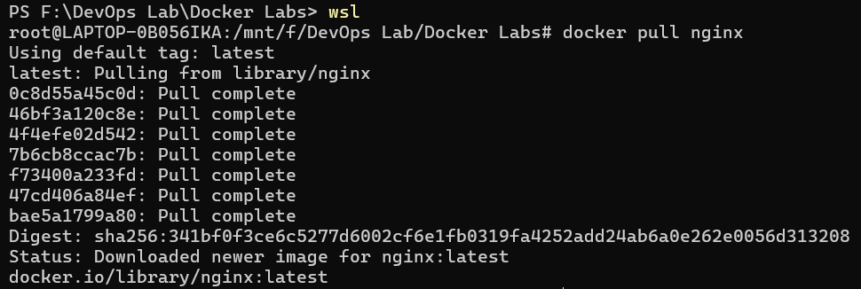
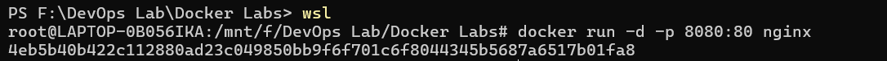
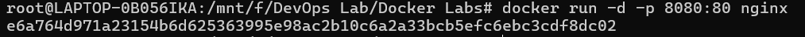
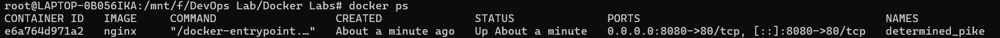
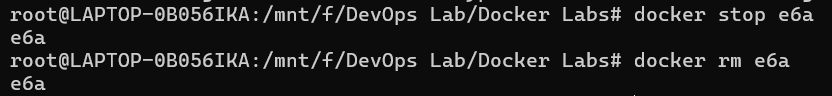
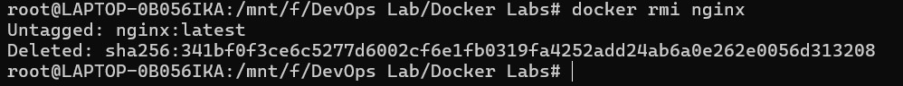
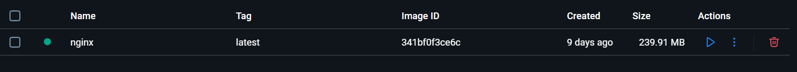

# Experiment 2: Docker Installation, Configuration, and Running Images

---

## Table of Contents

1. [Objective](#objective)
2. [Procedure](#procedure)
3. [Result](#result)
4. [Conclusion](#conclusion)

---

## Objective

- Pull Docker images
- Run containers
- Manage container lifecycle

---

## Procedure

### Step 1: Pull Image

Pull the Nginx image from Docker Hub:

```bash
docker pull nginx
```



---

### Step 2: Run Container with Port Mapping

Run a container with port mapping (host port 8080 to container port 80):

```bash
docker run -d -p 8080:80 nginx
```




---

### Step 3: Verify Running Containers

List all running containers:

```bash
docker ps
```



---

### Step 4: Stop and Remove Container

Stop the running container and remove it:

```bash
docker stop <container_id>
docker rm <container_id>
```





---

### Step 5: Remove Image

Remove the Docker image:

```bash
docker rmi nginx
```



---

## Result

Docker images were successfully pulled, containers executed, and lifecycle commands performed.


---

## Overall Conclusion

This lab demonstrated containerization using Docker, highlighting container management basics. Containers are better suited for rapid deployment and microservices, while VMs provide stronger isolation.

---

## Additional Resources

- [Docker Official Documentation](https://docs.docker.com/)
- [Docker Hub Registry](https://hub.docker.com/)