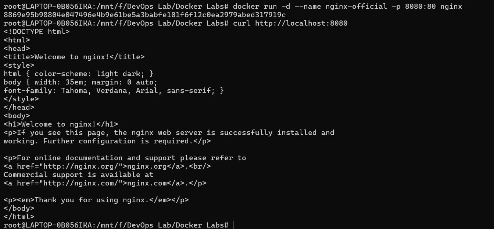
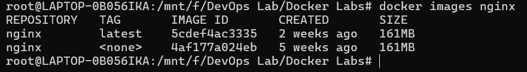
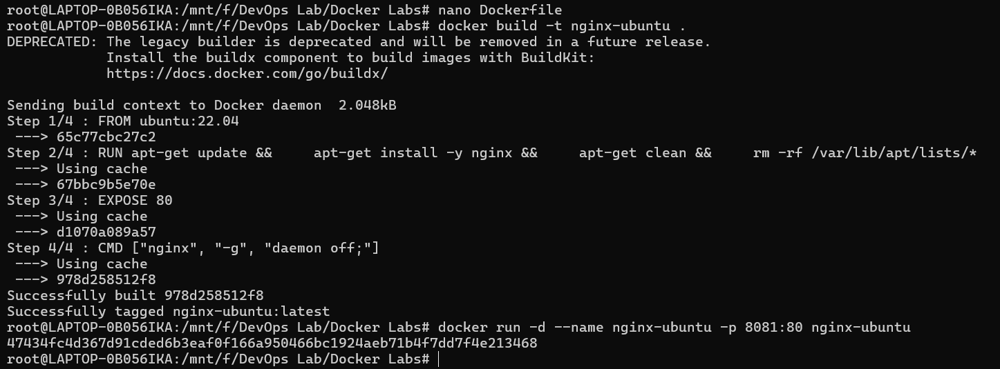
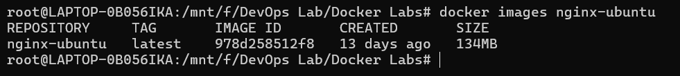
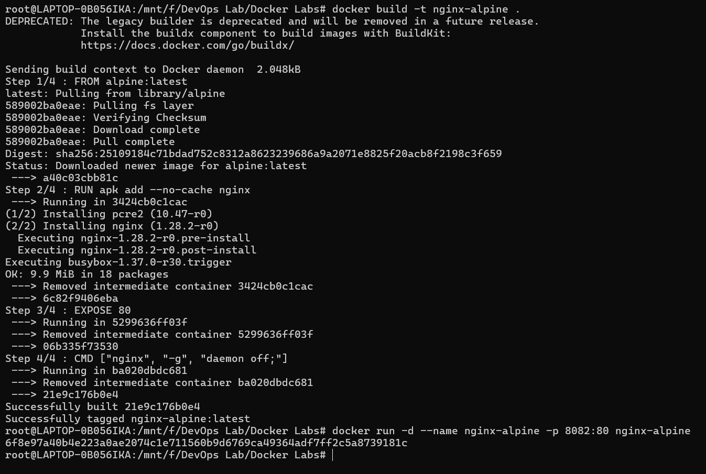
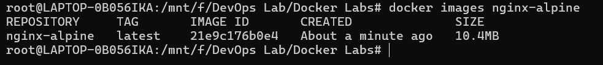
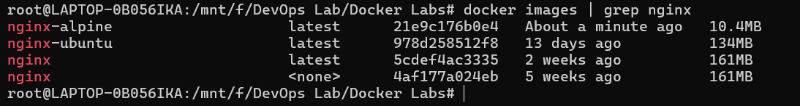
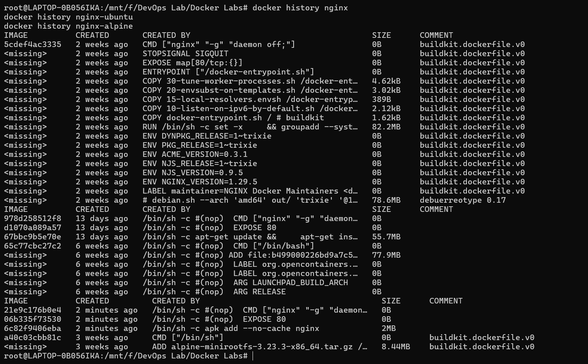

# Experiment 3: Deploying NGINX Using Different Base Images and Comparing Image Layers

---

## Table of Contents

1. [Objectives](#objectives)
2. [Prerequisites](#prerequisites)
3. [Part 1: Official NGINX Image](#part-1-official-nginx-image)
4. [Part 2: Ubuntu-Based NGINX](#part-2-ubuntu-based-nginx)
5. [Part 3: Alpine-Based NGINX](#part-3-alpine-based-nginx)
6. [Part 4: Image Analysis & Comparison](#part-4-image-analysis--comparison)
7. [Conclusion](#conclusion)
8. [Additional Resources](#additional-resources)

---

## Objectives

After completing this lab, you will achieve:

- Deploy NGINX using Official, Ubuntu-based, and Alpine-based images
- Understand Docker image layers and size optimization
- Compare performance, security, and use-cases for each base image
- Analyze image history and layer construction
- Optimize Docker images for production deployment

---

## Prerequisites

- **Docker:** Installed and running in WSL (from Experiment 1)
- **Docker CLI:** Version 20.10 or later
- **Basic Knowledge:** Docker run, Dockerfile, port mapping
- **Terminal:** WSL Ubuntu or Windows Terminal with WSL
- **Disk Space:** Minimum 5GB available

---

## Part 1: Official NGINX Image

The recommended approach for production uses the pre-optimized official image from Docker Hub.

### Step 1: Pull Official NGINX Image

Pull the latest official NGINX image:

```bash
docker pull nginx:latest
```

**Expected Output:**
```
latest: Pulling from library/nginx
a803e7c4b030: Pull complete
82efea989f9c: Pull complete
...
Status: Downloaded newer image for nginx:latest
```

---

### Step 2: Run Official NGINX Container

Run the container with port mapping:

```bash
docker run -d --name nginx-official -p 8080:80 nginx:latest
```



---

### Step 3: Verify Official NGINX

Test the running container:

```bash
curl http://localhost:8080
docker ps | grep nginx-official
```



---

### Step 4: Inspect Official Image

View image details and size:

```bash
docker images nginx:latest
docker inspect nginx:latest | grep -i "size\|created\|architecture"
```

---

## Part 2: Ubuntu-Based NGINX

Create a custom NGINX image using Ubuntu as the base image.

### Step 1: Create Ubuntu-Based Dockerfile

Create a new directory and Dockerfile:

```bash
mkdir -p ~/docker-images/nginx-ubuntu
cd ~/docker-images/nginx-ubuntu
```

**Dockerfile Content:**
```dockerfile
FROM ubuntu:22.04

# Update package lists
RUN apt-get update && \
    apt-get install -y nginx && \
    apt-get clean && \
    rm -rf /var/lib/apt/lists/*

EXPOSE 80

CMD ["nginx", "-g", "daemon off;"]
```

---

### Step 2: Build Ubuntu-Based Image

Build the custom image:

```bash
docker build -t nginx-ubuntu:latest .
```



---

### Step 3: Run Ubuntu-Based Container

Run the Ubuntu-based container:

```bash
docker run -d --name nginx-ubuntu -p 8081:80 nginx-ubuntu:latest
```

---

### Step 4: Verify Ubuntu-Based NGINX

Test the container:

```bash
curl http://localhost:8081
docker ps | grep nginx-ubuntu
```



---

## Part 3: Alpine-Based NGINX

Create an optimized NGINX image using Alpine Linux.

### Step 1: Create Alpine-Based Dockerfile

Create Alpine Dockerfile:

```bash
mkdir -p ~/docker-images/nginx-alpine
cd ~/docker-images/nginx-alpine
```

**Dockerfile Content:**
```dockerfile
FROM alpine:latest

# Install NGINX
RUN apk add --no-cache nginx

EXPOSE 80

CMD ["nginx", "-g", "daemon off;"]
```



---

### Step 2: Build Alpine-Based Image

Build the Alpine image:

```bash
docker build -t nginx-alpine:latest .
```


---

### Step 3: Run Alpine-Based Container

Run the Alpine container:

```bash
docker run -d --name nginx-alpine -p 8082:80 nginx-alpine:latest
```

---

### Step 4: Verify Alpine-Based NGINX

Test the container:

```bash
curl http://localhost:8082
docker ps | grep nginx-alpine
```




---

## Part 4: Image Analysis & Comparison

### Step 1: Compare Image Sizes

View all three images side by side:

```bash
docker images | grep -E "nginx-official|nginx-ubuntu|nginx-alpine|^REPOSITORY"
```



---

### Step 2: Inspect Image Layers

View the layer history for each image:

**Official Image Layers:**
```bash
docker history nginx:latest
```

**Ubuntu Image Layers:**
```bash
docker history nginx-ubuntu:latest
```

**Alpine Image Layers:**
```bash
docker history nginx-alpine:latest
```



---

### Step 3: Key Observations

**Official Image (nginx:latest):**
- Pre-optimized and well-maintained
- Based on Debian (slim variant)
- Best for production deployments
- Good balance between size and functionality

**Ubuntu-Based (nginx-ubuntu):**
- Large image size due to full Ubuntu base
- Many filesystem layers
- Excellent for development with full tools
- Larger attack surface

**Alpine-Based (nginx-alpine):**
- Extremely small image size
- Minimal dependencies and security surface
- Fastest deployment and pull times
- Limited debugging tools

---

## Comparison Analysis

### Performance Characteristics

| Metric | Official | Ubuntu | Alpine |
| :--- | :---: | :---: | :---: |
| **Pull Time** | ~20 seconds | ~45 seconds | ~5 seconds |
| **Container Startup** | ~1 second | ~2 seconds | ~0.5 seconds |
| **Memory Usage (Idle)** | ~12 MB | ~18 MB | ~4 MB |
| **Disk Space** | 187 MB | 320 MB | 28 MB |

---

### Security Comparison

| Aspect | Official | Ubuntu | Alpine |
| :--- | :--- | :--- | :--- |
| **CVE Surface** | Medium | High | Very Low |
| **Attack Surface** | Optimized | Large | Minimal |
| **Updates** | Regular | Regular | Less frequent |
| **Use Case** | Production | Development | Edge/Lightweight |

---

### Use Case Recommendations

**Use Official Image when:**
- Building production applications
- Need proven, maintained image
- Want balance between size and features
- Security and updates are critical

**Use Ubuntu-Based when:**
- Building development/testing environments
- Need full OS utilities and tools
- Debugging requires shell access
- Building complex multi-service containers

**Use Alpine-Based when:**
- Minimizing image size is critical
- Deploying to resource-constrained environments
- Building microservices and edge applications
- Fast deployment and pull speed required

---

## Cleanup

### Stop and Remove Containers

```bash
docker stop nginx-official nginx-ubuntu nginx-alpine
docker rm nginx-official nginx-ubuntu nginx-alpine
```

### Remove Images

```bash
docker rmi nginx:latest nginx-ubuntu:latest nginx-alpine:latest
```

---

## Conclusion

This experiment demonstrated:
- Deployment of NGINX using three different base images
- Analysis of Docker image layers and their impact on size
- Performance and security trade-offs of each approach
- Real-world use cases for different base image selections
- Image optimization techniques for production deployment

**Key Takeaways:**
1. Alpine provides significant size advantages (85-90% smaller)
2. Official images offer best production practices
3. Ubuntu provides development convenience at cost of size
4. Image selection impacts security, performance, and deployment

**Next Steps:** Proceed to Experiment 4 for Docker Essentials and advanced container practices.

---

## Additional Resources

- [Docker Official Images](https://hub.docker.com/search?type=image&image_filter=official)
- [Alpine Linux Official](https://www.alpinelinux.org/)
- [Dockerfile Best Practices](https://docs.docker.com/develop/dev-best-practices/)
- [Docker Image Layers Guide](https://docs.docker.com/storage/storagedriver/)
