# Experiment 6: Docker Run vs. Docker Compose

---

## Table of Contents

1. [PART A – THEORY](#part-a-theory)
2. [PART B – PRACTICAL TASK](#part-b-practical-task)
3. [PART C – CONVERSION & BUILD-BASED TASKS](#part-c-conversion--build-based-tasks)
4. [PART D – USING DOCKERFILE INSTEAD OF STANDARD IMAGE](#part-d-using-dockerfile-instead-of-standard-image)
5. [MULTI-CONTAINER APPLICATION INVOLVING DOCKER SWARM](#experiment-6-b-multi-container-application-involving-docker-swarm)
6. [Conclusion](#key-learning-outcomes)
7. [Additional Resources](#additional-resources)

---

## PART A – THEORY

### 1. Objective
To understand the relationship between `docker run` and **Docker Compose**, and to compare their configuration syntax and use cases.

### 2. Background Theory

#### 2.1 Docker Run (Imperative Approach)
The `docker run` command is used to create and start a container from an image. It requires explicit flags for configuration. This approach is **imperative**, meaning you provide step-by-step instructions.

**Example:**
```bash
docker run -d --name my-nginx -p 8080:80 nginx:alpine
```

#### 2.2 Docker Compose (Declarative Approach)
Docker Compose uses a YAML file (`docker-compose.yml`) to define services, networks, and volumes. Instead of multiple `docker run` commands, a single command is used:
```bash
docker compose up -d
```
Compose is **declarative**, meaning you define the desired state of the application.

### 3. Comparison: Docker Run vs. Docker Compose

| Feature | Docker Run | Docker Compose |
| :--- | :--- | :--- |
| **Approach** | Imperative (Step-by-step) | Declarative (Desired state) |
| **Configuration** | Command-line flags | YAML file |
| **Complexity** | Simple for single containers | Efficient for multi-service apps |
| **Management** | Manual tracking | Version-controlled configuration |
| **Service Links** | Manual network links | Automatic internal DNS |

---

## PART B – PRACTICAL TASK

### Task 1: Single Container Comparison

**Step 1: Run Nginx Using Docker Run**
```bash
docker run -d --name lab-nginx -p 8081:80 nginx:alpine
```
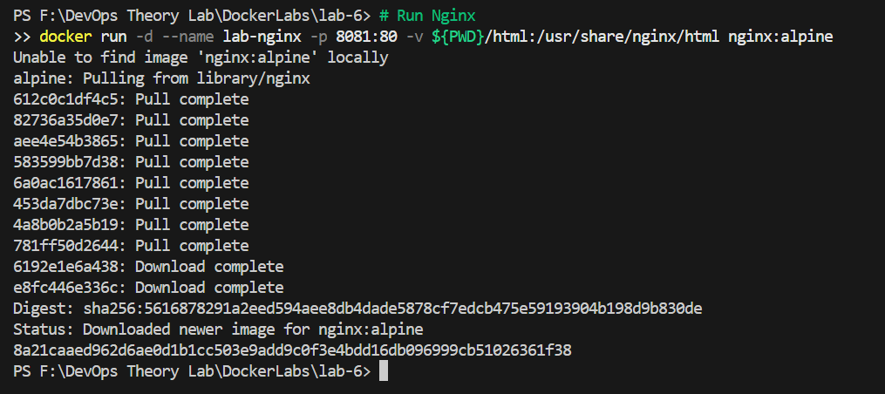

**Step 2: Run Same Setup Using Docker Compose**
Create `docker-compose.yml`:
```yaml
version: '3.8'
services:
  nginx:
    image: nginx:alpine
    container_name: lab-nginx
    ports:
      - "8081:80"
```
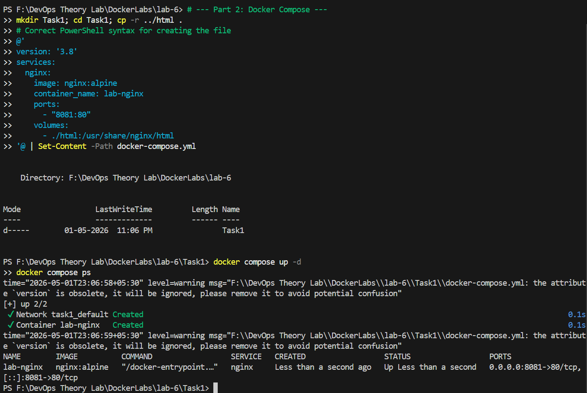

---

## PART C – CONVERSION & BUILD-BASED TASKS

### Task 2: Multi-Container Application (WordPress + MySQL)

#### Using Docker Compose (Structured way)
```yaml
version: '3.8'
services:
  mysql:
    image: mysql:5.7
    environment:
      MYSQL_ROOT_PASSWORD: secret
      MYSQL_DATABASE: wordpress
    volumes:
      - mysql_data:/var/lib/mysql

  wordpress:
    image: wordpress:latest
    ports:
      - "8082:80"
    environment:
      WORDPRESS_DB_HOST: mysql
      WORDPRESS_DB_PASSWORD: secret
    depends_on:
      - mysql

volumes:
  mysql_data:
```
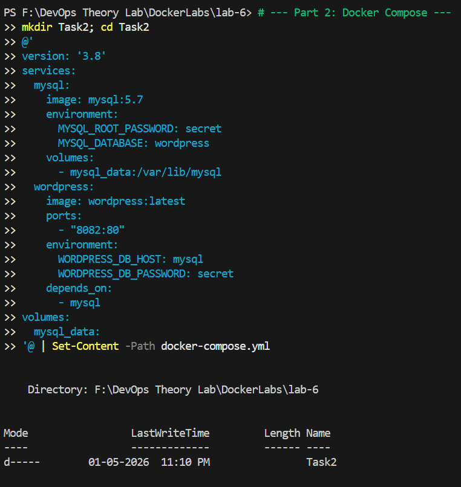
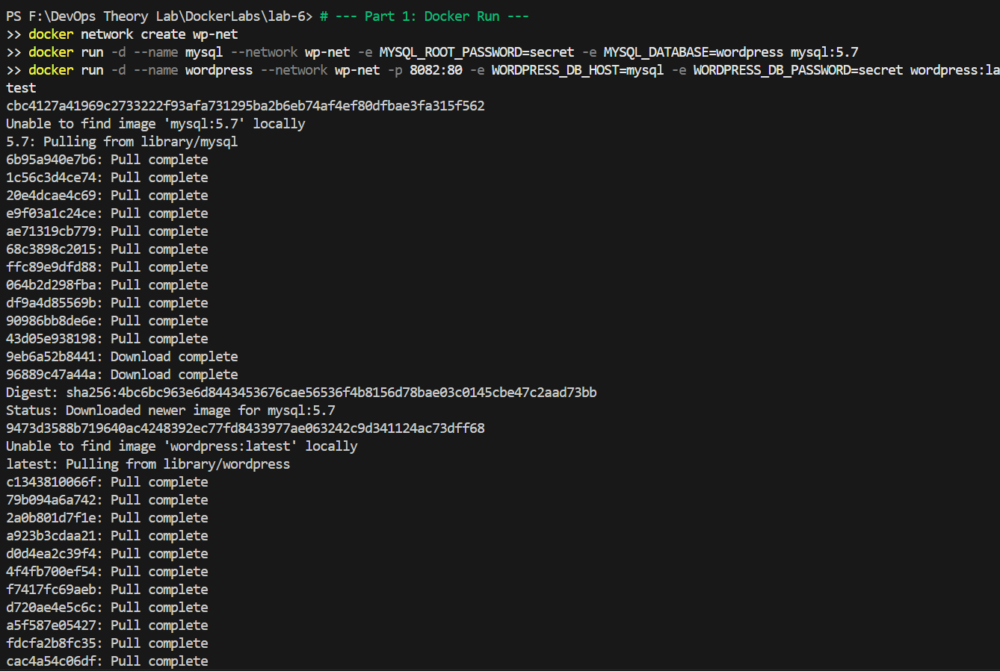
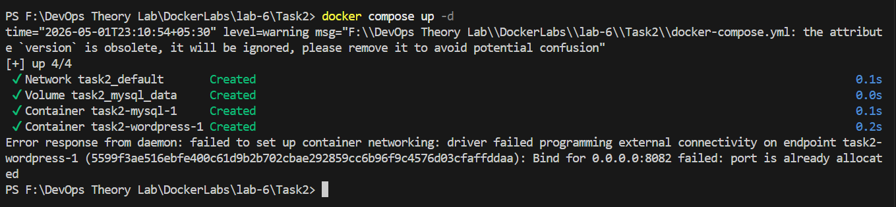

---

## PART D – USING DOCKERFILE INSTEAD OF STANDARD IMAGE

### Task 3: Replace Standard Image with Dockerfile

**Step 1: Create Dockerfile**
```dockerfile
FROM node:18-alpine
WORKDIR /app
COPY app.js .
EXPOSE 3000
CMD ["node", "app.js"]
```

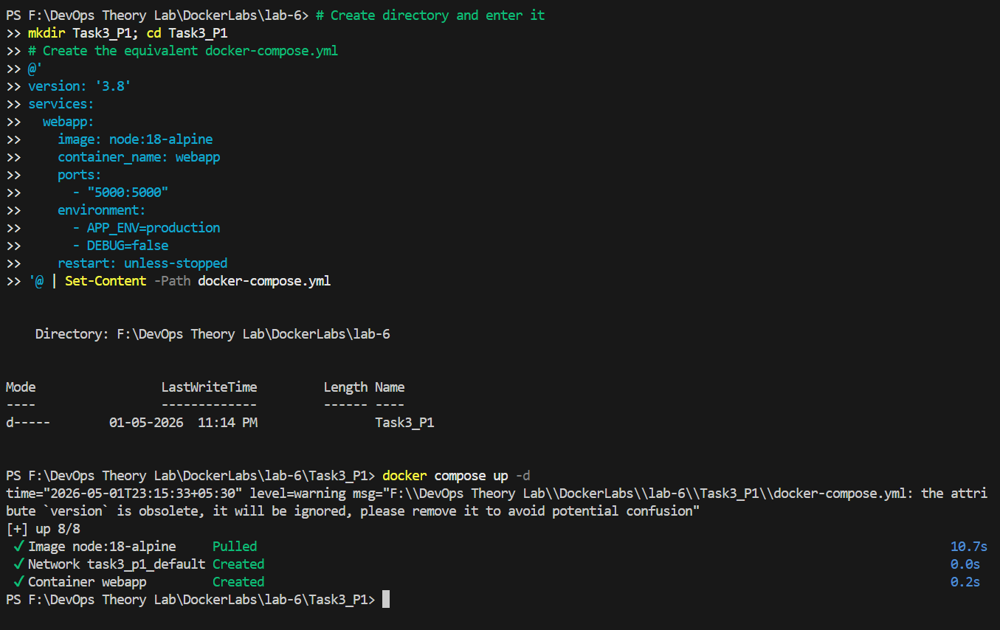

**Step 2: Create docker-compose.yml**
```yaml
version: '3.8'
services:
  nodeapp:
    build: .
    container_name: custom-node-app
    ports:
      - "3000:3000"
```
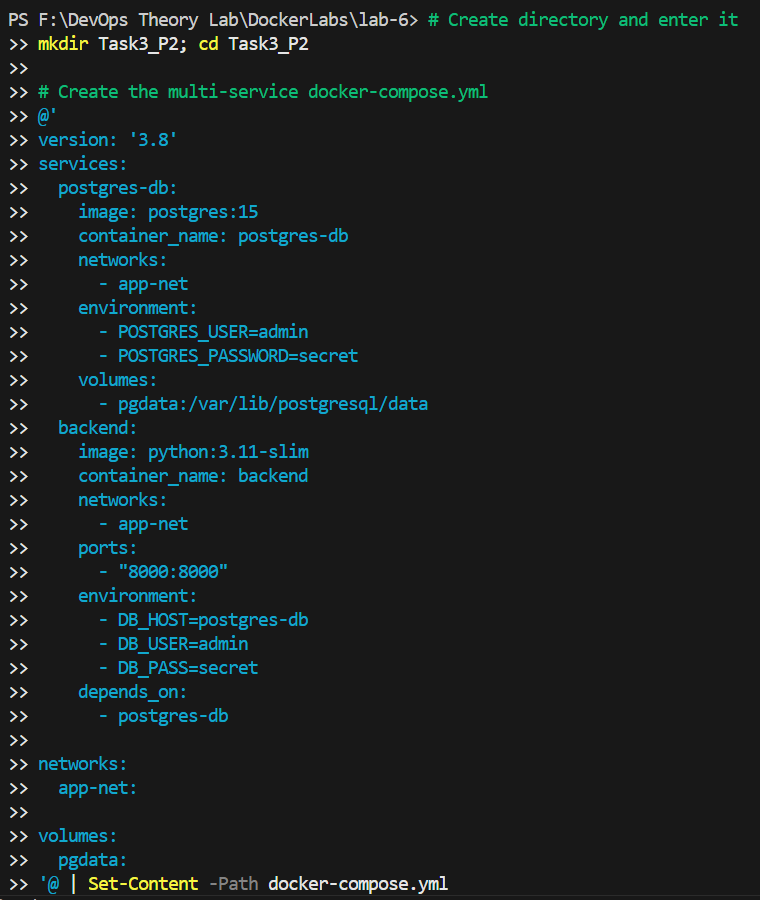
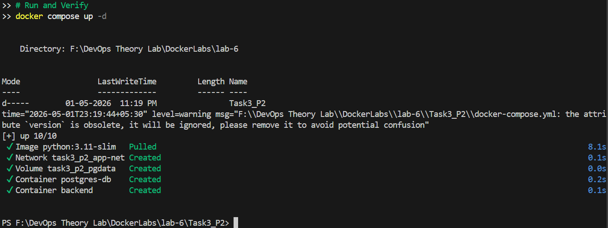
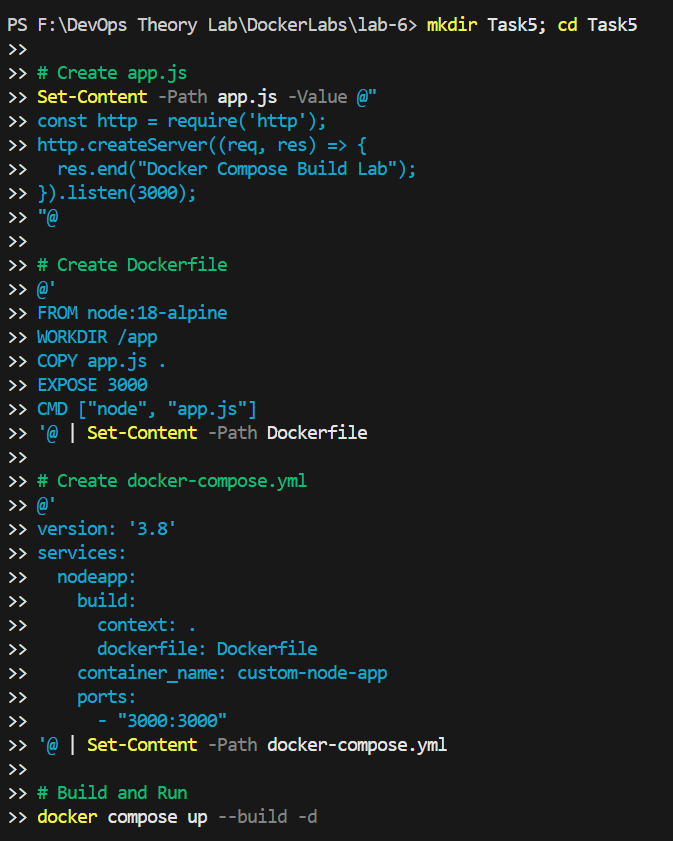
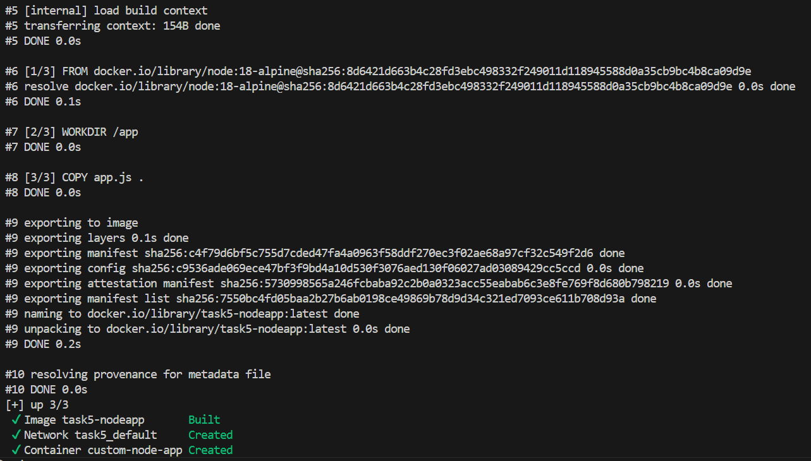
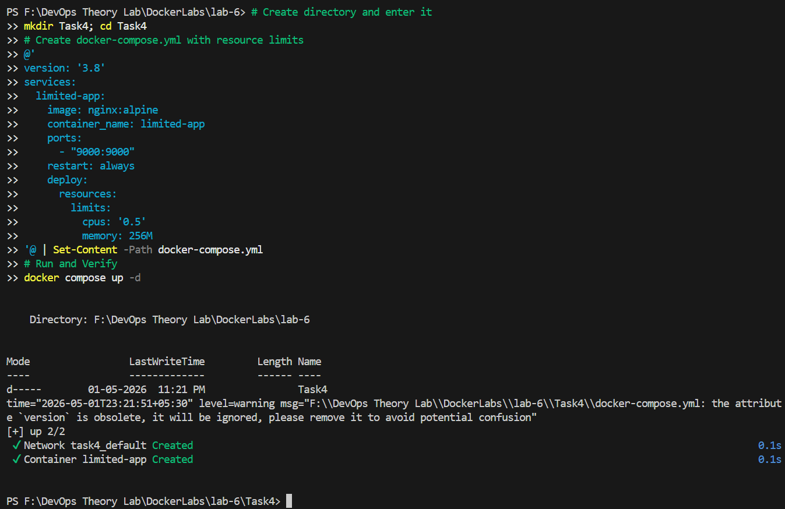

---

## EXPERIMENT 6 B: Multi-Container Application involving Docker Swarm

### 1. Running with Docker Swarm

**Step 1: Initialize Swarm**
```bash
docker swarm init
```
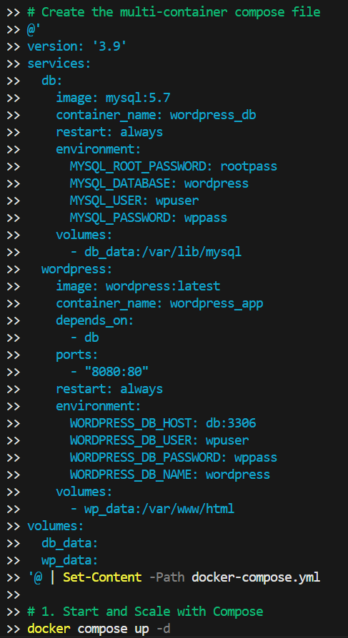
**Step 2: Deploy Stack**
```bash
docker stack deploy -c docker-compose.yml wpstack
```
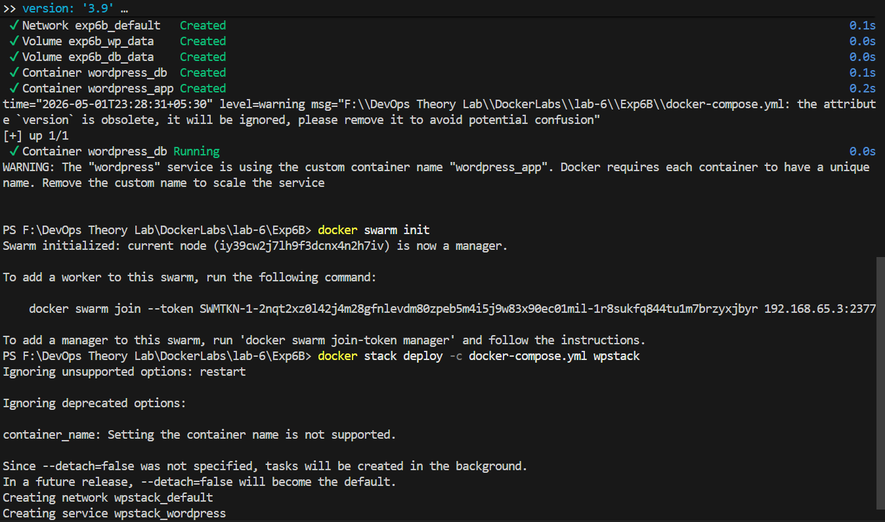
**Step 3: Scale Service**
```bash
docker service scale wpstack_wordpress=3
```
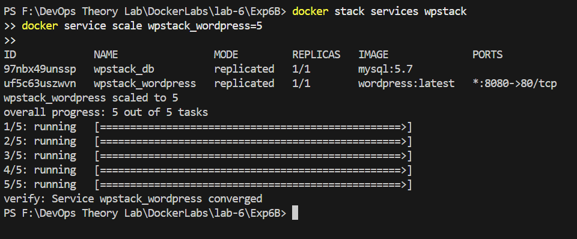

#### Comparison: Docker Compose vs Docker Swarm
| Metric | Docker Compose | Docker Swarm |
| :--- | :--- | :--- |
| **Scope** | Single host | Multi-node cluster |
| **Scaling** | Manual | Built-in |
| **Load Balancing** | No | Yes (Internal) |
| **Self-healing** | No | Yes |

---

## Key Learning Outcomes

- **Docker Compose** is ideal for local development, testing, and learning.
- **Docker Swarm** is useful for simple production clusters and easy scaling.
- Multi-container applications require orchestration for management.
- Internal networking and volumes are critical for persistence and communication.
- Declarative configuration (YAML) is preferred for complex deployments.

---

## Additional Resources

- [Docker Compose Overview](https://docs.docker.com/compose/)
- [Compose File Specification](https://docs.docker.com/compose/compose-file/)
- [Docker Swarm Mode Introduction](https://docs.docker.com/engine/swarm/)
- [WordPress Docker Official Image](https://hub.docker.com/_/wordpress)
