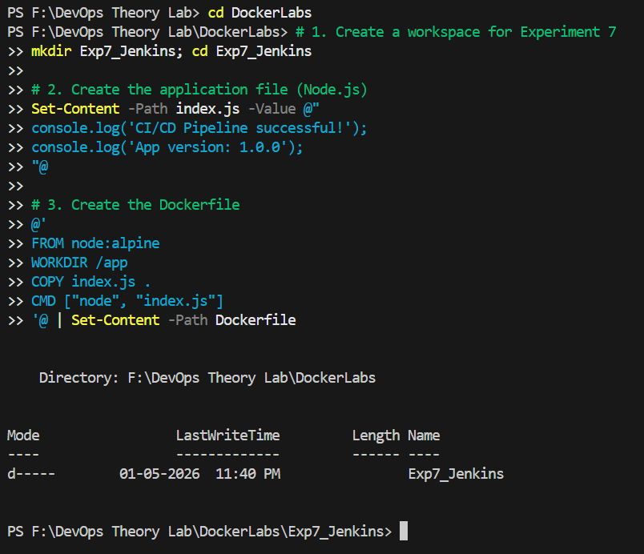
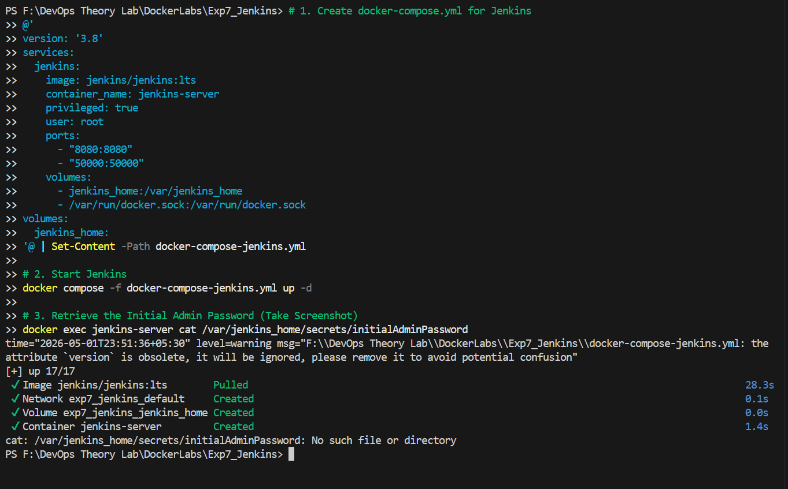

# Experiment 7: Jenkins, GitHub, and Docker Hub

---

## Table of Contents

1. [Aim](#1-aim)
2. [Objectives](#2-objectives)
3. [Theory](#3-theory)
4. [Part A: GitHub Repository Setup](#part-a-github-repository-setup)
5. [Part B: Jenkins Setup using Docker](#part-b-jenkins-setup-using-docker)
6. [Part C: Jenkins Configuration](#part-c-jenkins-configuration)
7. [Part D: GitHub Webhook Integration](#part-d-github-webhook-integration)
8. [Part E: Understanding Jenkins Pipeline Syntax](#part-e-understanding-jenkins-pipeline-syntax)
9. [Observations & Results](#observations--results)
10. [Additional Resources](#additional-resources)

---

## 1. Aim
To design and implement a complete **CI/CD pipeline** using Jenkins, integrating source code from GitHub, and building & pushing Docker images to Docker Hub.

---

## 2. Objectives
- Understand CI/CD workflow using Jenkins (GUI-based tool).
- Create a structured GitHub repository with application and a `Jenkinsfile`.
- Build Docker images from source code automatically.
- Securely store Docker Hub credentials in Jenkins.
- Automate the build and push process using **GitHub Webhooks**.

---

## 3. Theory
- **Jenkins**: A web-based GUI automation server used to build, test, and deploy software.
- **CI/CD**:
    - **Continuous Integration (CI)**: Code is automatically built and tested after each commit.
    - **Continuous Deployment (CD)**: Built artifacts are automatically delivered.
- **Workflow**: `Developer` → `GitHub` → `Webhook` → `Jenkins` → `Build` → `Docker Hub`.

---

## Part A: GitHub Repository Setup

### 5.1 Project Structure
Create a repository named `my-app` with the following structure:
```text
my-app/
├── app.py
├── requirements.txt
├── Dockerfile
└── Jenkinsfile
```



### 5.3 Jenkinsfile (Pipeline Definition)
```groovy
pipeline {
    agent any

    environment {
        IMAGE_NAME = "your-dockerhub-username/myapp"
    }

    stages {
        stage('Clone Source') {
            steps {
                git 'https://github.com/your-username/my-app.git'
            }
        }

        stage('Build Docker Image') {
            steps {
                sh 'docker build -t $IMAGE_NAME:latest .'
            }
        }

        stage('Login to Docker Hub') {
            steps {
                withCredentials([string(credentialsId: 'dockerhub-token', variable: 'DOCKER_TOKEN')]) {
                    sh 'echo $DOCKER_TOKEN | docker login -u your-dockerhub-username --password-stdin'
                }
            }
        }

        stage('Push to Docker Hub') {
            steps {
                sh 'docker push $IMAGE_NAME:latest'
            }
        }
    }
}
```

---

## Part B: Jenkins Setup using Docker

### 6.1 Create Docker Compose File
```yaml
version: '3.8'
services:
  jenkins:
    image: jenkins/jenkins:lts
    container_name: jenkins
    restart: always
    ports:
      - "8080:8080"
    volumes:
      - jenkins_home:/var/jenkins_home
      - /var/run/docker.sock:/var/run/docker.sock
    user: root

volumes:
  jenkins_home:
```

---

## Part E: Understanding Jenkins Pipeline Syntax

### Key Terms
- **`pipeline`**: The root block containing the entire definition.
- **`agent any`**: Tells Jenkins to run this pipeline on any available node.
- **`stages`**: Groups the different phases (Clone, Build, Auth, Push).
- **`steps`**: The actual commands (e.g., `sh`, `git`).
- **`withCredentials`**: A secure way to inject sensitive data into the environment temporarily.

---

## Observations & Results
- **Automation**: Once configured, a simple `git push` triggers the entire build and push process.
- **Security**: Credentials are managed centrally in Jenkins and never exposed in the source code.



---

## Additional Resources

- [Jenkins Documentation](https://www.jenkins.io/doc/)
- [Using a Jenkinsfile](https://www.jenkins.io/doc/book/pipeline/jenkinsfile/)
- [Pipeline Syntax Guide](https://www.jenkins.io/doc/book/pipeline/syntax/)
- [GitHub Webhooks Guide](https://docs.github.com/en/developers/webhooks-and-events/webhooks/about-webhooks)
