# 🚀 Docker Container Assignment

## 📌 Project Overview
This project demonstrates containerization of a Node.js application with PostgreSQL using Docker and Docker Compose. It includes image building, custom networking, and API testing.

---
## Folder structures

# 📷 Step-by-Step Implementation
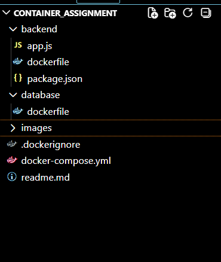
---

## Step 1: Project Structure
This step shows the folder structure using `tree /F`. It includes backend, database, and configuration files.

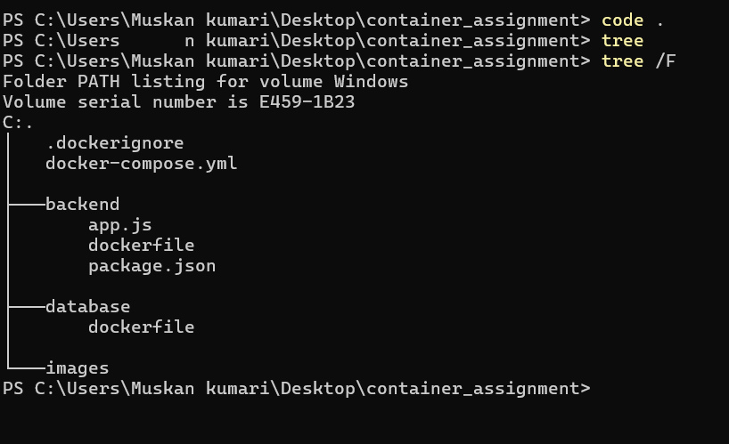

---

## Step 2: Backend Code (app.js)
This file contains Express server and API routes with PostgreSQL integration.
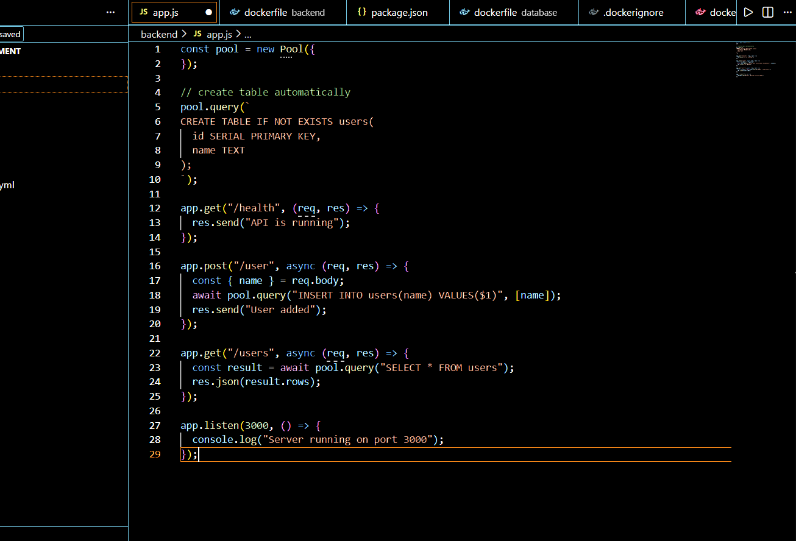

---

## Step 3: package.json
Defines dependencies and scripts required to run the application.

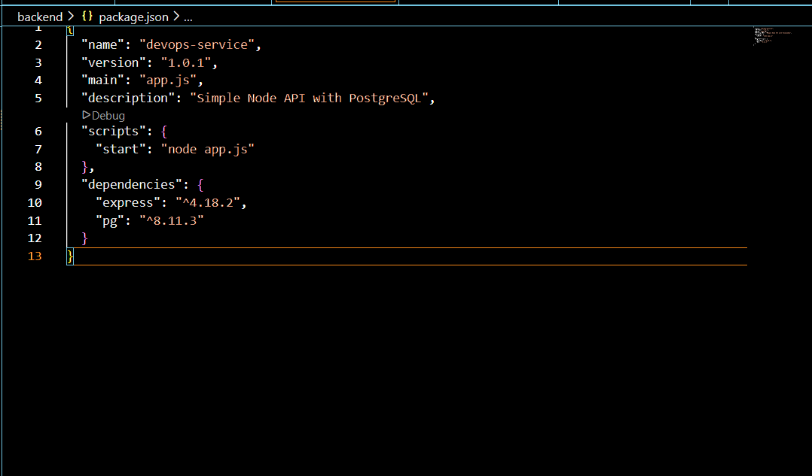

---

## Step 4: Backend Dockerfile
Defines multi-stage build for Node.js application.

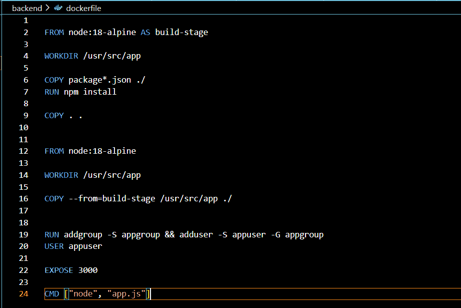

---

## Step 5: Database Dockerfile
Defines PostgreSQL container configuration.

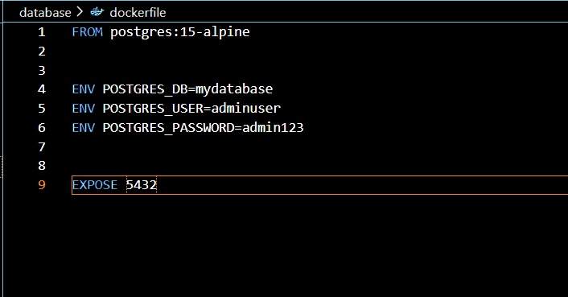

---

## Step 6: .dockerignore
Excludes unnecessary files from Docker build.

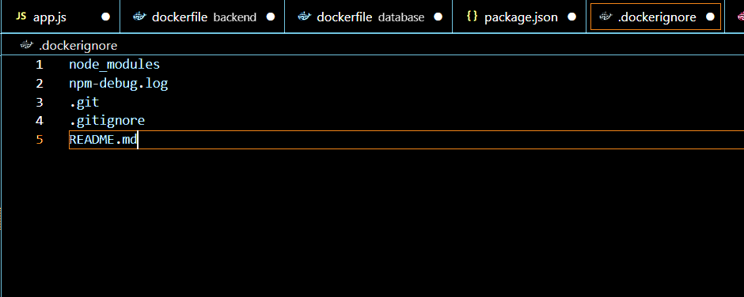

---

## Step 7: Docker Desktop Running
Shows Docker Desktop UI confirming Docker is running.

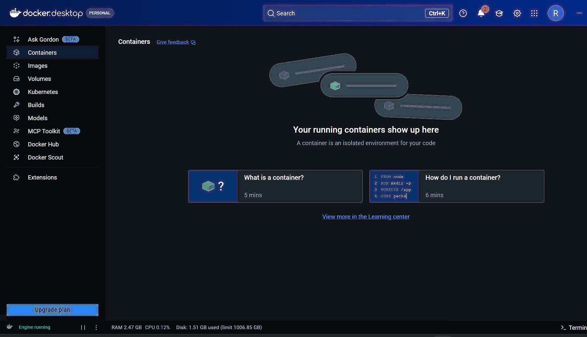

---

## Step 8: docker ps (Initial State)
Shows no containers running initially.

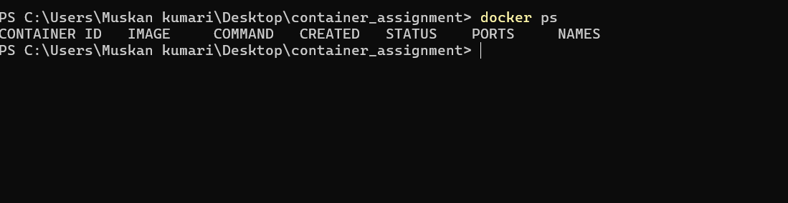

---

## Step 9: Build Backend Image
Builds backend Docker image using Dockerfile.

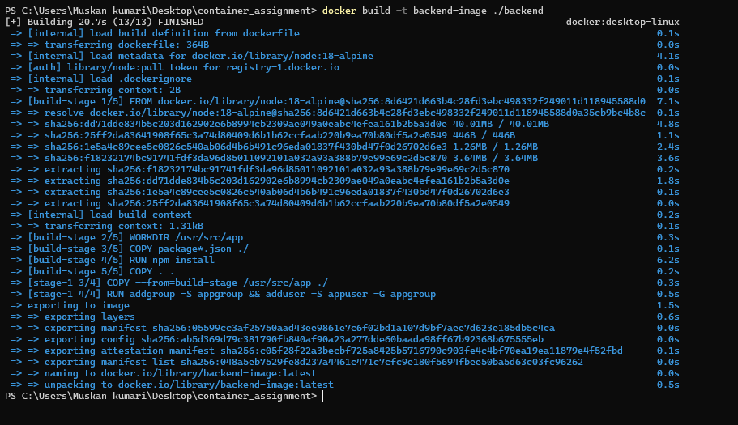

---

## Step 10: Build PostgreSQL Image
Builds PostgreSQL image and shows warning message.

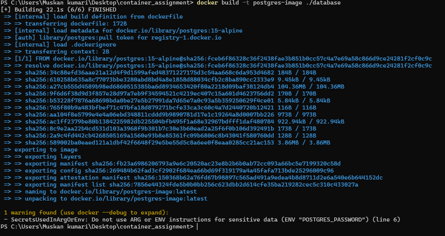

---

## Step 11: docker images
Lists all created Docker images.

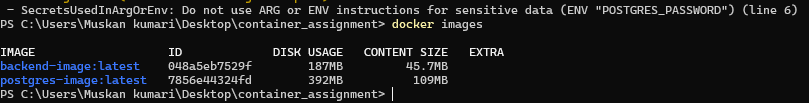

---

## Step 12: docker network ls
Shows available Docker networks.

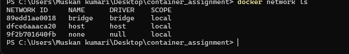

---

## Step 13: Create Custom Network
Creates ipvlan network with subnet and gateway.

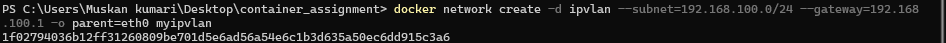

---

## Step 14: Verify Network
Shows newly created network in list.

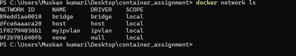

---

## Step 15: ipconfig
Displays system IP configuration.

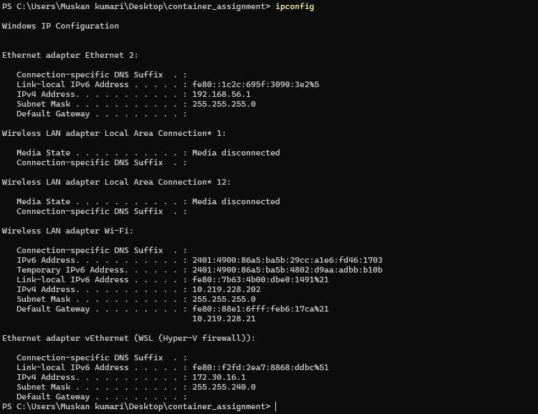

---

## Step 16: Inspect Network
Shows detailed configuration of custom network.

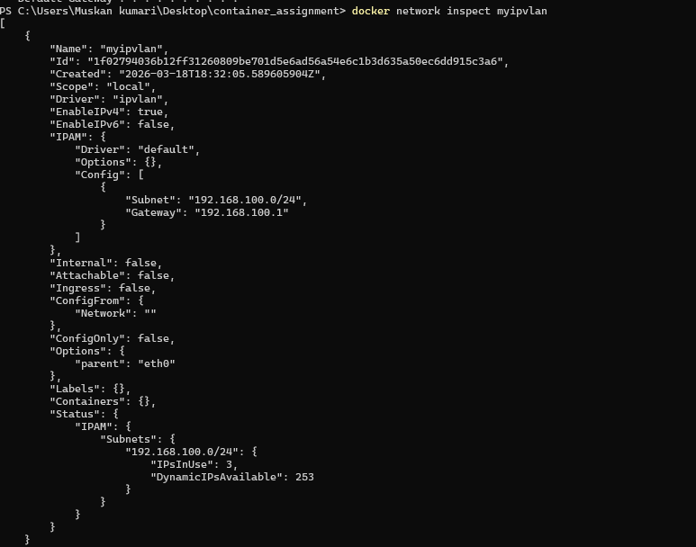

---

## Step 17: docker-compose.yml
Defines services, environment variables, and network.

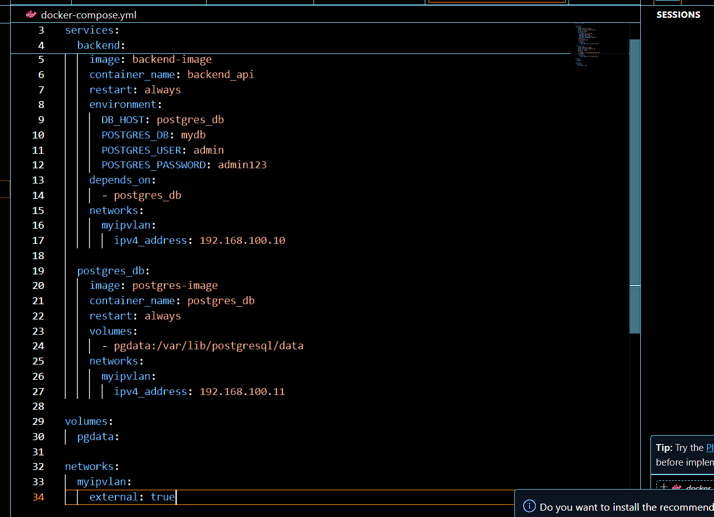

---

## Step 18: docker-compose up
Starts backend and database containers.

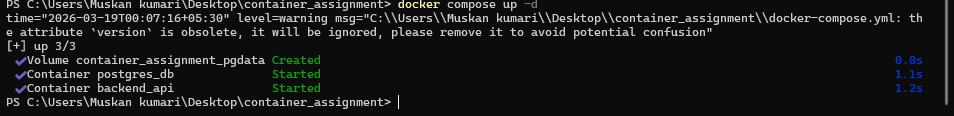

---

## Step 19: docker ps (Running Containers)
Shows running containers with status.

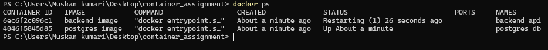

---

## Step 20: Inspect Backend Container
Shows detailed configuration of backend container.

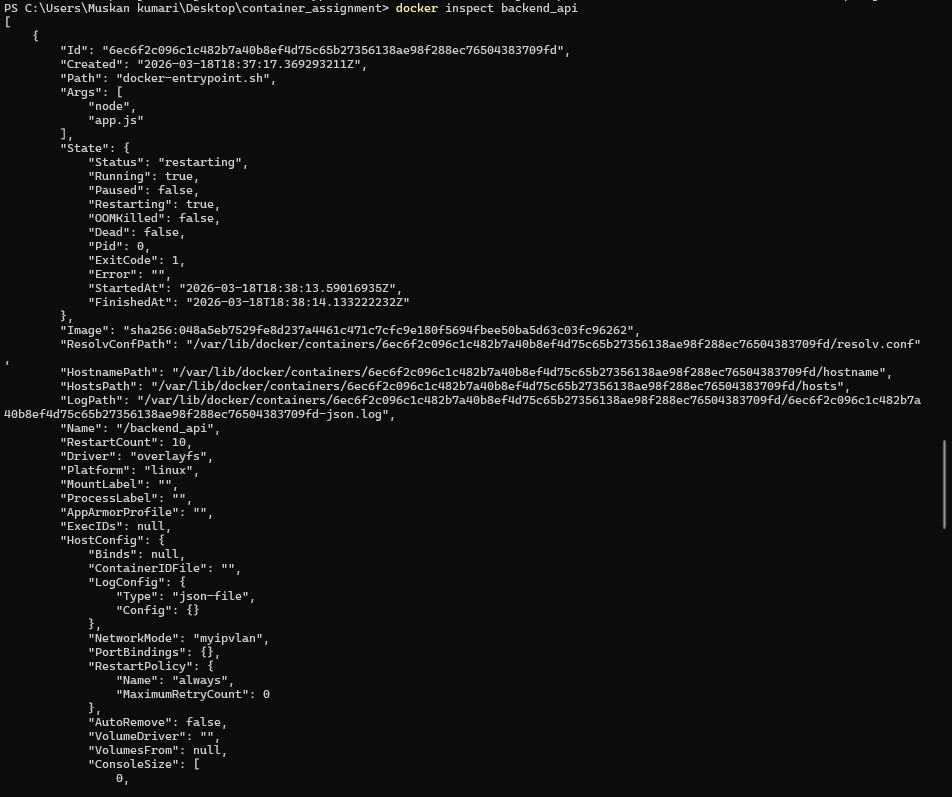

---

## Step 21: Inspect PostgreSQL Container
Shows configuration of PostgreSQL container.

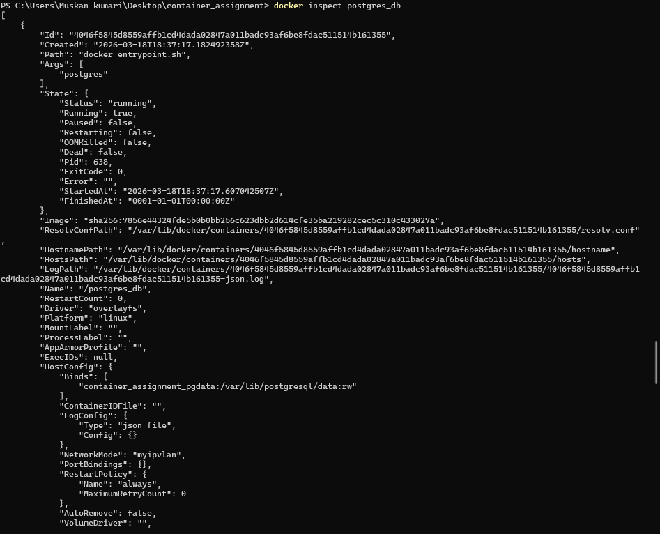

---

## Step 22: Test Health API
Checks `/health` endpoint inside container.

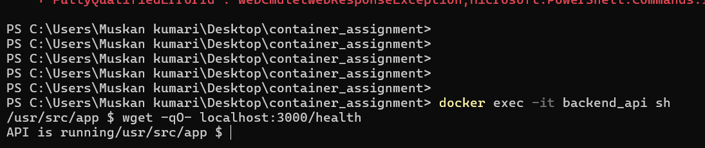

---

## Step 23: Add User via API
Sends POST request to `/user`.

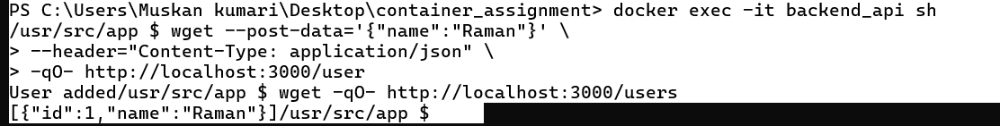

---

## Step 24: Get Users via API
Fetches users data from database.

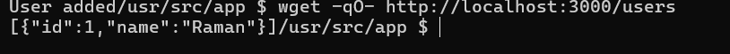

---

## Step 25: docker-compose down
Stops and removes all containers.

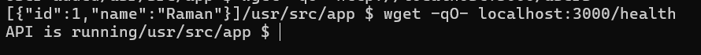
---

## Step 26: docker-compose build
Rebuilds containers from Dockerfiles.

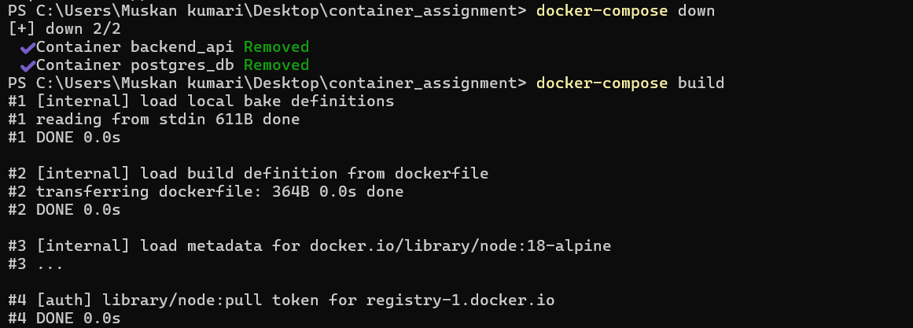

---

## Step 27: Final API Verification
Tests API again after rebuild to confirm working.

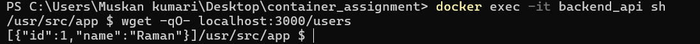

---
## ⚙️ Build Optimization & Security

To improve efficiency and performance, several optimization techniques were applied during containerization. A multi-stage Docker build is implemented for the backend, where dependencies are installed in a separate build stage and only the required files are transferred to the final image. This helps in keeping the image lightweight and clean.

A lightweight base image (`node:18-alpine`) is used to reduce overall image size, improve startup speed, and optimize resource usage. This ensures faster deployment and better performance of the containerized application.

The `.dockerignore` file is configured to exclude unnecessary files such as local dependencies, logs, and version control data. This reduces the build context size and avoids adding unwanted files to the Docker image.

For security enhancement, the application is executed using a non-root user instead of the default root user. This minimizes security risks and restricts unnecessary access within the container environment.

## 📊 Image Size Comparison

Choosing the right base image is important for optimizing container performance and resource usage.  

- `node:18` → approximately **1.1 GB**  
- `node:18-alpine` → approximately **180 MB**  

The Alpine-based image is much smaller in size, which leads to faster image downloads, reduced storage consumption, and quicker container startup times. This makes it a better choice for lightweight and efficient deployments.

---

## 🌐 Macvlan vs IPvlan

| Feature        | Macvlan                                               | IPvlan                                      |
|----------------|------------------------------------------------------|---------------------------------------------|
| MAC Addressing | Each container gets a unique MAC address              | Containers share the host’s MAC address      |
| Network Impact | Higher load due to multiple MAC entries in switches   | Lower load with simplified network handling  |
| Scalability    | Less suitable for large-scale environments            | Better suited for scalable deployments       |
| Use Case       | Ideal for smaller or isolated network setups          | Preferred for production and large systems   |

**_Network Design Diagram_**

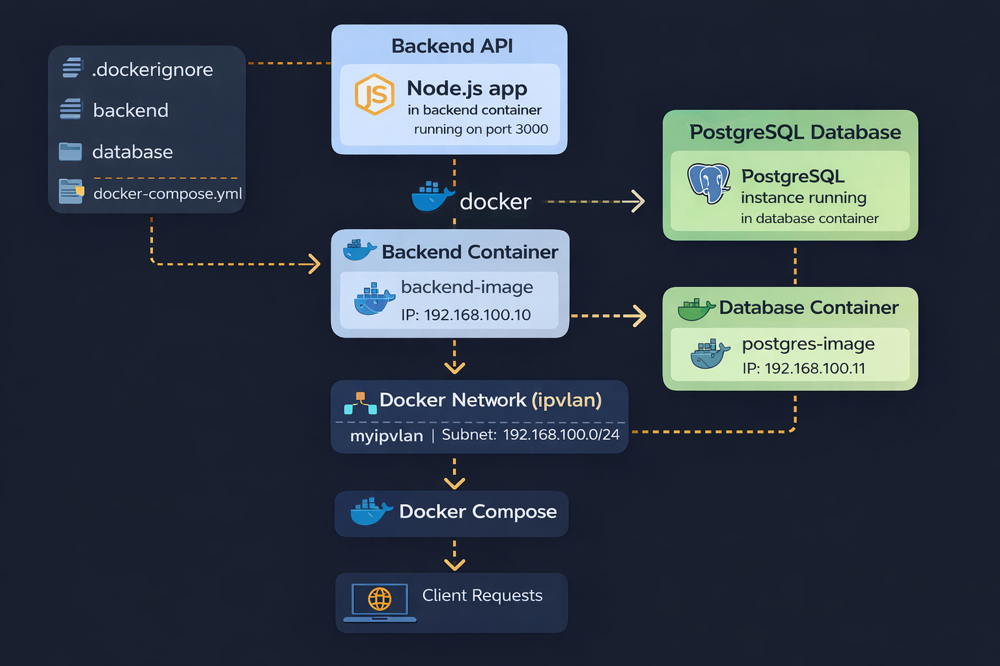

# ✅ Conclusion
This project demonstrates complete containerization using Docker and Docker Compose with networking, database integration, and API testing.

---

# 👨‍💻 Author
**Raman Kumar**