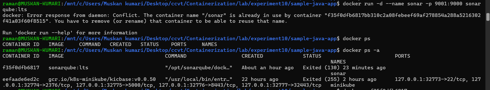
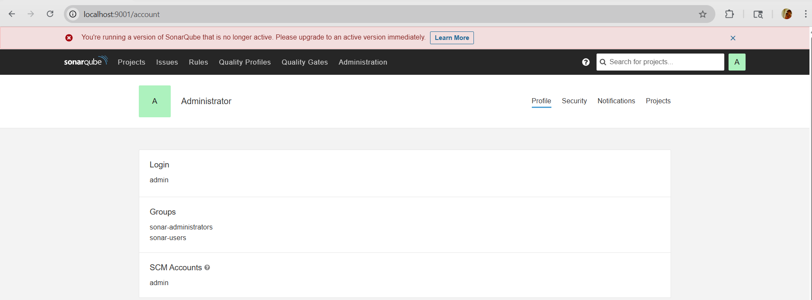
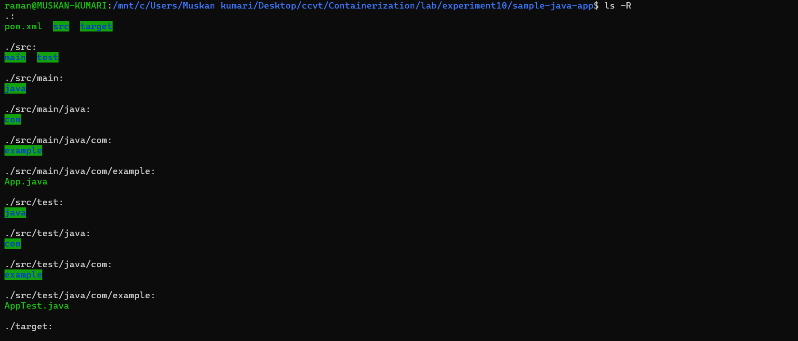
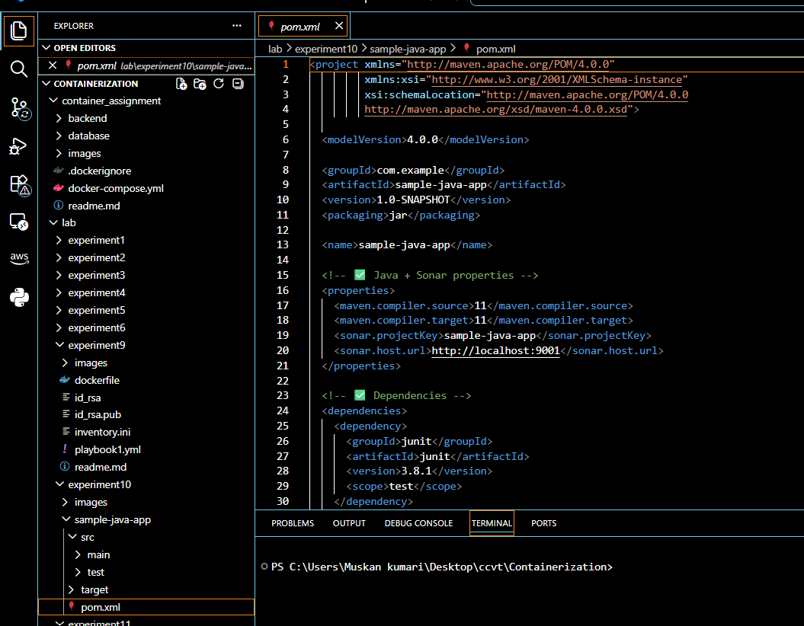
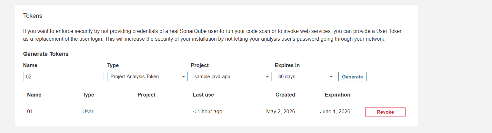
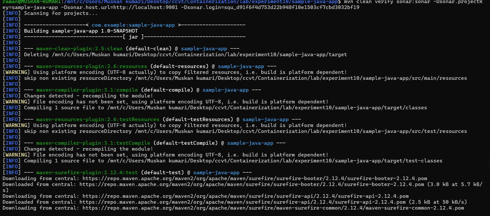
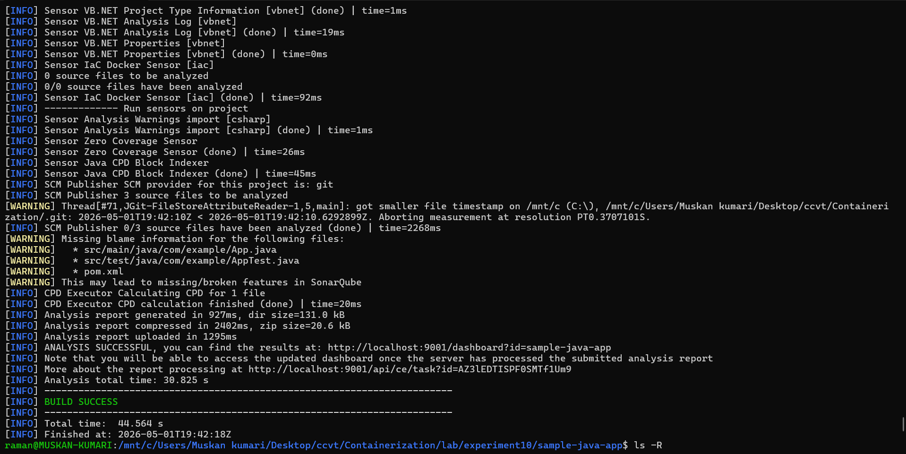
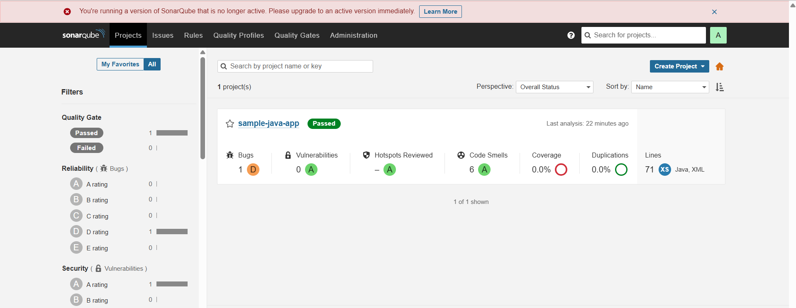
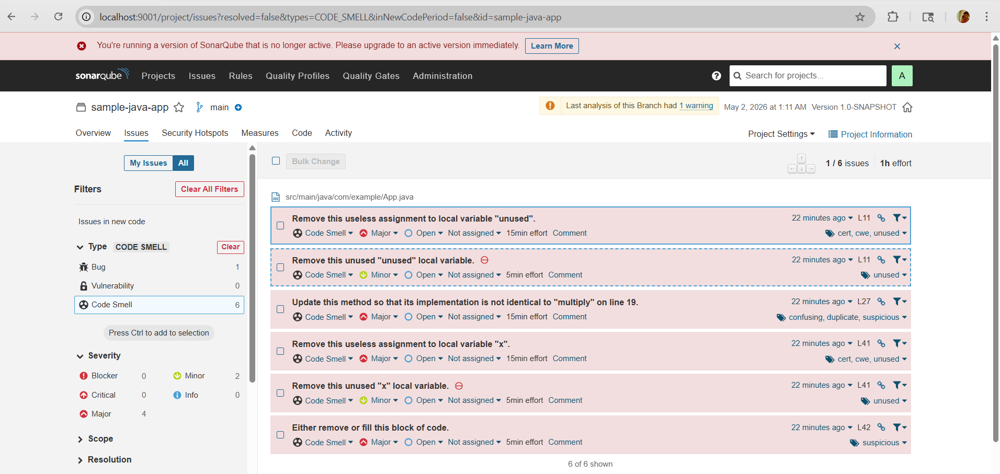

## Experiment 10:Static Code Analysis with SonarQube

<hr>

<h4 align="center">Static Code Analysis with SonarQube</h4>

<hr>

This experiment demonstrates how to set up SonarQube (a continuous code quality inspection tool) using Docker, integrate it with a Maven‑based Java project, and analyse the code for bugs, vulnerabilities, and code smells.

---

## 📁 Table of Contents

- [Overview](#overview)
- [Prerequisites](#prerequisites)
- [Step 1 – Start SonarQube Server with Docker](#step-1--start-sonarqube-server-with-docker)
- [Step 2 – Prepare the Java Maven Project](#step-2--prepare-the-java-maven-project)
- [Step 3 – Configure SonarQube Project and Generate Token](#step-3--configure-sonarqube-project-and-generate-token)
- [Step 4 – Run SonarQube Analysis with Maven](#step-4--run-sonarqube-analysis-with-maven)
- [Step 5 – View Analysis Results](#step-5--view-analysis-results)
- [Step 6 – Understand the Issues Found](#step-6--understand-the-issues-found)
- [Cleanup](#cleanup)
- [Key Takeaways](#key-takeaways)

---

## Overview

**SonarQube** is an open‑source platform for continuous inspection of code quality. It detects bugs, vulnerabilities, code smells, and security hotspots in over 25 programming languages. In this experiment we:

- Run SonarQube Community Edition inside a Docker container.
- Analyse a simple Java Maven project (`sample-java-app`).
- Use the SonarQube Maven plugin to push analysis results.
- Explore the SonarQube dashboard.

## Prerequisites

- Docker installed and running.
- Java (JDK 8 or later) and Maven installed (or use the Maven wrapper).
- Basic knowledge of Maven projects.

---

## Step 1 – Start SonarQube Server with Docker

SonarQube requires a database; for evaluation we use the embedded H2 database (not for production).

```bash
docker run -d --name sonar -p 9001:9000 sonarqube:lts
```

Verify the container is running:

```bash
docker ps
```



Access SonarQube web interface at:  
**http://localhost:9001**

Default login:  
- Username: `admin`  
- Password: `admin`  

You will be prompted to change the password immediately (optional for this experiment).



---

## Step 2 – Prepare the Java Maven Project

The project structure is shown below:

```
sample-java-app/
├── pom.xml
├── src/
│   ├── main/java/com/example/App.java
│   └── test/java/com/example/AppTest.java
└── target/ (generated after build)
```



**`pom.xml`** (Maven configuration) – includes the SonarQube plugin dependency:

```xml
<project ...>
  <groupId>com.example</groupId>
  <artifactId>sample-java-app</artifactId>
  <version>1.0-SNAPSHOT</version>
  ...
  <properties>
    <maven.compiler.source>1.8</maven.compiler.source>
    <maven.compiler.target>1.8</maven.compiler.target>
  </properties>
  <dependencies>
    <dependency>
      <groupId>junit</groupId>
      <artifactId>junit</artifactId>
      <version>3.8.1</version>
      <scope>test</scope>
    </dependency>
  </dependencies>
</project>
```



---

## Step 3 – Configure SonarQube Project and Generate Token

1. After logging in, go to **Projects** → **Create Project**.
2. Choose **Manually** → Give project key `java-app` and display name `sample-java-app`.
3. In the analysis method, choose **Locally** → **Maven**.
4. Generate a project token (e.g., name `my-token-app`, expiration 30 days).  
   Copy the token – it will look like:  
   `sqp_1c7688db219530221f5927934be0ec9be0e800a0`




---

## Step 4 – Run SonarQube Analysis with Maven

From the root directory of your Maven project (`sample-java-app/`), execute:

```bash
mvn clean verify sonar:sonar \
  -Dsonar.projectKey=java-app \
  -Dsonar.host.url=http://localhost:9001 \
  -Dsonar.login=YOUR_GENERATED_TOKEN
```

Replace `YOUR_GENERATED_TOKEN` with the token you copied.

Maven will:
- Compile the code
- Run tests (`verify`)
- Execute the SonarQube scanner and send the report to the server



If successful, you will see:

```
[INFO] ANALYSIS SUCCESSFUL, you can find the results at: http://localhost:9001/dashboard?id=java-app
[INFO] BUILD SUCCESS
```



---

## Step 5 – View Analysis Results

Go back to **http://localhost:9001**. The project dashboard shows:

- **Quality Gate** status (Passed / Failed)
- **Bugs**, **Vulnerabilities**, **Code Smells**, **Coverage**, **Duplications**



In this sample project, the analysis found:
- 0 Bugs
- 0 Vulnerabilities
- 1 Code Smell (major severity)

---

## Step 6 – Understand the Issues Found

Click on **Issues** to see detailed information.

The single code smell is located in `App.java` (line 11):  
> Replace this use of System.out or System.err by a logger.

SonarQube recommends using a logging framework (e.g., SLF4J) instead of `System.out.println()` for production code.



This demonstrates how SonarQube helps enforce coding standards and maintainability.

---

## Cleanup

Stop and remove the SonarQube container (all data will be lost because we used the embedded H2 database):

```bash
docker stop sonar
docker rm sonar
```

If you want to remove the container automatically when stopped, add `--rm` to the `docker run` command.

---

## Key Takeaways

- **SonarQube** provides continuous code quality inspection.
- Running it in **Docker** is quick and isolated.
- The **Maven plugin** integrates seamlessly with Java projects.
- The dashboard gives **actionable metrics** (bugs, vulnerabilities, code smells).
- Even a simple “Hello World” project can reveal real‑world issues (e.g., using `System.out`).
- For production, use an external database (PostgreSQL) and persistent volumes.

---

*This experiment shows how to incorporate static analysis into a development workflow using SonarQube and Docker.*

**Author:** Raman kumar  
**Date:** April 25, 2026
```

**Instructions for GitHub:**
1. Inside `Experiment-10/`, create an `Images/` folder.
2. Copy all screenshot files (`1.png` … `10.png`) into `Images/`.
3. Also place the `sample-java-app` folder (with `pom.xml`, `src/`, etc.) in the same directory.
4. Push the  and the project files.

Now your SonarQube experiment documentation is complete and matches the images you provided.
