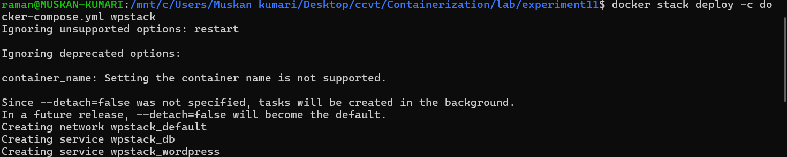
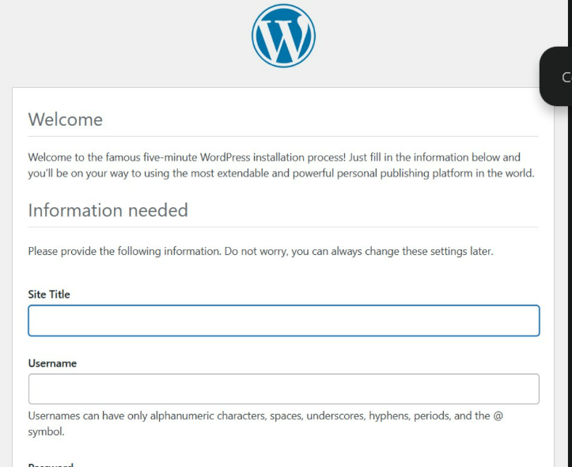
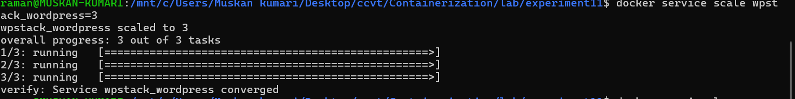
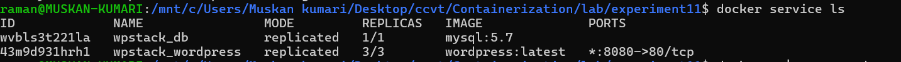
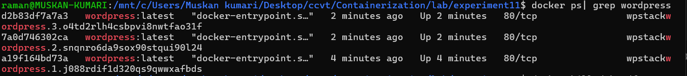
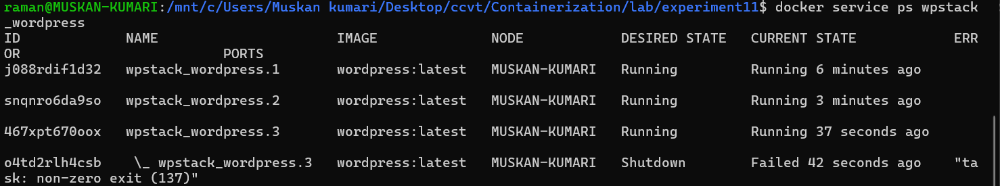
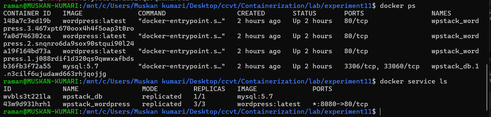
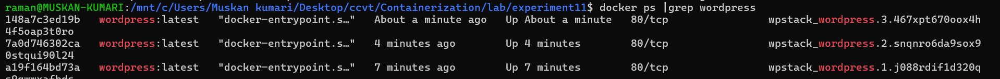
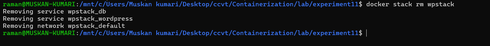
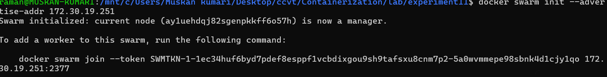

```markdown
# Experiment 11: Orchestration using Docker Compose & Docker Swarm

**Continuation of Experiment 6**  
Moving from Docker Compose to Docker Swarm: automatic scaling, self‑healing and load balancing.

---

## Objective

- Understand the limitations of plain Docker Compose and the need for orchestration.
- Initialise a single‑node Docker Swarm.
- Deploy a WordPress+MySQL stack to Swarm using an existing Compose file.
- Scale the application up/down and observe automatic load balancing.
- Test self‑healing by killing a container and letting Swarm replace it.
- Clean up the stack.

---

## Prerequisites

- Docker with Swarm mode enabled (Docker Engine 20.10+)
- The `docker-compose.yml` from Experiment 6 (WordPress + MySQL)
- No containers from previous experiments running

<details>
<summary>docker-compose.yml (same as Experiment 6)</summary>

```yaml
version: '3.9'

services:
  db:
    image: mysql:5.7
    container_name: wordpress_db
    restart: always
    environment:
      MYSQL_ROOT_PASSWORD: rootpass
      MYSQL_DATABASE: wordpress
      MYSQL_USER: wpuser
      MYSQL_PASSWORD: wppass
    volumes:
      - db_data:/var/lib/mysql

  wordpress:
    image: wordpress:latest
    container_name: wordpress_app
    depends_on:
      - db
    ports:
      - "8080:80"
    restart: always
    environment:
      WORDPRESS_DB_HOST: db:3306
      WORDPRESS_DB_USER: wpuser
      WORDPRESS_DB_PASSWORD: wppass
      WORDPRESS_DB_NAME: wordpress
    volumes:
      - wp_data:/var/www/html

volumes:
  db_data:
  wp_data:
```

</details>

---

## Task 1: Check Current State (No Swarm)

Make sure no containers from earlier experiments are running.

```bash
docker compose down -v   # if you used compose
docker ps                # should be empty
```


---

## Task 2: Initialize Docker Swarm

Turn your machine into a single‑node Swarm manager.

```bash
docker swarm init
```

Verify the node is active and is the leader:

```bash
docker node ls
```


> **Note:** The join token shown in the optional multi‑node section later (image2) is only needed when adding worker machines.

---

## Task 3: Deploy as a Stack

Use the same Compose file to create a Swarm **stack** (a group of services).

```bash
docker stack deploy -c docker-compose.yml wpstack
```

**What happens:** Swarm creates an overlay network, then two services (`wpstack_db` and `wpstack_wordpress`).  
Services, not raw containers, are now the management unit.



---

## Task 4: Verify the Deployment

List all services in the stack:

```bash
docker service ls
```


See detailed tasks (containers) for WordPress:

```bash
docker service ps wpstack_wordpress
```

> Observation: containers are named like `wpstack_wordpress.1.<id>` – they are managed by Swarm, not started directly by you.

---

## Task 5: Access WordPress

Open your browser and go to `http://localhost:8080`. You should see the WordPress setup screen, exactly as in Experiment 6, but now backed by a Swarm service.



Complete the installation (site title, username, password). Once finished, you will see the success page.


---

## Task 6: Scale the Application (Swarm’s Superpower)

Scale the WordPress service from 1 replica to 3 replicas with a single command:

```bash
docker service scale wpstack_wordpress=3
```



Verify the change:

```bash
docker service ls
```



Now check the actual containers:

```bash
docker ps | grep wordpress
```



**What happened:**  
- 3 containers are now running, all sharing port 80.  
- Swarm’s internal load balancer listens on port 8080 *once* and distributes incoming requests across all 3 containers – no port conflicts!

---

## Task 7: Test Self‑Healing (Automatic Recovery)

Self‑healing means Swarm automatically replaces failed containers without manual intervention.

### Step 1: Identify a WordPress container

```bash
docker ps | grep wordpress
```

### Step 2: Kill it to simulate a crash

```bash
docker kill <container-id>
```

### Step 3: Observe Swarm recreate the container

```bash
docker service ps wpstack_wordpress
```



Notice:
- The killed container shows `Shutdown` / `Failed` with a non‑zero exit code.
- A **new** container is automatically created to maintain the desired replica count (3).

### Step 4: Verify all three are running again

```bash
docker ps
```



```bash
docker ps | grep wordpress
```



> This is self‑healing: no `docker restart` needed. Swarm constantly monitors the desired state and corrects any deviation.

---

## Task 8: Remove the Stack

Clean up everything:

```bash
docker stack rm wpstack
```



Verify that services and containers are gone:

```bash
docker service ls   # empty
docker ps           # no more WordPress/MySQL containers
```

> Note: Named volumes (`db_data`, `wp_data`) persist. Delete them manually with `docker volume prune` if desired.

---

## Optional: Multi‑Node Swarm (Advanced)

If you have additional machines, you can add them as workers.

1. On the **manager**, get the join token:
   ```bash
   docker swarm join-token worker
   ```

2. On the **worker** node, join the cluster:
   ```bash
   docker swarm join --token <token> <manager-ip>:2377
   ```

   

3. Verify from the manager:
   ```bash
   docker node ls
   ```

   Now your stack will automatically distribute containers across multiple hosts.

---

## Observations & Analysis

- **Compose file reuse:** The same YAML works for both `docker compose up` and `docker stack deploy`. Swarm extends Compose, it does not replace it.
- **Containers vs Services:** In Swarm you manage *services* (desired state), not individual containers. Swarm creates/kills containers to match that state.
- **Port mystery solved:** Plain Compose cannot scale a service that binds a host port; Swarm solves this with an internal load balancer.
- **Side‑by‑side comparison:**

| Feature          | Docker Compose                | Docker Swarm                         |
|------------------|-------------------------------|--------------------------------------|
| Scope            | Single host                   | Multi‑node cluster                   |
| Scaling          | `--scale` flag (basic)       | `docker service scale` (built‑in)   |
| Load Balancing   | No (port conflicts)           | Yes (internal LB)                    |
| Self‑Healing     | No (`restart` on same host)   | Yes (automatic)                      |
| Rolling Updates  | No                            | Yes (zero‑downtime)                  |
| Service Discovery| Via container names           | Via DNS + VIP                        |
| Use Case         | Development, testing          | Simple production clusters           |

---

## Learning Outcome Check

1. **Why is Compose not enough for production?**  
   Compose lacks built‑in scaling with load balancing, self‑healing across hosts, and rolling updates.

2. **What does `docker stack deploy` do differently than `docker compose up`?**  
   It creates Swarm *services* (desired state) rather than just running containers. The Swarm manager then schedules tasks across the cluster.

3. **How does Swarm achieve self‑healing?**  
   The manager constantly compares the current state with the desired state (e.g., 3 replicas). If a container fails, the manager creates a new one immediately.

4. **What happens if you run `docker kill` on a container managed by Swarm?**  
   Swarm detects the container is no longer running and starts a replacement to satisfy the replica count.

5. **Can you use the same Compose file for both development and production?**  
   Yes. The file defines the application structure. `docker compose up` runs it locally; `docker stack deploy` runs it with Swarm orchestration.

---

## Quick Reference Card

| Action                       | Command |
|------------------------------|---------|
| Initialize Swarm             | `docker swarm init` |
| Deploy stack                 | `docker stack deploy -c docker-compose.yml <name>` |
| List services                | `docker service ls` |
| Scale service                | `docker service scale <stack>_<service>=<N>` |
| Inspect service tasks        | `docker service ps <service>` |
| Remove stack                 | `docker stack rm <name>` |
| Leave Swarm (force)          | `docker swarm leave --force` |

---

**Final Takeaway:** *Compose defines the application. Swarm runs it reliably.*
```