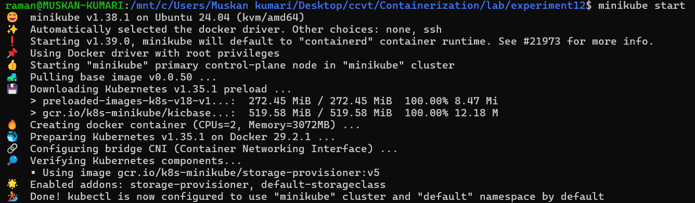
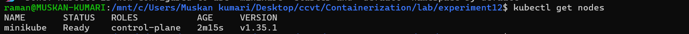
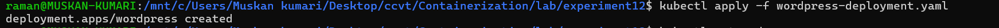
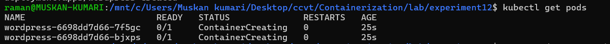
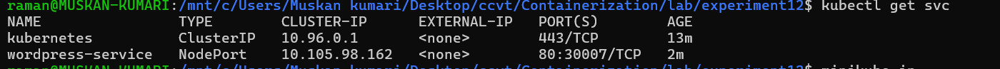
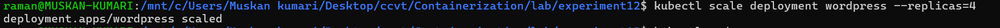
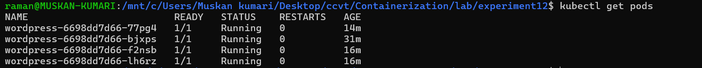
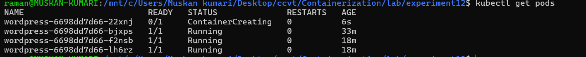

```markdown
# Experiment 12: Study and Analyse Container Orchestration using Kubernetes

## 📌 Objective
Understand why Kubernetes is used, learn its core concepts, and perform hands-on tasks: deploying, exposing, scaling, and testing self-healing of applications using Kubernetes.

---

## 🚀 Why Kubernetes over Docker Swarm?

| Reason               | Explanation                                                |
|----------------------|------------------------------------------------------------|
| **Industry standard** | Most companies use Kubernetes in production.              |
| **Powerful scheduling** | Automatically decides where to run your workloads.      |
| **Large ecosystem**    | Rich set of tools, monitoring, logging, and plugins.     |
| **Cloud‑native support** | Works seamlessly on AWS, GCP, Azure, and on‑prem.       |

---

## 🧱 Core Kubernetes Concepts

| Docker Concept | Kubernetes Equivalent | Meaning                                                                                     |
|----------------|-----------------------|---------------------------------------------------------------------------------------------|
| Container      | **Pod**               | Smallest deployable unit; a Pod can contain one or more tightly coupled containers.        |
| -              | **Deployment**        | Manages a set of identical Pods, ensures the desired number of replicas, and handles updates.|
| -              | **Service**           | Provides a stable network endpoint (IP/DNS) to access a set of Pods.                       |

---

## 🔧 Prerequisites
- `kubectl` installed and configured
- A running cluster (Minikube, k3d, or kubeadm).  
  **We used Minikube** (Docker driver, Kubernetes v1.35.1).

---

## 🛠️ Hands‑On Lab (Using Minikube)

### Step 0: Start Minikube & Verify Cluster

```bash
minikube start
kubectl get nodes
```

  


---

### Task 1: Create a Deployment

Create `wordpress-deployment.yaml`:

```yaml
apiVersion: apps/v1
kind: Deployment
metadata:
  name: wordpress
spec:
  replicas: 2
  selector:
    matchLabels:
      app: wordpress
  template:
    metadata:
      labels:
        app: wordpress
    spec:
      containers:
      - name: wordpress
        image: wordpress:latest
        ports:
        - containerPort: 80
```

Apply the deployment:

```bash
kubectl apply -f wordpress-deployment.yaml
```




Check pods (they will be in `ContainerCreating` briefly):

```bash
kubectl get pods
```



---

### Task 2: Expose the Deployment as a Service

Create `wordpress-service.yaml`:

```yaml
apiVersion: v1
kind: Service
metadata:
  name: wordpress-service
spec:
  type: NodePort
  selector:
    app: wordpress
  ports:
  - port: 80
    targetPort: 80
    nodePort: 30007
```

Apply the service:

```bash
kubectl apply -f wordpress-service.yaml
```

  *(file listing shows both YAML files)*

Verify the service:

```bash
kubectl get svc
```



---

### Task 3: Access WordPress

Get the URL (Minikube tunnel required):

```bash
minikube service wordpress-service --url
```

Access the displayed URL (e.g., `http://127.0.0.1:46249`) in your browser.


---

### Task 4: Scale the Deployment

Scale from 2 to 4 replicas:

```bash
kubectl scale deployment wordpress --replicas=4
kubectl get pods
```

  


---

### Task 5: Self‑Healing Demonstration

Delete one pod manually and observe Kubernetes restoring the desired count.

```bash
# Get pod names
kubectl get pods

# Delete a specific pod (replace <pod-name>)
kubectl delete pod wordpress-6698dd7d66-bjxps

# Watch the new pod being created
kubectl get pods
```

  
*(One pod terminating, another already `ContainerCreating` to maintain 4 replicas.)*

---

## 🆚 PART C – Swarm vs Kubernetes (Simple Comparison)

| Feature        | Docker Swarm          | Kubernetes                           |
|----------------|-----------------------|--------------------------------------|
| Setup          | Very easy             | More complex                         |
| Scaling        | Basic                 | Advanced (auto‑scaling)              |
| Ecosystem      | Small                 | Huge (monitoring, logging, tools)    |
| Industry usage | Rare                  | Standard                             |

**Verdict:** Learn Kubernetes – it’s what the industry uses.

---

## 🏗️ PART D – Advanced Lab: Real Cluster with kubeadm (High‑Level Overview)

For a multi‑node production‑like cluster, use **kubeadm**.

**Requirements:**
- 2–3 VMs (Ubuntu 22.04/24.04)
- Each VM: ≥2 CPU, ≥2 GB RAM

**Key Steps:**
1. Install `kubeadm`, `kubelet`, `kubectl` on all nodes.
2. Initialize the control plane (`sudo kubeadm init`).
3. Copy admin config and set up `kubectl`.
4. Install a network plugin (e.g., Calico).
5. Join worker nodes with the token provided by `kubeadm init`.
6. Verify with `kubectl get nodes`.

> **Teaching Insight – When to use which tool:**
> - **k3d** – Quick local testing (single node)
> - **Minikube** – Single‑node cluster on laptop
> - **kubeadm** – Real, production‑style cluster

---

## 🧾 Summary of Commands (Cheat Sheet)

| Command                                              | Description                           |
|------------------------------------------------------|---------------------------------------|
| `minikube start`                                    | Start a local Kubernetes cluster      |
| `kubectl get nodes`                                 | List cluster nodes                    |
| `kubectl apply -f <file>`                           | Create/update resources               |
| `kubectl get pods`                                  | List pods                             |
| `kubectl get svc`                                   | List services                         |
| `kubectl scale deployment <name> --replicas=<n>`    | Scale a deployment                    |
| `kubectl delete pod <pod-name>`                     | Delete a pod (self‑healing test)      |
| `minikube service <svc-name> --url`                 | Get external URL for a service        |

---

## ✅ Conclusion

In this experiment, we:
- Understood basic Kubernetes concepts (Pods, Deployments, Services).
- Deployed a WordPress application with 2 replicas.
- Exposed it externally using a NodePort Service.
- Scaled the deployment to 4 replicas.
- Verified Kubernetes’ self‑healing by deleting a pod and watching it recover.
- Learned how to set up a real multi‑node cluster with `kubeadm`.


```