## Experiment 3:- Docker Deploy NGINX Using Different Base Images and Comparing Image Layers    


<hr>

<h4 align="center"> Part 1: Deploy NGINX Using Official Image (Recommended Approach) </h4>

<hr>


**Step 1: Pull the Image**
```bash
docker pull nginx:latest
```
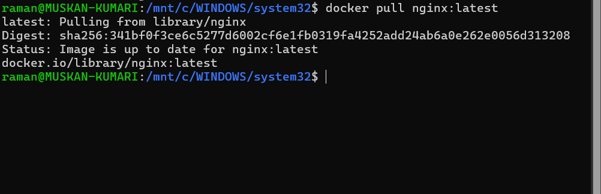


**Step 2: Run the Container**
```bash
docker run -d --name nginx-official -p 8080:80 nginx
```
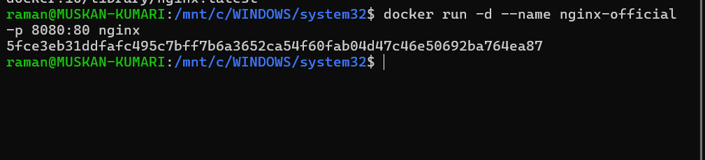


**Step 3: Verify**
```bash
curl http://localhost:8080
```
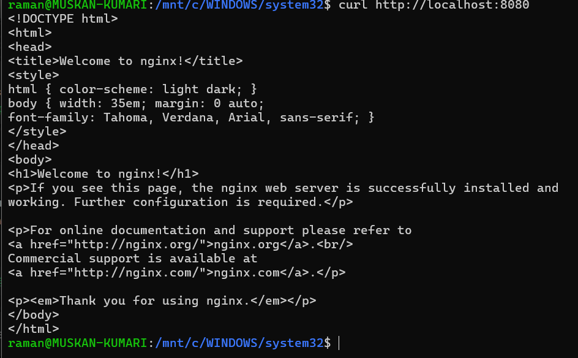


You should see the **NGINX welcome page**.


**Key Observations**
```bash
docker images nginx
```
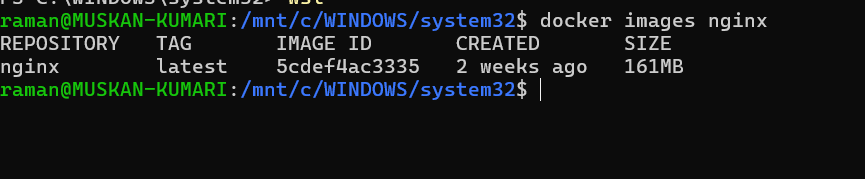


* Image is **pre-optimized**
* Minimal configuration required
* Uses Debian-based OS internally


<hr>

<h4 align="center"> Part 2: Custom NGINX Using Ubuntu Base Image </h4>

<hr>


**Step 1: Create Dockerfile**

```Dockerfile
FROM ubuntu:22.04

RUN apt-get update && \
    apt-get install -y nginx && \
    apt-get clean && \
    rm -rf /var/lib/apt/lists/*

EXPOSE 80

CMD ["nginx", "-g", "daemon off;"]
```


**Step 2: Build Image**

```bash
docker build -t nginx-ubuntu .
```


**Step 3: Run Container**

```bash
docker run -d --name nginx-ubuntu -p 8081:80 nginx-ubuntu
```
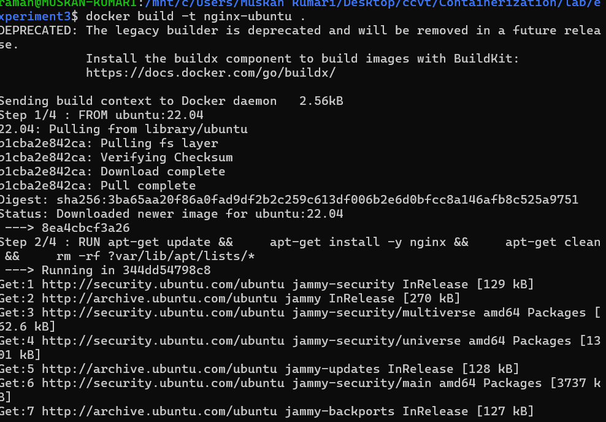


**Observations**

```bash
docker images nginx-ubuntu
```
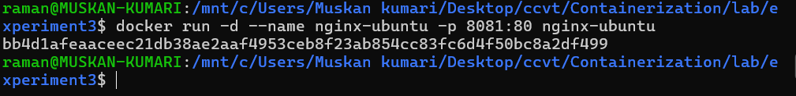

* Much **larger image size**
* More layers
* Full OS utilities available


<hr>

<h4 align="center"> Part 3: Custom NGINX Using Alpine Base Image </h4>

<hr>


**Step 1: Create Dockerfile**

```Dockerfile
FROM alpine:latest

RUN apk add --no-cache nginx

EXPOSE 80

CMD ["nginx", "-g", "daemon off;"]
```

**Step 2: Build Image**

```bash
docker build -t nginx-alpine .
```
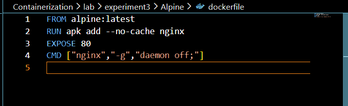

**Step 3: Run Container**

```bash
docker run -d --name nginx-alpine -p 8082:80 nginx-alpine
```
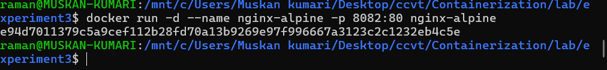


**Observations**

```bash
docker images nginx-alpine
```
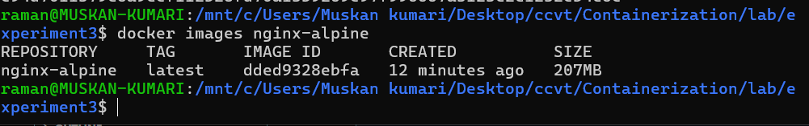


* Extremely **small image**
* Fewer packages
* Faster pull and startup time


<hr>

<h4 align="center"> Part 4: Image Size and Layer Comparison </h4>

<hr>


**Compare Sizes**

```bash
docker images | grep nginx
```
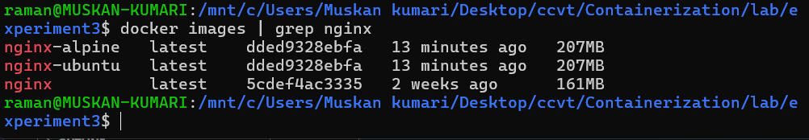


_Typical result (approx):_

| Image Type   | Size      |
| ------------ | --------- |
| nginx:latest | 161 MB    |
| nginx-ubuntu | 134 MB    |
| nginx-alpine | 10.4 MB   |


**Inspect Layers**

```bash
docker history nginx
docker history nginx-ubuntu
docker history nginx-alpine
```
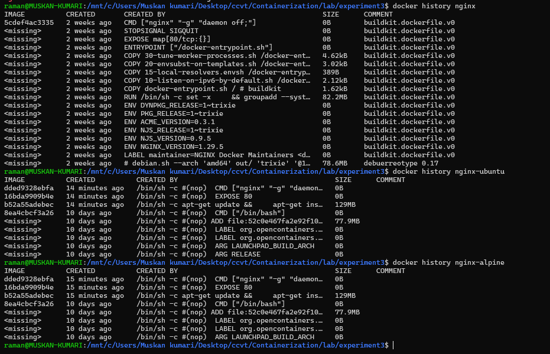


**Observations:**

* Ubuntu has many filesystem layers
* Alpine has minimal layers
* Official NGINX image is optimized but heavier than Alpine


<hr>

<h4 align="center"> Part 5: Functional Tasks Using NGINX </h4>

<hr>


**Task 1: Serve Custom HTML Page**

```bash
mkdir html
echo "<h1>Raman Kumar - 500120223</h1>" > html/index.html
```
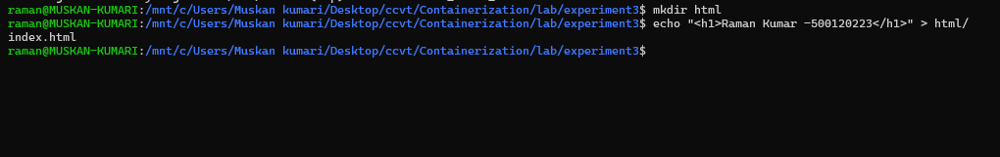

_Run:_

```bash
docker run -d \
  -p 8083:80 \
  -v $(pwd)/html:/usr/share/nginx/html \
  nginx
```
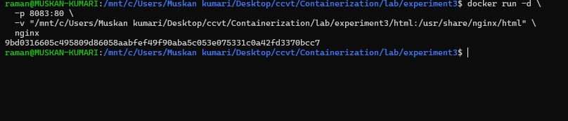
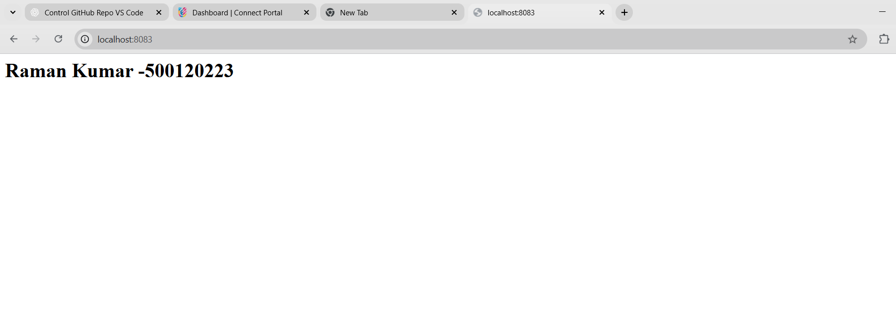

**Task 2: Reverse Proxy (Conceptual)**

_NGINX can:_

* Forward traffic to backend services
* Load balance multiple containers
* Terminate SSL

_Example use cases:_

* Frontend for microservices
* API gateway
* Static file server


<hr>

<h4 align="center"> Part 6: Comparison Summary </h4>

<hr>


**Image Comparison Table**

| Feature          | Official NGINX | Ubuntu + NGINX | Alpine + NGINX |
| ---------------- | -------------- | -------------- | -------------- |
| Image Size       | Medium         | Large          | Very Small     |
| Ease of Use      | Very Easy      | Medium         | Medium         |
| Startup Time     | Fast           | Slow           | Very Fast      |
| Debugging Tools  | Limited        | Excellent      | Minimal        |
| Security Surface | Medium         | Large          | Small          |
| Production Ready | Yes            | Rarely         | Yes            |


<hr>

<h4 align="center"> Part 7: When to Use What </h4>

<hr>


**Use Official NGINX Image When:**

* Production deployment
* Standard web hosting
* Reverse proxy / load balancer

**Use Ubuntu-Based Image When:**

* Learning Linux + NGINX internals
* Heavy debugging needed
* Custom system-level dependencies

**Use Alpine-Based Image When:**

* Microservices
* CI/CD pipelines
* Cloud and Kubernetes workloads


<hr>

<div align="center">

<a href="../Experiment-2/">
  
</a>
&nbsp;
<a href="../../Lab/">
  
</a>

</div>