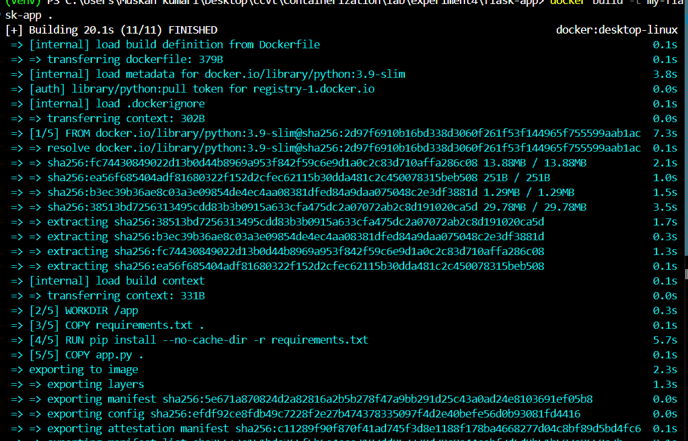
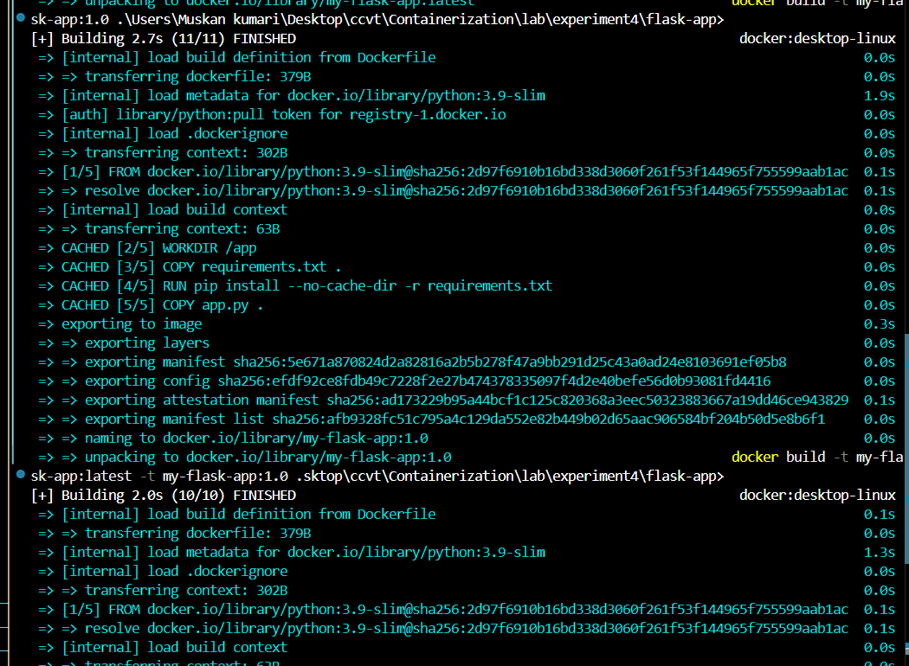
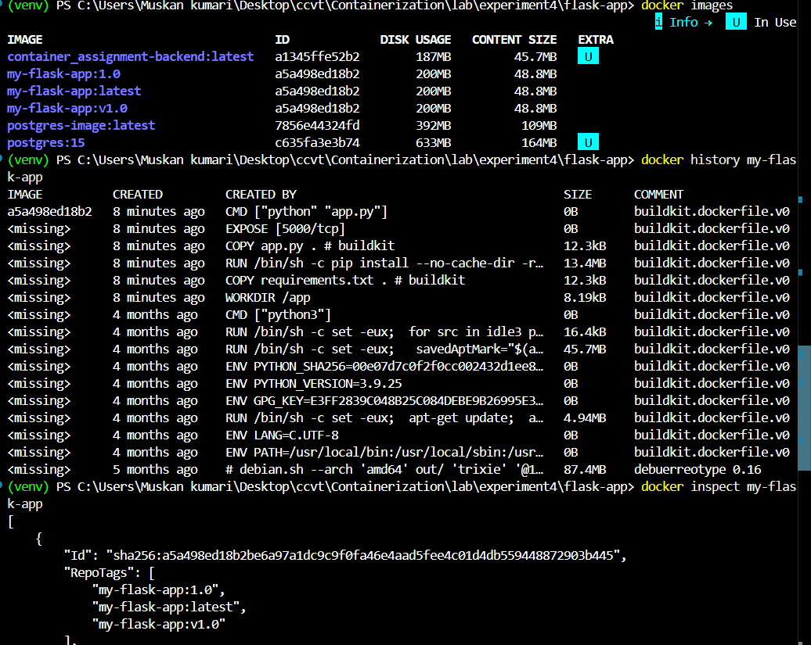
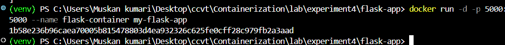
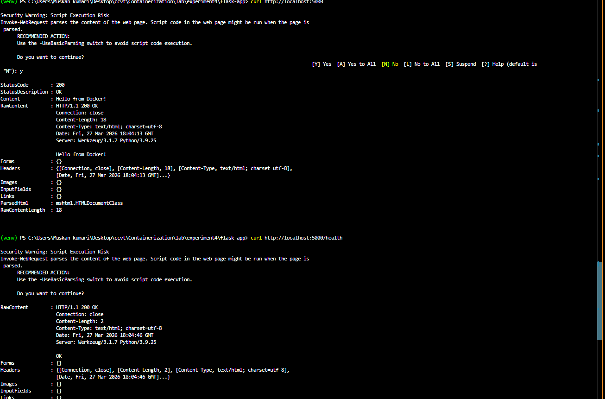
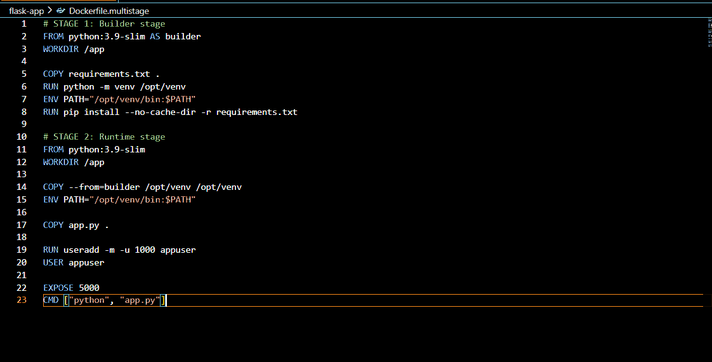
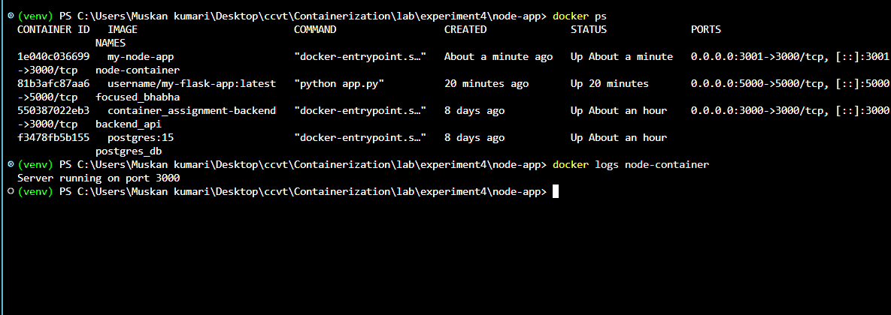
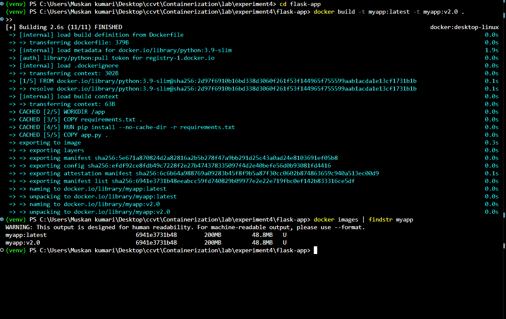
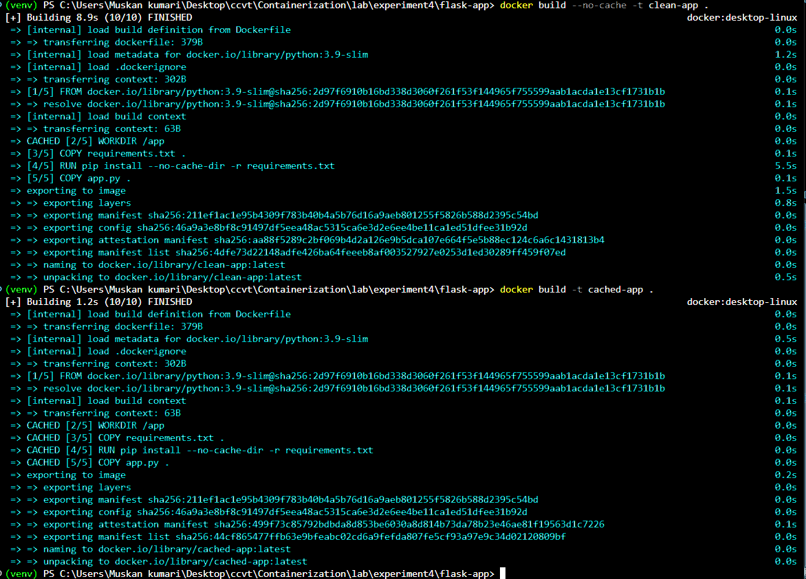
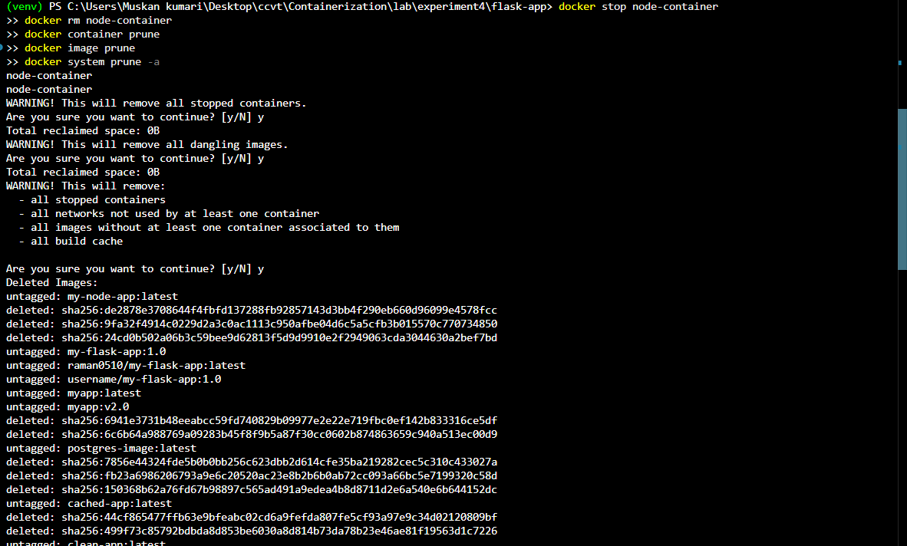

# Lab 4: Docker Essentials

## Objective
Learn Docker fundamentals including containerizing applications with Dockerfiles, building and tagging images, running containers, multi-stage builds, and working with multiple application stacks (Python Flask & Node.js).

---

## Part 1: Containerizing Applications with Dockerfile

### Step 1: Create a Simple Flask Application

**app.py** — A simple Flask web server with two endpoints:
```python
from flask import Flask
app = Flask(__name__)

@app.route('/')
def hello():
    return "Hello from Docker!"

@app.route('/health')
def health():
    return "OK"

if __name__ == '__main__':
    app.run(host='0.0.0.0', port=5000)
```

**requirements.txt**:
```
Flask==2.3.3
```

### Step 2: Create Dockerfile

```dockerfile
# Use Python base image
FROM python:3.9-slim

# Set working directory
WORKDIR /app

# Copy requirements file
COPY requirements.txt .

# Install dependencies
RUN pip install --no-cache-dir -r requirements.txt

# Copy application code
COPY app.py .

# Expose port
EXPOSE 5000

# Run the application
CMD ["python", "app.py"]
```

---

## Part 2: Using .dockerignore

### .dockerignore File

```
# Python files
__pycache__/
*.pyc
*.pyo
*.pyd

# Environment files
.env
.venv
env/
venv/

# IDE files
.vscode/
.idea/

# Git files
.git/
.gitignore

# OS files
.DS_Store
Thumbs.db

# Logs
*.log
logs/

# Test files
tests/
test_*.py
```

### Why .dockerignore is Important
- **Prevents unnecessary files** from being copied into the image
- **Reduces image size** by excluding development/test files
- **Improves build speed** by reducing build context
- **Increases security** by keeping sensitive files out of images

---

## Part 3: Building Docker Images

### Step 1: Basic Build
```bash
docker build -t my-flask-app .
```



### Step 2: Tagging Images
```bash
docker build -t my-flask-app:1.0 .
docker build -t my-flask-app:latest -t my-flask-app:1.0 .
docker tag my-flask-app:latest my-flask-app:v1.0
```



### Step 3: View Image Details
```bash
docker images
docker history my-flask-app
docker inspect my-flask-app
```



---

## Part 4: Running Containers

### Step 1: Run Container
```bash
docker run -d -p 5000:5000 --name flask-container my-flask-app
```



### Step 2: Test & Manage Container
```bash
curl http://localhost:5000
curl http://localhost:5000/health
docker ps
docker logs flask-container
```



### Step 3: Stop & Remove Container
```bash
docker stop flask-container
docker rm flask-container
```

---

## Part 5: Multi-stage Builds

### Why Multi-stage Builds?
- **Smaller final image size** — only runtime dependencies included
- **Better security** — build tools not present in final image
- **Separation of concerns** — build stage vs runtime stage

### Multi-stage Dockerfile (`Dockerfile.multistage`)
```dockerfile
# STAGE 1: Builder stage
FROM python:3.9-slim AS builder
WORKDIR /app

COPY requirements.txt .
RUN python -m venv /opt/venv
ENV PATH="/opt/venv/bin:$PATH"
RUN pip install --no-cache-dir -r requirements.txt

# STAGE 2: Runtime stage
FROM python:3.9-slim
WORKDIR /app

COPY --from=builder /opt/venv /opt/venv
ENV PATH="/opt/venv/bin:$PATH"

COPY app.py .

RUN useradd -m -u 1000 appuser
USER appuser

EXPOSE 5000
CMD ["python", "app.py"]
```

### Build & Compare
```bash
docker build -t flask-regular .
docker build -f Dockerfile.multistage -t flask-multistage .
docker images | findstr flask-
```

**Results:**
| Image | Size |
|-------|------|
| flask-regular | 132MB |
| flask-multistage | 145MB |



> **Note:** The multi-stage build includes a virtual environment and a non-root user for better security practices, which adds slight overhead. The benefit of multi-stage becomes more significant with larger applications that have heavy build dependencies.

---

## Part 6: Publishing to Docker Hub

```bash
docker login
docker tag my-flask-app:latest username/my-flask-app:1.0
docker tag my-flask-app:latest username/my-flask-app:latest
docker push username/my-flask-app:1.0
docker push username/my-flask-app:latest
docker pull username/my-flask-app:latest
docker run -d -p 5000:5000 username/my-flask-app:latest
```

---

## Part 7: Node.js Example

### Application Files

**app.js:**
```javascript
const express = require('express');
const app = express();
const port = 3000;

app.get('/', (req, res) => {
  res.send('Hello from Node.js Docker!');
});

app.get('/health', (req, res) => {
  res.json({ status: 'healthy' });
});

app.listen(port, () => {
  console.log(`Server running on port ${port}`);
});
```

**package.json:**
```json
{
  "name": "node-docker-app",
  "version": "1.0.0",
  "main": "app.js",
  "dependencies": {
    "express": "^4.18.2"
  }
}
```

**Dockerfile:**
```dockerfile
FROM node:18-alpine
WORKDIR /app

COPY package*.json ./
RUN npm install --only=production

COPY app.js .

EXPOSE 3000
CMD ["node", "app.js"]
```

### Build & Run
```bash
docker build -t my-node-app .
docker run -d -p 3000:3000 --name node-container my-node-app
curl http://localhost:3000
```



### Container Status & Logs
```bash
docker ps
docker logs node-container
```



---

## Part 8: Practice Exercises

### Exercise 1: Multi-tagging
```bash
docker build -t myapp:latest -t myapp:v2.0 .
docker images | findstr myapp
```



### Exercise 3: Clean Build vs Cached Build
```bash
docker build --no-cache -t clean-app .    # ~5.1s (no cache)
docker build -t cached-app .              # ~0.1s (cached)
```

**Results:**
| Build Type | Time | Cache Used |
|-----------|------|------------|
| Clean (no-cache) | 5.1s | ❌ No |
| Cached | 0.1s | ✅ Yes |

> The cached build is significantly faster as Docker reuses unchanged layers.



---

## Cleanup

```bash
docker stop node-container
docker rm node-container
docker container prune
docker image prune
docker system prune -a
```


---

## Docker Commands Cheat Sheet

| Command | Example |
|---------|---------|
| Build | `docker build -t myapp .` |
| Run | `docker run -p 3000:3000 myapp` |
| List containers | `docker ps -a` |
| List images | `docker images` |
| Tag | `docker tag myapp:latest myapp:v1` |
| Login | `docker login` |
| Push | `docker push username/myapp` |
| Pull | `docker pull username/myapp` |
| Remove container | `docker rm container-name` |
| Remove image | `docker rmi image-name` |
| Logs | `docker logs container-name` |
| Exec | `docker exec -it container-name bash` |

---

## Key Takeaways

1. **Dockerfile** defines how to build a container image step by step
2. **.dockerignore** improves build performance and security
3. **Tagging** enables proper image versioning and organization
4. **Multi-stage builds** separate build and runtime for smaller, more secure images
5. **Docker Hub** enables sharing and distributing images
6. **Always test locally** before pushing to production
7. **Cleanup regularly** using `docker system prune` to reclaim disk space

---

## 🔗 Navigation

| Previous | Home | Next |
|----------|------|------|
| [← Lab 3](../Lab3/README.md) | [Main README](../../README.md) | [Lab 5 →](../Lab5/README.md) |

### All Labs
- [Lab 1 — VM vs Container Comparison](../Lab-1/README.md)
- [Lab 2 — Docker Installation & GitHub Pages](../Lab2/README.md)
- [Lab 3 — Docker Images, NGINX & Flask Deployment](../Lab3/README.md)
- **Lab 4 — Docker Essentials** *(You are here)*
- [Lab 5 — Volumes, Env Vars, Monitoring, Networks](../Lab5/README.md)
- [Lab 6 — Docker Run vs Docker Compose](../Lab6/README.md)