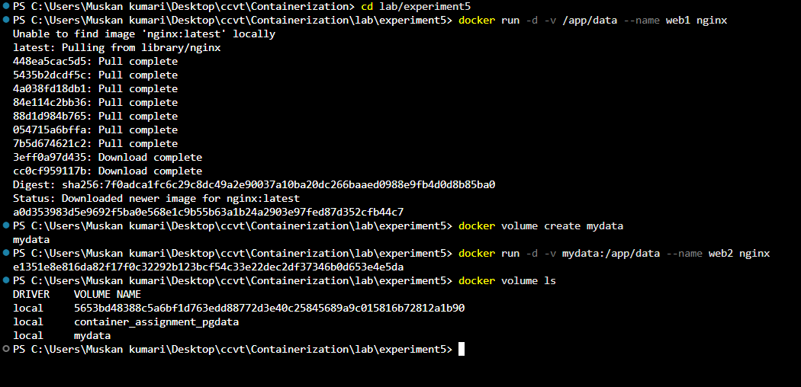
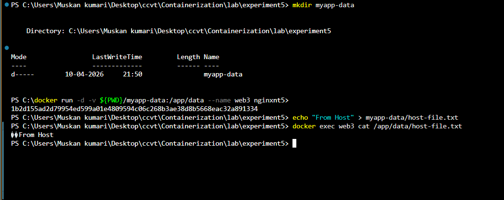
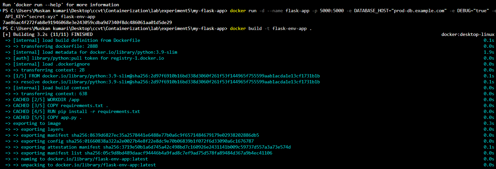
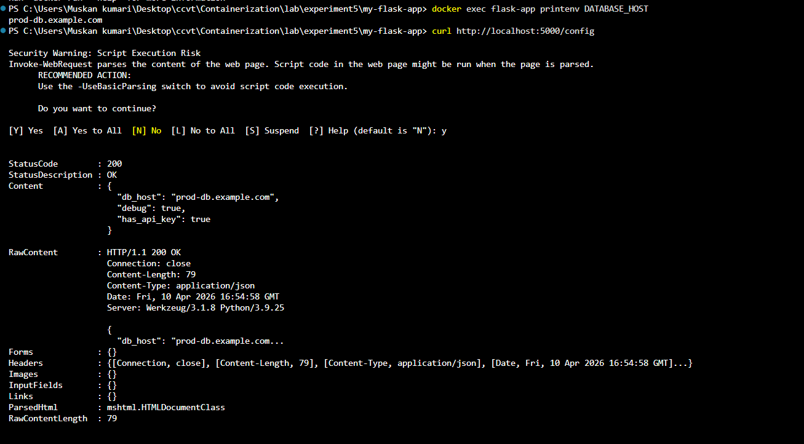
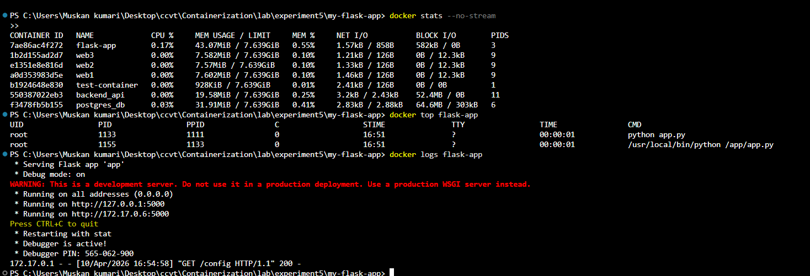
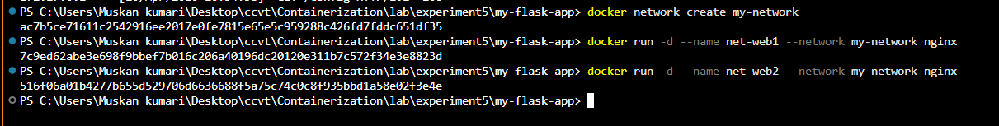
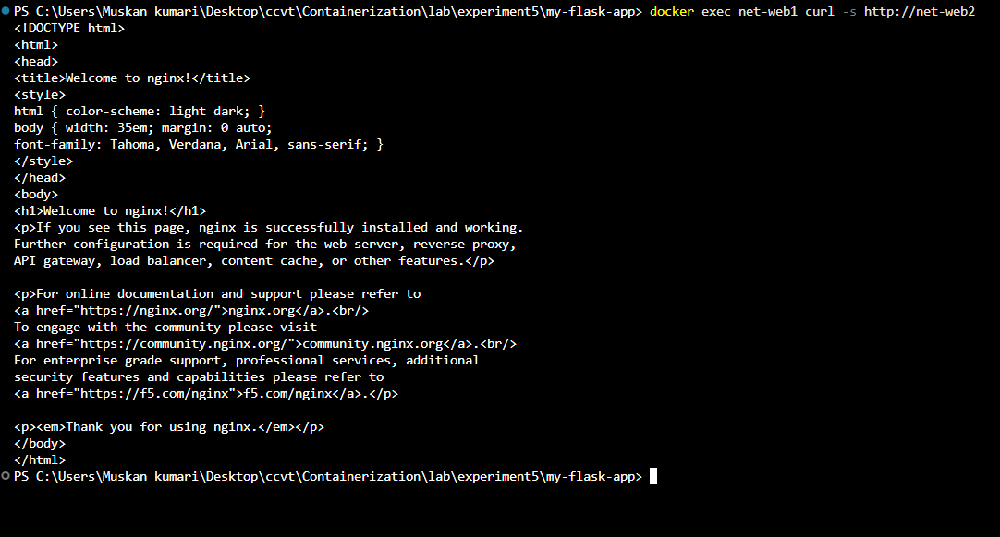
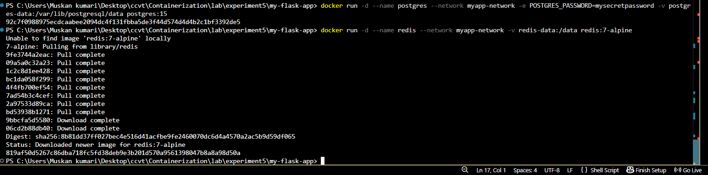
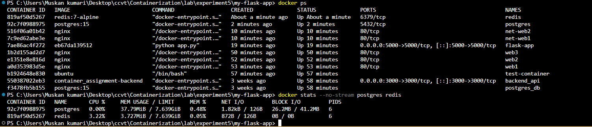
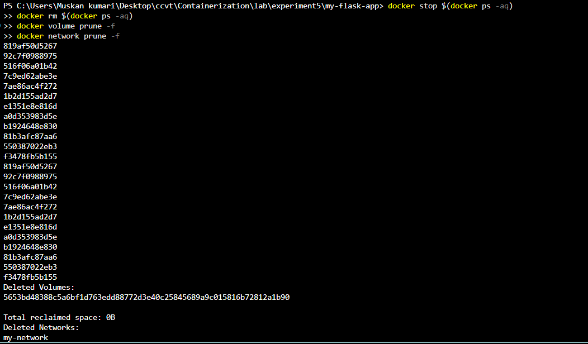

# Lab 5: Docker Volumes, Environment Variables, Monitoring & Networks

## Objective
Learn advanced Docker concepts including persistent data storage with volumes, application configuration with environment variables, container monitoring, and linking multiple containers using Docker networks.

---

## Part 1: Docker Volumes -- Persistent Data Storage

By default, data inside a container is ephemeral (lost when the container is removed). Volumes provide a way to safely persist data.

### 1. Anonymous & Named Volumes

```bash
docker run -d -v /app/data --name web1 nginx
docker volume create mydata
docker run -d -v mydata:/app/data --name web2 nginx
docker volume ls
```



### 2. Bind Mounts (Host Directory)

Bind mounts attach a specific directory on your host machine to a directory inside the container.

```bash
mkdir myapp-data
docker run -d -v ${PWD}/myapp-data:/app/data --name web3 nginx
echo "From Host" > myapp-data/host-file.txt
docker exec web3 cat /app/data/host-file.txt
```



---

## Part 2: Environment Variables

Environment variables allow us to pass configuration parameters into the container at runtime.

### 1. Building and Running a Flask App with ENV Vars

We built a custom Flask application that returns configuration data via a `/config` API endpoint.

**app.py**
```python
import os
from flask import Flask
app = Flask(__name__)

db_host = os.environ.get('DATABASE_HOST', 'localhost')
debug_mode = os.environ.get('DEBUG', 'false').lower() == 'true'
api_key = os.environ.get('API_KEY')

@app.route('/config')
def config():
    return {
        'db_host': db_host,
        'debug': debug_mode,
        'has_api_key': bool(api_key)
    }

if __name__ == '__main__':
    port = int(os.environ.get('PORT', 5000))
    app.run(host='0.0.0.0', port=port, debug=debug_mode)
```

**Dockerfile**
```dockerfile
FROM python:3.9-slim

ENV PYTHONUNBUFFERED=1
ENV PYTHONDONTWRITEBYTECODE=1

WORKDIR /app
COPY requirements.txt .
RUN pip install -r requirements.txt

COPY app.py .

ENV PORT=5000
ENV DEBUG=false

EXPOSE 5000
CMD ["python", "app.py"]
```

```bash
docker build -t flask-env-app .
docker run -d --name flask-app -p 5000:5000 \
  -e DATABASE_HOST="prod-db.example.com" \
  -e DEBUG="true" \
  -e API_KEY="secret-xyz" \
  flask-env-app
```



### 2. Testing Injected Environment Variables

We can verify that the environment variables were successfully passed into the running container.

```bash
docker exec flask-app printenv DATABASE_HOST
curl http://localhost:5000/config
```



---

## Part 3: Docker Monitoring

Monitoring allows us to keep track of resource usage, running processes, and application logs.

```bash
docker stats --no-stream
docker top flask-app
docker logs flask-app
```



### Automated Monitoring Script

We can automate these checks using a bash script (`monitor.sh`):

**monitor.sh**
```bash
#!/bin/bash

echo "=== Docker Monitoring Dashboard ==="
echo "Time: $(date)"

echo "1. Running Containers:"
docker ps --format "table {{.Names}}\t{{.Status}}\t{{.Ports}}"

echo "2. Resource Usage:"
docker stats --no-stream --format "table {{.Name}}\t{{.CPUPerc}}\t{{.MemUsage}}"

echo "3. Recent Events:"
docker events --since '5m' --until '0s' | tail

echo "4. System Info:"
docker system df
```

---

## Part 4: Docker Networks

Docker networks allow isolated containers to securely communicate with each other.

### 1. Creating a Network

We created a custom bridge network and attached two Nginx containers to it.

```bash
docker network create my-network
docker run -d --name net-web1 --network my-network nginx
docker run -d --name net-web2 --network my-network nginx
```



### 2. Internal Network Communication

Because they share a custom network, containers can communicate with each other using their container names as DNS addresses.

```bash
docker exec net-web1 curl -s http://net-web2
```



---

## Part 5: Real-World Example (Multi-Container Setup)

In a real-world scenario, we often have an application connected to a database and a cache layer, all residing on the same network.

### 1. Running Postgres and Redis on a Shared Network

```bash
docker network create myapp-network
docker run -d --name postgres --network myapp-network \
  -e POSTGRES_PASSWORD=mysecretpassword \
  -v postgres-data:/var/lib/postgresql/data postgres:15

docker run -d --name redis --network myapp-network \
  -v redis-data:/data redis:7-alpine
```



### 2. Verifying the Services

```bash
docker ps
docker stats --no-stream postgres redis
```



---

## Cleanup

```bash
docker stop $(docker ps -aq)
docker rm $(docker ps -aq)
docker volume prune -f
docker network prune -f
```



---

## Docker Commands Cheat Sheet

### Volumes
| Command | Description |
|---------|-------------|
| `docker volume create <name>` | Create a named volume |
| `docker run -v <volume>:/path` | Mount named volume |
| `docker run -v /host:/container` | Mount local bind |

### Environment Variables
| Command | Description |
|---------|-------------|
| `docker run -e VAR=value` | Inject single variable |
| `docker run --env-file .env` | Inject multiple from file |

### Monitoring
| Command | Description |
|---------|-------------|
| `docker stats` | Live resource usage |
| `docker top <container>` | process list inside container |
| `docker logs -f <container>` | Follow container logs |

### Networks
| Command | Description |
|---------|-------------|
| `docker network create <name>` | Create custom network |
| `docker run --network <name>` | Run container on network |

---

## Key Takeaways

1. **Volumes persist data** safely outside the container lifecycle.
2. **Env variables configure apps** without modifying the actual code or image.
3. **Monitoring helps debugging** performance, memory issues, and hidden errors.
4. **Networks enable communication** securely via DNS isolation between containers.
5. Use **named volumes in production** for database persistence.
6. Use **custom networks** for multi-container applications instead of linking containers manually.

---

