```markdown
<h2 align="center">Experiment 6: Docker Run vs Docker Compose</h2>

This experiment compares the imperative (`docker run`) and declarative (`docker-compose.yml`) approaches for container deployment. It covers single‑container setups, multi‑container applications (WordPress + MySQL), building custom images, resource limits, and an introduction to scaling with Docker Swarm.

---

## 📁 Table of Contents

- [Part A – Theory](#part-a--theory)
- [Part B – Practical Tasks](#part-b--practical-tasks)
  - [Task 1: Single Container Comparison (Nginx)](#task-1-single-container-comparison-nginx)
  - [Task 2: Multi-Container Application (WordPress + MySQL)](#task-2-multi-container-application-wordpress--mysql)
- [Part C – Conversion & Build‑Based Tasks](#part-c--conversion--build-based-tasks)
  - [Task 3: Convert Docker Run to Compose (WebApp)](#task-3-convert-docker-run-to-compose-webapp)
  - [Task 4: Resource Limits Conversion](#task-4-resource-limits-conversion)
  - [Task 5: Replace Standard Image with Dockerfile (Node.js)](#task-5-replace-standard-image-with-dockerfile-nodejs)
  - [Task 6: Multi‑Stage Dockerfile with Compose (Challenge)](#task-6-multi-stage-dockerfile-with-compose-challenge)
- [Part D – Multi‑Container WordPress Stack (Detailed)](#part-d--multi-container-wordpress-stack-detailed)
- [Scaling in Compose vs Swarm](#scaling-in-docker-compose-vs-docker-swarm)
- [Cleanup Commands](#cleanup-commands)
- [Key Takeaways](#key-takeaways)

---

## Part A – Theory

### 1. Objective
To understand the relationship between `docker run` and Docker Compose, compare their syntax, and learn when to use each approach.

### 2.1 Docker Run (Imperative Approach)
`docker run` creates and starts a container with explicit flags: `-p`, `-v`, `-e`, `--network`, `--restart`, `--memory`, `--cpus`, `--name`.

**Example:**
```bash
docker run -d --name my-nginx -p 8080:80 -v ./html:/usr/share/nginx/html -e NGINX_HOST=localhost --restart unless-stopped nginx:alpine
```

### 2.2 Docker Compose (Declarative Approach)
Uses a YAML file (`docker-compose.yml`) to define services, networks, and volumes.  
Start everything with: `docker compose up -d`

**Equivalent Compose file:**
```yaml
version: '3.8'
services:
  nginx:
    image: nginx:alpine
    container_name: my-nginx
    ports: ["8080:80"]
    volumes: ["./html:/usr/share/nginx/html"]
    environment:
      NGINX_HOST: localhost
    restart: unless-stopped
```

### 3. Mapping: Docker Run vs Docker Compose

| docker run flag          | docker-compose.yml equivalent               |
|--------------------------|---------------------------------------------|
| `-p 8080:80`             | `ports: - "8080:80"`                        |
| `-v ./html:/usr/share/...` | `volumes: - ./html:/usr/share/...`        |
| `-e VAR=value`           | `environment: VAR: value`                   |
| `--network mynet`        | `networks: - mynet`                         |
| `--restart always`       | `restart: always`                           |
| `--name myapp`           | `container_name: myapp`                     |
| `--memory 256m --cpus 0.5` | `deploy: resources: limits: cpus: '0.5' memory: 256m` |

### 4. Advantages of Docker Compose
1. Simplifies multi‑container applications  
2. Reproducibility and version control  
3. Unified lifecycle management (`up`, `down`, `logs`, `ps`)  
4. Supports service scaling (`docker compose up --scale web=3`)

---

## Part B – Practical Tasks

### Task 1: Single Container Comparison (Nginx)

**Step 1 – Run Nginx using `docker run`**
```bash
docker run -d --name lab-nginx -p 8081:80 -v $(pwd)/html:/usr/share/nginx/html nginx:alpine
docker ps
```
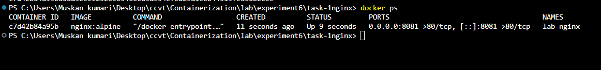

Access `http://localhost:8081` → you should see the Nginx welcome page.

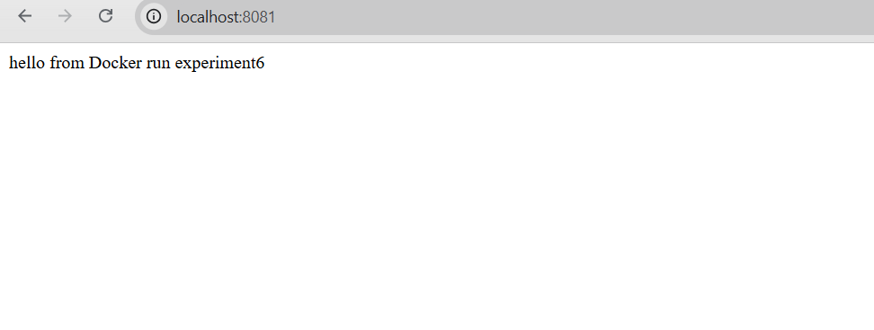

Stop and remove:
```bash
docker stop lab-nginx && docker rm lab-nginx
```

**Step 2 – Same setup using Docker Compose**

Create `docker-compose.yml`:
```yaml
version: '3.8'
services:
  nginx:
    image: nginx:alpine
    container_name: lab-nginx
    ports: ["8081:80"]
    volumes: ["./html:/usr/share/nginx/html"]
```
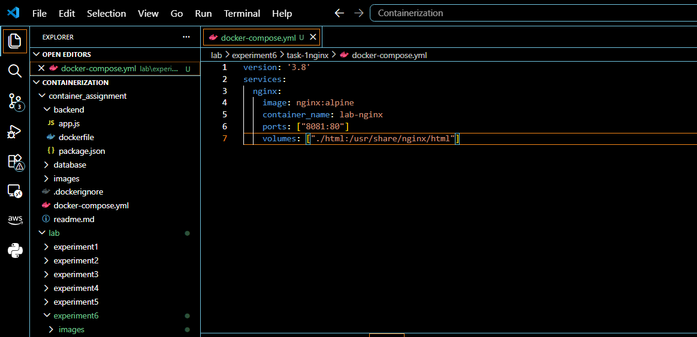

Run:
```bash
docker compose up -d
docker compose ps
```
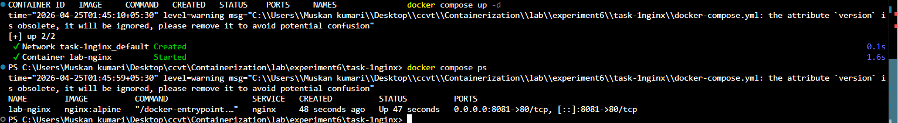

Stop:
```bash
docker compose down
```

---

### Task 2: Multi-Container Application (WordPress + MySQL)

**A. Using `docker run` (manual network)** – not shown in screenshots but described in PDF.

**B. Using Docker Compose**

Create `docker-compose.yml` inside `task2-wordpress/wp-compose`:
```yaml
version: '3.8'
services:
  mysql:
    image: mysql:5.7
    container_name: mysql
    restart: always
    environment:
      MYSQL_ROOT_PASSWORD: secret
      MYSQL_DATABASE: wordpress
      MYSQL_USER: wpuser
      MYSQL_PASSWORD: wppass
    volumes:
      - mysql_data:/var/lib/mysql
  wordpress:
    image: wordpress:latest
    container_name: wordpress
    ports: ["8082:80"]
    environment:
      WORDPRESS_DB_HOST: mysql:3306
      WORDPRESS_DB_USER: wpuser
      WORDPRESS_DB_PASSWORD: wppass
      WORDPRESS_DB_NAME: wordpress
    depends_on: [mysql]
volumes:
  mysql_data:
```
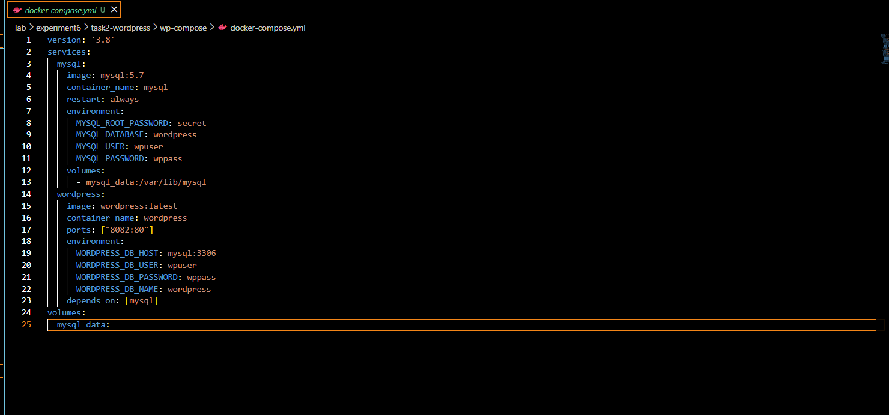

Run:
```bash
docker compose up -d
docker ps
```
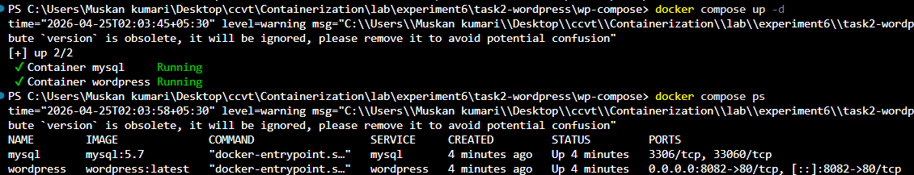

MySQL logs during startup:
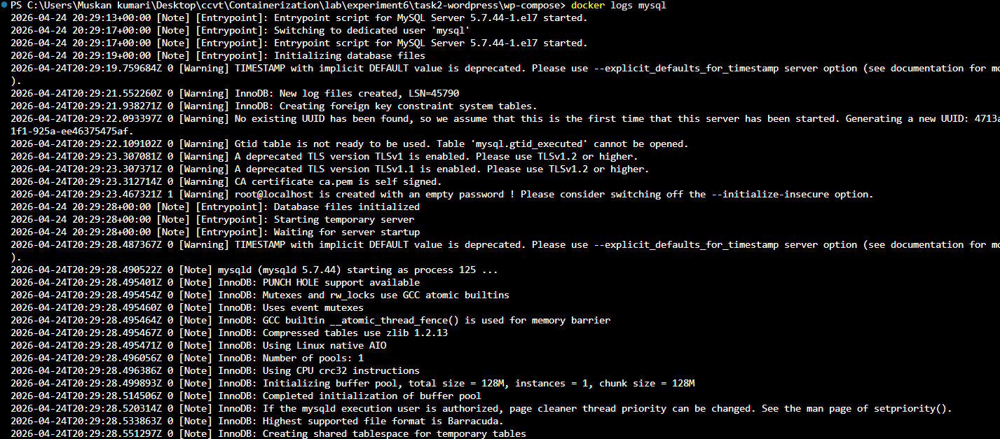

Access `http://localhost:8082` → WordPress installation screen:
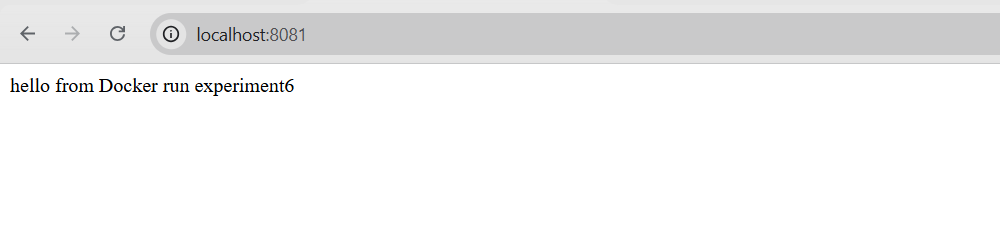

Stop and remove everything (including volumes):
```bash
docker compose down -v
```

---

## Part C – Conversion & Build‑Based Tasks

### Task 3: Convert Docker Run to Compose (WebApp)

**Given run command:**
```bash
docker run -d --name webapp -p 5000:5000 -e APP_ENV=production -e DEBUG=false --restart unless-stopped node:18-alpine
```

**Equivalent `docker-compose.yml` (task3-webapp):**
```yaml
version: '3.8'
services:
  webapp:
    image: node:18-alpine
    container_name: webapp
    ports: ["5000:5000"]
    command: ["node", "-e", "require('http').createServer((req, res) => res.end('Hello from WebApp')).listen(5000)"]
    restart: unless-stopped
```
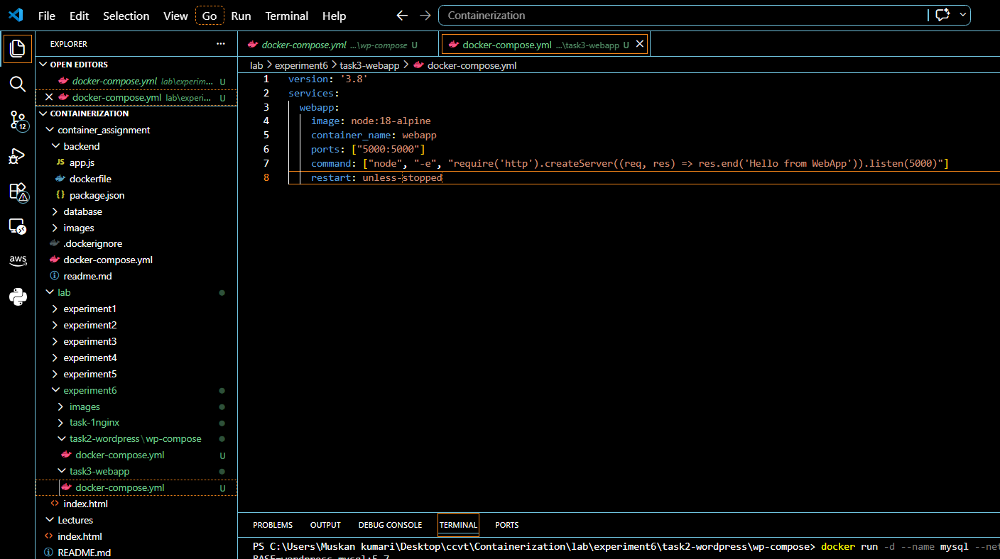

Run:
```bash
docker compose up -d
docker compose ps
```
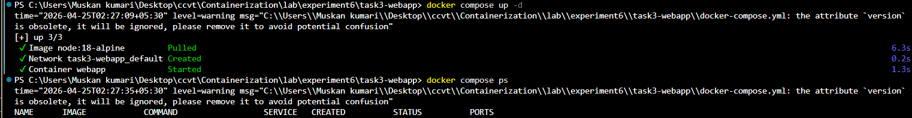

Test:
```bash
curl http://localhost:5000
```
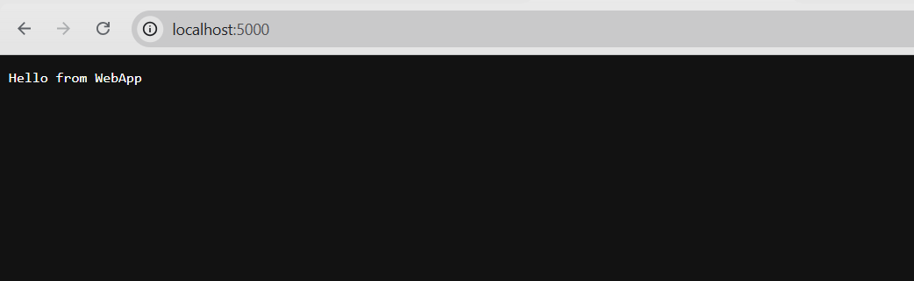

**Project structure overview:**  
The screenshot below shows the folder layout with multiple compose files for different tasks.
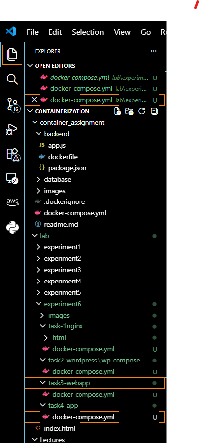

### Task 4: Resource Limits Conversion

**Given run command:**
```bash
docker run -d --name limited-app -p 9000:9000 --memory=256m --cpus=0.5 --restart always nginx:alpine
```

**Compose file (task4-app):**
```yaml
version: '3.8'
services:
  app:
    image: nginx:alpine
    container_name: limited-app
    ports: ["9000:9000"]
    deploy:
      resources:
        limits:
          cpus: '0.5'
          memory: 256m
    restart: always
```
Run:
```bash
docker compose up -d
docker ps
```
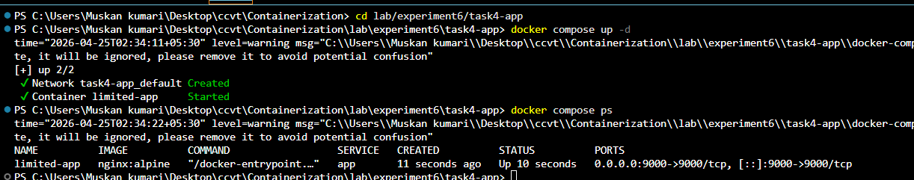

> **Note:** `deploy` resource limits are fully respected in Swarm mode. In standard Compose they may be ignored; use `--compatibility` or runtime flags if needed.

### Task 5: Replace Standard Image with Dockerfile (Node.js)

**Step 1 – Create `app.js`:**
```javascript
const http = require('http');
http.createServer((req, res) => {
  res.end("Docker Compose Build Lab");
}).listen(3000);
```
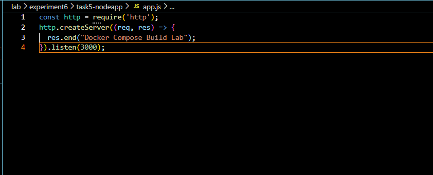

**Step 2 – Create `Dockerfile`:**
```dockerfile
FROM node:18-alpine
WORKDIR /app
COPY app.js .
EXPOSE 3000
CMD ["node", "app.js"]
```
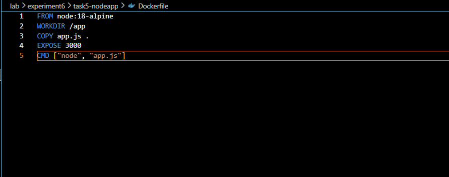

**Step 3 – Create `docker-compose.yml`:**
```yaml
version: '3.8'
services:
  nodeapp:
    build: .
    container_name: custom-node-app
    ports: ["3000:3000"]
```
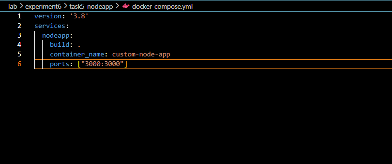

**Build and run:**
```bash
docker compose up --build -d
```
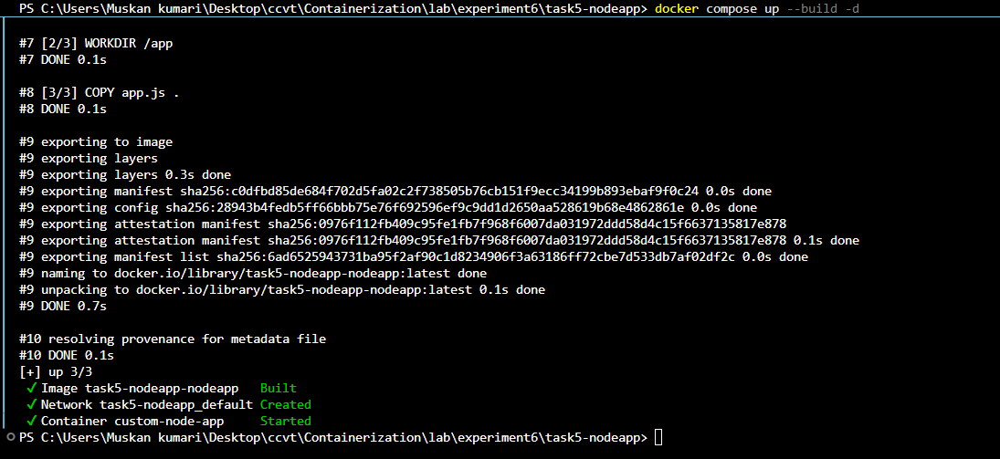

Verify at `http://localhost:3000`.  
Change the message in `app.js`, then rebuild: `docker compose up --build -d`

**Additional command:** use `docker compose build` to only build images.
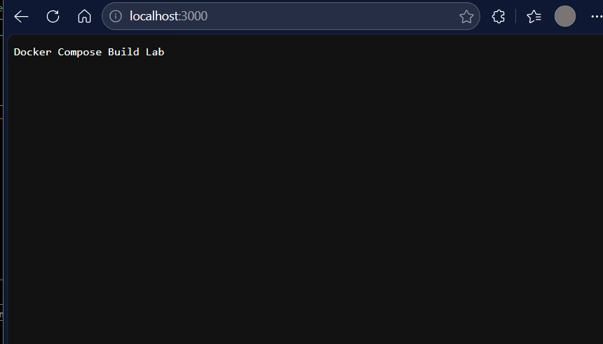

**Difference between `image:` and `build:`**  
- `image:` uses a pre‑existing image.  
- `build:` tells Compose to build an image from a Dockerfile in the specified context.

### Task 6: Multi‑Stage Dockerfile with Compose (Challenge)

Create a multi‑stage Dockerfile for a Python FastAPI app (or Node.js) that uses a builder stage and a lean final stage. Build with Compose (`build: .`), add environment variables and a development volume mount. Compare image sizes:
```bash
docker images
```

---

## Part D – Multi‑Container WordPress Stack (Detailed)

### Architecture
- WordPress container (PHP/Apache)  
- MySQL container  
- Custom network for internal DNS  
- Volumes for persistent database and WordPress files

### `docker-compose.yml` (full version with named volumes)
```yaml
version: '3.9'
services:
  db:
    image: mysql:5.7
    container_name: wordpress_db
    restart: always
    environment:
      MYSQL_ROOT_PASSWORD: rootpass
      MYSQL_DATABASE: wordpress
      MYSQL_USER: wpuser
      MYSQL_PASSWORD: wppass
    volumes:
      - db_data:/var/lib/mysql
  wordpress:
    image: wordpress:latest
    container_name: wordpress_app
    depends_on: [db]
    ports: ["8080:80"]
    restart: always
    environment:
      WORDPRESS_DB_HOST: db:3306
      WORDPRESS_DB_USER: wpuser
      WORDPRESS_DB_PASSWORD: wppass
      WORDPRESS_DB_NAME: wordpress
    volumes:
      - wp_data:/var/www/html
volumes:
  db_data:
  wp_data:
```

Start and verify:
```bash
docker compose up -d
docker ps
```

Access `http://localhost:8080` to complete WordPress installation.  
Volumes persist after `docker compose down`. Remove them with `docker compose down -v`.

---

## Scaling in Docker Compose vs Docker Swarm

### Compose scaling (single host, no load balancing)
```bash
docker compose up --scale wordpress=3
```
**Problem:** Port conflict.  
**Solution:** Use a reverse proxy (Nginx) or Swarm.

### Docker Swarm (production)
```bash
docker swarm init
docker stack deploy -c docker-compose.yml wpstack
docker service scale wpstack_wordpress=3
```

| Feature                | Docker Compose           | Docker Swarm                 |
|------------------------|--------------------------|------------------------------|
| Scope                  | Single host              | Multi‑node cluster           |
| Scaling                | Manual (`--scale`)       | Built‑in (`service scale`)   |
| Load balancing         | No                       | Yes (internal ingress)       |
| Self‑healing           | No                       | Yes                          |
| Rolling updates        | No                       | Yes                          |

---

## Cleanup Commands

```bash
# Stop and remove containers, networks, and volumes (if -v added)
docker compose down -v

# Remove all unused resources
docker volume prune -f
docker network prune -f
docker image prune -f

# Leave Swarm mode if initialized
docker swarm leave --force
```

---

## Key Takeaways

- **`docker run`** = imperative, good for quick tests.  
- **Docker Compose** = declarative, ideal for multi‑service apps.  
- **Builds** integrated via `build:` in Compose.  
- **Multi‑stage Dockerfiles** produce smaller images.  
- **Scaling** requires Swarm (or Kubernetes) for production.  
- **Volumes** ensure data persistence.  

---

*This experiment covers the complete spectrum from single‑container runs to production‑orchestrated stacks using Docker Compose and Swarm.*

**Author:** Raman kumar  
**Date:** April 24, 2026
```

**Instructions for GitHub:**
1. Create an `Images/` folder inside `Experiment-6/`.
2. Copy **all** screenshot files (`1.png` … `18.png`) into `Images/`.
3. Ensure that the directory structure matches the one shown in `12.png` (task1-nginx, task2-wordpress, task3-webapp, task4-app, task5-nodeapp folders).
4. Push the `README.md` together with your code files.

Now every image is properly referenced and the README is fully self‑contained.