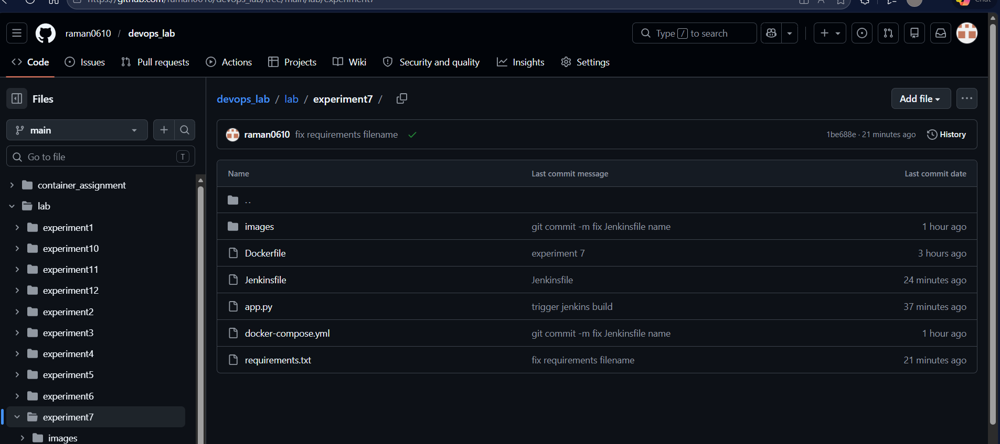
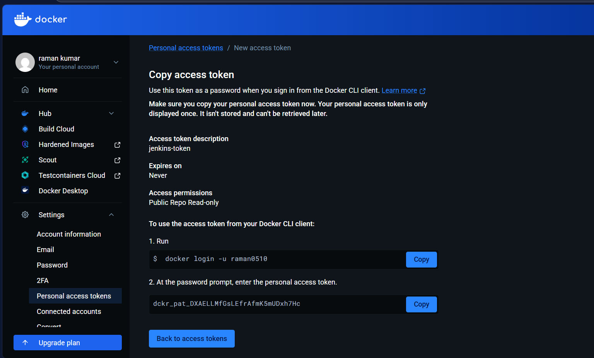
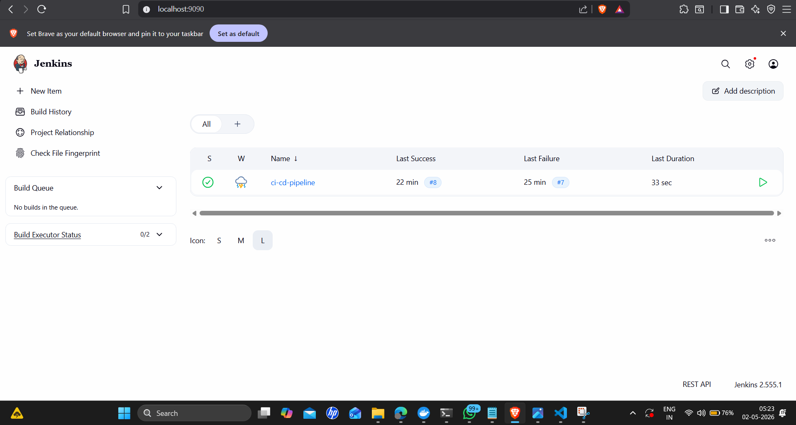
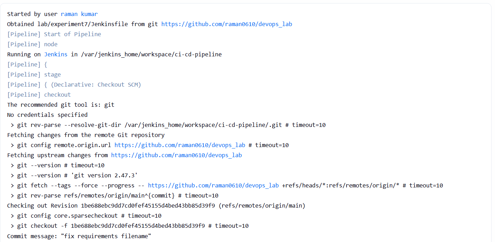
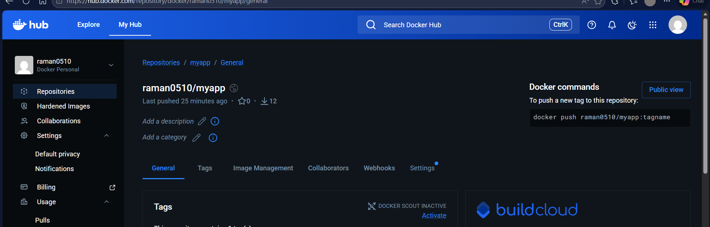
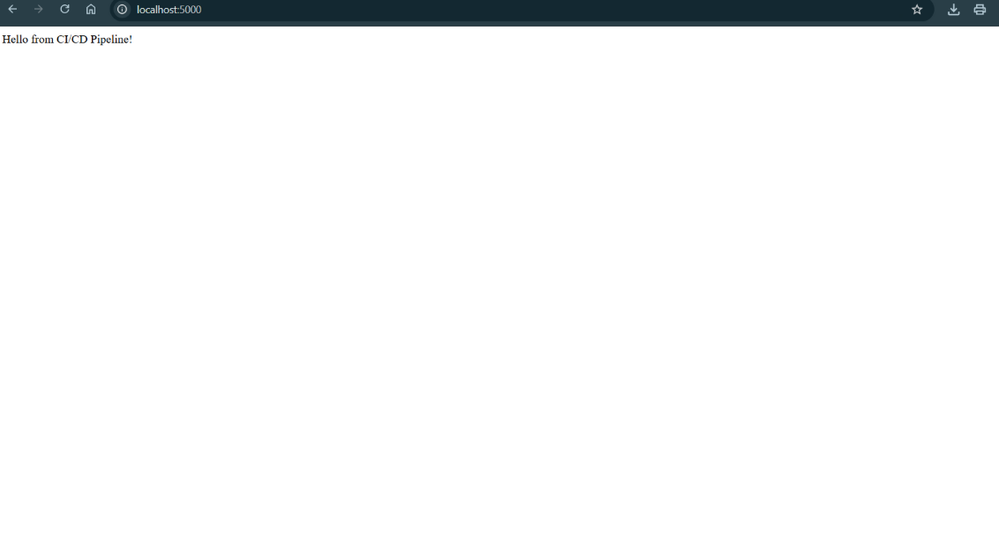
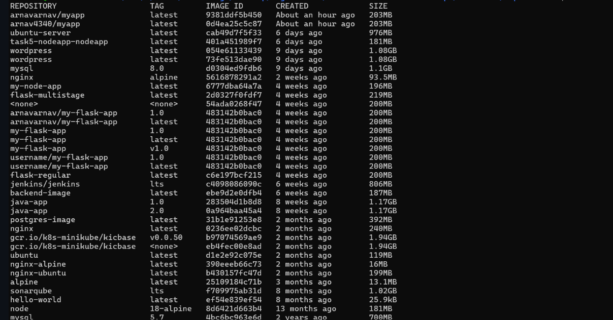

```markdown
# Lab Experiment 7: CI/CD using Jenkins, GitHub and Docker Hub

## Aim
To design and implement a complete CI/CD pipeline using Jenkins, integrating source code from GitHub, and building & pushing Docker images to Docker Hub.

## Objectives
- Understand CI/CD workflow using Jenkins (GUI-based tool)
- Create a structured GitHub repository with application + Jenkinsfile
- Build Docker images from source code
- Securely store Docker Hub credentials in Jenkins
- Automate build & push process using webhook triggers
- Use same host (Docker) as Jenkins agent

## Prerequisites
- Docker & Docker Compose installed
- GitHub account
- Docker Hub account
- Basic Linux command knowledge

---

## Step-by-Step Implementation

### 1. GitHub Repository Setup
A repository `devops_lab` was created with the following structure:

- **app.py** – Simple Flask web server
- **requirements.txt** – Python dependencies (Flask)
- **Dockerfile** – Build instructions for the Docker image
- **Jenkinsfile** – Pipeline definition (stored in `lab/experiment7/Jenkinsfile`)



### 2. Docker Hub Access Token
A personal access token was generated on Docker Hub with **Public Repo Read-only** permissions.  
This token is used by Jenkins to authenticate securely without hardcoding passwords.



> ⚠️ **Security Note:** The token is redacted in any public documentation. Jenkins stores it as a credential and never exposes it in logs.

### 3. Jenkins Setup with Docker
Jenkins was started as a container using the following `docker-compose.yml`:

```yaml
version: '3.8'
services:
  jenkins:
    image: jenkins/jenkins:lts
    container_name: jenkins
    restart: always
    ports:
      - "8080:8080"
      - "50000:50000"
    volumes:
      - jenkins_home:/var/jenkins_home
      - /var/run/docker.sock:/var/run/docker.sock
    user: root
volumes:
  jenkins_home:
```

- Access Jenkins at `http://<host-ip>:8080`
- Unlock with the initial admin password:
  ```bash
  docker exec -it jenkins cat /var/jenkins_home/secrets/initialAdminPassword
  ```
- Install suggested plugins and create an admin user.

### 4. Jenkins Configuration

#### 4.1 Docker Hub Credentials
- Navigate to **Manage Jenkins → Credentials → Add Credentials**
- Kind: **Secret text**
- ID: `dockerhub-token`
- Secret: *your Docker Hub access token*

#### 4.2 Pipeline Job
- Create a **Pipeline** job named `ci-cd-pipeline`
- Definition: **Pipeline script from SCM**
- SCM: Git  
  Repository URL: `https://github.com/raman0610/devops_lab`
- Script Path: `lab/experiment7/Jenkinsfile`



### 5. GitHub Webhook
- In the GitHub repository settings, add a webhook:
  - Payload URL: `http://<jenkins-ip>:8080/github-webhook/`
  - Content type: `application/json`
  - Events: **Just the push event**
- This triggers Jenkins automatically on every code push.

### 6. Pipeline Execution (Full Flow)
After a code push, the webhook triggers the pipeline. The console output shows:

1. **Clone Source** – Jenkins pulls the latest code
2. **Build Docker Image** – `docker build -t raman0510/myapp:latest .`
3. **Login to Docker Hub** – securely using the stored token
4. **Push Image** – `docker push raman0510/myapp:latest`



The image is then available on Docker Hub.



### 7. Verification
The application can be run locally with:

```bash
docker run -d -p 80:80 raman0510/myapp:latest
```

Accessing `http://localhost` displays the expected message:



Local Docker images list confirms the built image:



---

## Observations
- Jenkins GUI simplifies management while the pipeline remains fully code‑driven.
- GitHub acts as both the source code repository and the pipeline definition store.
- Docker ensures consistent builds and easy deployment.
- Webhooks make the CI/CD process fully automatic.
- The Docker socket mount (`/var/run/docker.sock`) allows Jenkins to control the host Docker daemon directly, eliminating the need for a separate agent.

## Result
A complete CI/CD pipeline was successfully implemented:
- Source code and Jenkinsfile are maintained in GitHub.
- Jenkins automatically detects changes via webhook.
- Docker image is built on the same host and securely pushed to Docker Hub.

---

## Viva Questions & Answers

1. **What is the role of Jenkinsfile?**  
   A Jenkinsfile is a text file that defines the entire CI/CD pipeline as code (Pipeline as Code). It specifies stages, steps, and configurations, making the pipeline version‑controlled and repeatable.

2. **How does Jenkins integrate with GitHub?**  
   Jenkins uses a Git plugin to clone repositories. Webhooks notify Jenkins of new commits, triggering pipeline execution automatically.

3. **Why is Docker used in CI/CD?**  
   Docker creates isolated, consistent build environments. The same Dockerfile can be used to build, test, and deploy, ensuring the application runs identically everywhere.

4. **What is a webhook?**  
   A webhook is an HTTP callback that notifies an external service (Jenkins) when an event (e.g., push) occurs in the repository. It enables real‑time automation.

5. **Why store the Docker Hub token in Jenkins credentials?**  
   Storing secrets in Jenkins credentials prevents hardcoding sensitive information in source code or pipeline scripts, improving security and manageability.

6. **What is the benefit of using the same host as agent?**  
   Mounting the Docker socket into Jenkins allows the Jenkins container to directly control the host’s Docker daemon. This simplifies the architecture, avoids additional agent machines, and speeds up build processes.

---

## Key Takeaways
- Jenkins pipelines follow a `pipeline → stages → stage → steps` structure.
- The `withCredentials` block safely injects secrets into the build environment for the duration of a step.
- Always use the credentials store – never hardcode passwords or tokens.
- A webhook makes the entire pipeline truly automatic after every code change.
```