## Experiment 9:Docker –Ansible – Agentless Configuration Management

<hr>

<h4 align="center">Ansible – Agentless Configuration Management</h4>

<hr>

This experiment demonstrates how Ansible solves infrastructure management problems through agentless automation, idempotent playbooks, and declarative YAML syntax. We will set up a control node (WSL/Ubuntu), create four Docker containers as managed servers, and use Ansible to configure them consistently.

---

## 📁 Table of Contents

- [What is Ansible?](#what-is-ansible)
- [Key Concepts](#key-concepts)
- [How Ansible Works](#how-ansible-works)
- [Benefits of Ansible](#benefits-of-using-ansible)
- [Part A – Ansible Installation & Demo](#part-a--ansible-installation--demo)
  - [Installation via apt](#1-installation-via-apt-debianubuntu)
  - [Post‑Installation Test](#3-post-installation-test)
- [Part B – Setting Up Docker Containers as Managed Nodes](#part-b--setting-up-docker-containers-as-managed-nodes)
  - [1. Generate SSH Key Pair](#1-create-ssh-key-pair-in-wsl)
  - [2. Create Dockerfile with OpenSSH Server](#2-create-dockerfile-for-ubuntu-ssh-server)
  - [3. Build the Docker Image](#3-build-the-docker-image)
  - [4. Run Four SSH Server Containers](#4-run-the-docker-containers)
- [Part C – Ansible Inventory & Connectivity Test](#part-c--ansible-inventory--connectivity-test)
  - [Create Inventory File](#step-2-create-ansible-inventory)
  - [Test Connectivity with `ansible ping`](#step-4-test-connectivity)
- [Part D – Writing and Running Playbooks](#part-d--writing-and-running-playbooks)
  - [Example Playbook: `playbook1.yml`](#example-playbook-playbook1yml)
  - [Running the Playbook](#running-the-playbook)
  - [Ad‑Hoc Command to Verify](#ad-hoc-command-to-verify)
- [Cleanup](#cleanup)
- [Key Takeaways](#key-takeaways)

---

## What is Ansible?

Ansible is an open‑source automation tool for configuration management, application deployment, and orchestration. It follows an **agentless architecture** (uses SSH for Linux, WinRM for Windows) and uses **YAML‑based playbooks** to define automation tasks.

## Key Concepts

| Concept        | Description                                                                 |
|----------------|-----------------------------------------------------------------------------|
| Control Node   | Machine with Ansible installed (e.g., your WSL/Ubuntu)                      |
| Managed Nodes  | Target servers (no Ansible agent required)                                  |
| Inventory      | File listing managed nodes (e.g., `inventory.ini`)                          |
| Playbooks      | YAML files containing sequences of automation tasks                         |
| Modules        | Units of code Ansible executes (e.g., `ping`, `apt`, `copy`)                |
| Idempotency    | Running a playbook multiple times yields the same result                    |

## How Ansible Works

- **Agentless** – No extra software on managed nodes.
- **Push‑based** – Control node initiates changes over SSH.
- **Declarative** – You describe the desired state; Ansible figures out the steps.

## Benefits of Using Ansible

- Free and open‑source, battle‑tested.
- Easy to start – no special coding skills.
- Simple deployment workflow, no agents.
- Idempotent, predictable, and secure.

---

## Part A – Ansible Installation & Demo

### 1. Installation via apt (Debian/Ubuntu)

```bash
sudo apt update -y
sudo apt install ansible -y
ansible --version
```

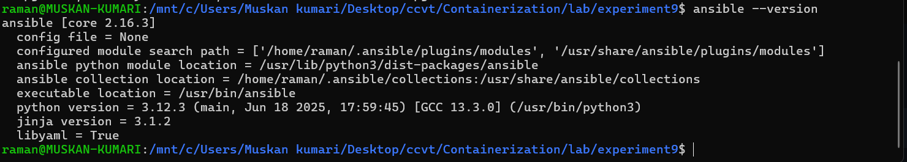

### 3. Post‑Installation Test

Test with a local ping:

```bash
ansible localhost -m ping
```

Expected output:
```
localhost | SUCCESS => { "changed": false, "ping": "pong" }
```

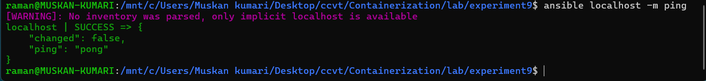

---

## Part B – Setting Up Docker Containers as Managed Nodes

We will create a custom Ubuntu image with OpenSSH server, then run four containers as our managed servers.

### 1. Create SSH Key Pair in WSL

Generate a 4096‑bit RSA key pair (accept default paths, empty passphrase):

```bash
ssh-keygen -t rsa -b 4096
```

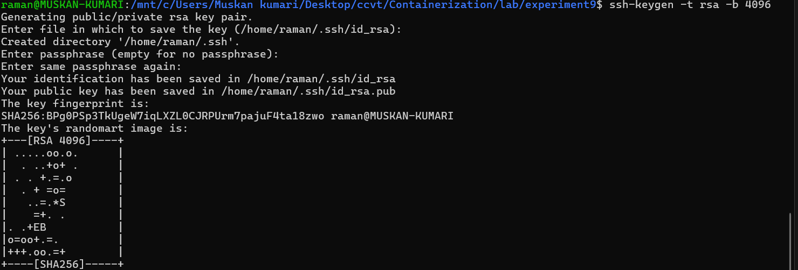

Copy the public and private keys to the experiment directory:

```bash
cp ~/.ssh/id_rsa .
cp ~/.ssh/id_rsa.pub .
```

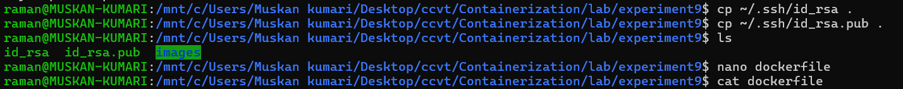

### 2. Create Dockerfile for Ubuntu SSH Server

Create a `Dockerfile` with the following content:

```dockerfile
FROM ubuntu

RUN apt update -y
RUN apt install -y python3 python3-pip openssh-server

RUN mkdir -p /var/run/sshd

RUN mkdir -p /run/sshd && \
  echo 'root:password' | chpasswd && \
  sed -i 's/#PermitRootLogin prohibit-password/PermitRootLogin yes/' /etc/ssh/sshd_config && \
  sed -i 's/#PasswordAuthentication yes/PasswordAuthentication no/' /etc/ssh/sshd_config && \
  sed -i 's/#PubkeyAuthentication yes/PubkeyAuthentication yes/' /etc/ssh/sshd_config

RUN mkdir -p /root/.ssh && chmod 700 /root/.ssh

COPY id_rsa /root/.ssh/id_rsa
COPY id_rsa.pub /root/.ssh/authorized_keys

RUN chmod 600 /root/.ssh/id_rsa && \
  chmod 644 /root/.ssh/authorized_keys

RUN sed -i 's@session\s*required\s*pam_loginuid.so@session optional pam_loginuid.so@g' /etc/pam.d/sshd

EXPOSE 22

CMD ["/usr/sbin/sshd", "-D"]
```

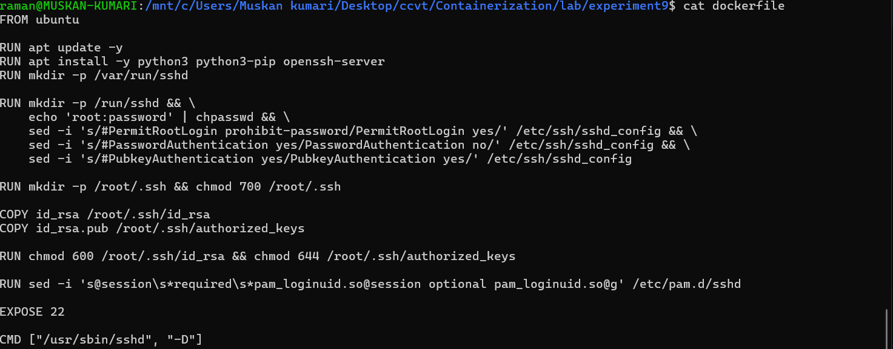

### 3. Build the Docker Image

```bash
docker build -t ubuntu-server .
```

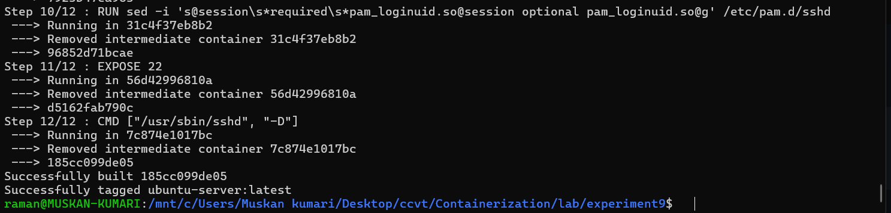

### 4. Run Four SSH Server Containers

Start four containers with mapped SSH ports 2201–2204:

```bash
for i in {1..4}; do
  echo "Creating server${i} on port 220${i}"
  docker run -d --rm -p 220${i}:22 --name server${i} ubuntu-server
done
```

Verify containers are running:

```bash
docker ps
```

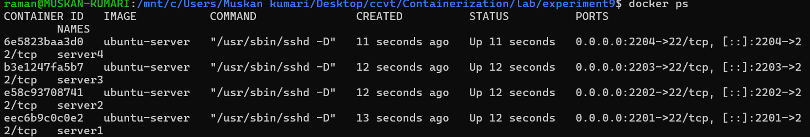

---

## Part C – Ansible Inventory & Connectivity Test

### Step 2: Create Ansible Inventory

Create `inventory.ini` with the four servers (using localhost and mapped ports):

```ini
[servers]
server1  ansible_host=localhost  ansible_port=2201
server2  ansible_host=localhost  ansible_port=2202
server3  ansible_host=localhost  ansible_port=2203
server4  ansible_host=localhost  ansible_port=2204

[servers:vars]
ansible_user=root
ansible_ssh_private_key_file=./id_rsa
ansible_python_interpreter=/usr/bin/python3
```

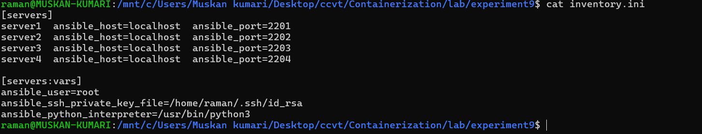

### Step 4: Test Connectivity

Run an Ansible ping to all servers:

```bash
ansible all -i inventory.ini -m ping
```

You may be prompted to accept host keys; answer `yes`. The output should show `"ping": "pong"` for each server.

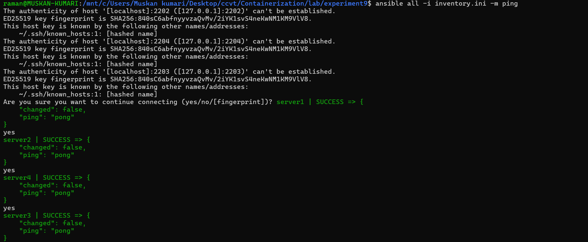

---

## Part D – Writing and Running Playbooks

### Example Playbook: `playbook1.yml`

Create a playbook that:
- Updates apt cache
- Installs packages (`vim`, `curl`, `wget`)
- Creates a test file on each server

```yaml
---
- name: Configure multiple servers
  hosts: servers
  become: yes

  tasks:
    - name: Update apt package index
      apt:
        update_cache: yes

    - name: Install packages
      apt:
        name: ["vim", "curl", "wget"]
        state: present

    - name: Create test file
      copy:
        dest: /root/ansible_test.txt
        content: "Configured by Ansible on {{ inventory_hostname }}"
```

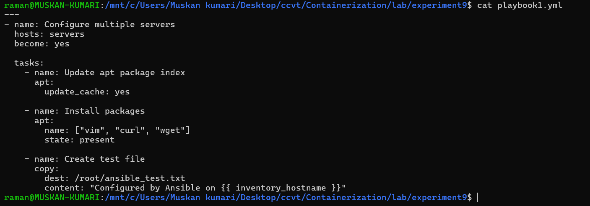

### Running the Playbook

```bash
ansible-playbook -i inventory.ini playbook1.yml
```

### Ad‑Hoc Command to Verify

Check the content of the created file on all servers:

```bash
ansible all -i inventory.ini -m command -a "cat /root/ansible_test.txt"
```

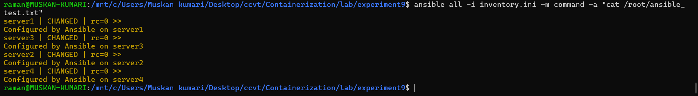

Each server shows its own name, proving that Ansible configured them individually.

---

## Cleanup

Stop and remove the four server containers:

```bash
for i in {1..4}; do
  docker stop server${i}
done
```

Remove the Docker image (optional):

```bash
docker rmi ubuntu-server
```

---

## Key Takeaways

- **Ansible is agentless** – only requires SSH access to managed nodes.
- **Inventory** defines which hosts to manage.
- **Playbooks** (YAML) are declarative and idempotent.
- **Modules** like `ping`, `apt`, `copy` provide reusable functionality.
- **Ad‑hoc commands** are great for quick checks (`ansible -m command -a`).
- Using Docker containers as managed nodes is an excellent way to learn Ansible without physical or cloud servers.

---

*This experiment demonstrates how Ansible solves configuration drift and enables scalable, consistent server management.*

**Author:** Raman kumar
```

**Instructions for GitHub:**
1. Create an `Images/` folder inside `Experiment-9/`.
2. Copy all screenshot files (`1.png` … `10.png`, `12.png`, and optionally the folder structure image if you want to include it) into `Images/`.
3. Place the , `Dockerfile`, `id_rsa`, `id_rsa.pub`, `inventory.ini`, and `playbook1.yml` in the same directory (the keys can be omitted from the repository for security; the README explains how to generate them).
4. Push to GitHub.

Now your Ansible experiment documentation is ready, properly formatted, and includes all referenced images.