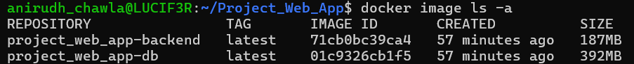
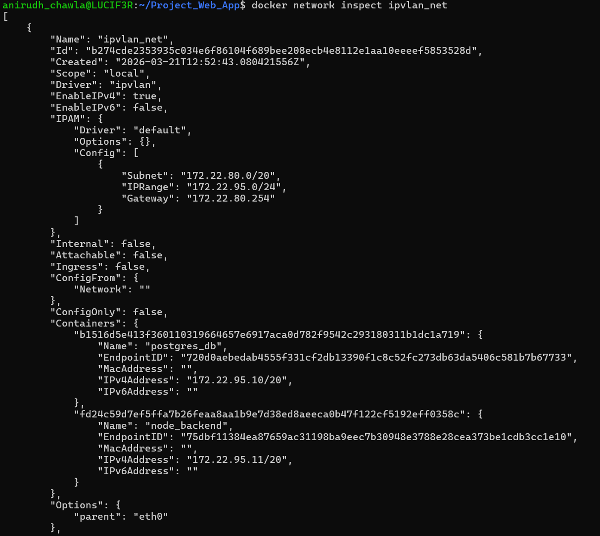
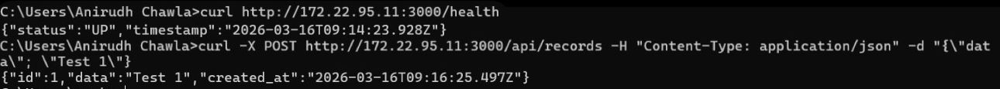
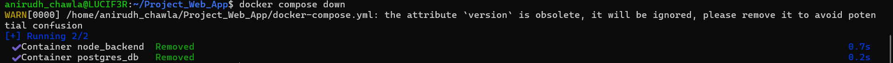
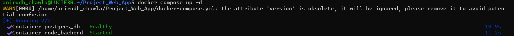

---

# Report: Containerized Web Application with PostgreSQL using Docker Compose and Ipvlan

**Date:** March 16, 2026

## Table of Contents
1.  [Objective](#1-objective)
2.  [System Architecture & Design](#2-system-architecture--design)
    *   [Component Overview](#component-overview)
    *   [Network Design Diagram](#network-design-diagram)
3.  [Implementation Details](#3-implementation-details)
    *   [Backend API (Node.js + Express)](#backend-api-nodejs--express)
    *   [Database (PostgreSQL)](#database-postgresql)
4.  [Dockerization Strategy & Build Optimization](#4-dockerization-strategy--build-optimization)
    *   [Backend Dockerfile Analysis](#backend-dockerfile-analysis)
    *   [Database Dockerfile Analysis](#database-dockerfile-analysis)
    *   [Image Size Comparison](#image-size-comparison)
5.  [Networking: Ipvlan Configuration](#5-networking-ipvlan-configuration)
    *   [Rationale for Choosing Ipvlan over Macvlan](#rationale-for-choosing-ipvlan-over-macvlan)
    *   [Network Creation Command](#network-creation-command)
6.  [Orchestration with Docker Compose](#6-orchestration-with-docker-compose)
    *   [docker-compose.yml Analysis](#docker-composeyml-analysis)
7.  [Verification and Proofs](#7-verification-and-proofs)
    *   [Network Inspection](#network-inspection)
    *   [Container LAN Accessibility](#container-lan-accessibility)
    *   [Volume Persistence Test](#volume-persistence-test)
8.  [Conclusion](#8-conclusion)

---

## 1. Objective

The objective of this project was to design, containerize, and deploy a production-ready web application stack. The system utilizes a **PostgreSQL** database and a **Node.js + Express** backend API. Key constraints included using **separate Dockerfiles**, implementing **multi-stage builds** for optimization, orchestrating the services with **Docker Compose**, ensuring data persistence with **named volumes**, and assigning static, LAN-accessible IPs to containers using an **Ipvlan** network.

## 2. System Architecture & Design

### Component Overview

The architecture consists of three main tiers:

1.  **Client**: Any HTTP client (like a web browser or Postman) on the local area network (LAN) that interacts with the backend API.
2.  **Backend Container**: A lightweight container running a Node.js and Express application. It exposes API endpoints for creating and fetching records and connects directly to the database container over the LAN.
3.  **Database Container**: A container running a PostgreSQL server. Its data is persisted outside the container's lifecycle using a Docker named volume, and it is assigned a static IP for stable communication with the backend.

### Network Design Diagram

The system uses an Ipvlan network, which allows the containers to appear as independent devices on the host's local network, each with its own IP address.

```text
       [ Physical Router / Gateway ] (e.g., 172.29.144.1)
                  |
                  | (Physical LAN - 172.29.144.0/20)
                  |
--------------------------------------------------------------------
| Docker Host Machine (WSL2 - eth0)                                |
|                                                                  |
|  [ Ipvlan Network (ipvlan_net) ]                                 |
|       |                                 |                        |
|  (172.29.150.11)                  (172.29.150.10)                |
|  [ Backend Container ] ---> LAN ---> [ Database Container ]      |
|   (Node.js + Express)                (PostgreSQL)                |
|                                         |                        |
|                               [ Named Volume: pgdata ]           |
--------------------------------------------------------------------
      ^
      |
[ Client (Browser/Postman) on LAN ]
(Accesses http://172.22.90.10:3000)
```

## 3. Implementation Details

### Backend API (Node.js + Express)

The backend exposes three RESTful API endpoints:
*   `GET /health`: A health check endpoint to confirm the service is running. Used by Docker's health check mechanism.
*   `POST /api/records`: Accepts a JSON body (`{"data": "some value"}`) to insert a new record into the database.
*   `GET /api/records`: Fetches and returns all existing records from the database.

On startup, the application automatically connects to PostgreSQL and executes a `CREATE TABLE IF NOT EXISTS` command, ensuring the required `records` table is present. All database credentials and connection details are securely passed via environment variables.

### Database (PostgreSQL)

A custom Dockerfile based on `postgres:15-alpine` is used for the database. This fulfills the requirement of not using the default image directly. The Dockerfile and `docker-compose.yml` file work together to configure the default database name, user, and password.

## 4. Dockerization Strategy & Build Optimization

A key goal was creating minimal, secure, and efficient Docker images suitable for a production environment.

### Backend Dockerfile Analysis

The backend image is built using a multi-stage `Dockerfile` to drastically reduce its final size.

*   **Builder Stage**: This stage uses the `node:18-alpine` image to install production dependencies (`npm install --production`). This stage contains the entire NPM cache and build toolchain, which are unnecessary at runtime.
*   **Runtime Stage**: This stage also starts from a clean `node:18-alpine` base image. It copies only the necessary `node_modules` from the builder stage and the application source code.
*   **Best Practices Implemented**:
    *   **Minimal Base Image**: `alpine` is used for its small footprint (~5MB).
    *   **Non-Root User**: The container switches to the unprivileged `node` user for enhanced security.
    *   **`.dockerignore`**: Prevents local `node_modules` and other artifacts from being sent to the Docker daemon, speeding up the build process.

[Backend DockerFile](Containerization_Web_App/backend/Dockerfile)

### Database Dockerfile Analysis

The database Dockerfile uses a minimal base image and sets default environment variables, satisfying the project requirements.

[Database DockerFIle](Containerization_Web_App/database/Dockerfile)

### Image Size Comparison

The optimization techniques yield a significant reduction in image size.

| Image Type | Base Image | Size (Approx.) | Optimization Benefit |
| :--- | :--- | :--- | :--- |
| Unoptimized Backend | `node:18` | ~1.1 GB | - |
| **Optimized Backend** | `node:18-alpine` (multi-stage) | **~175 MB** | **84% size reduction.** Faster pulls, smaller attack surface. |
| Unoptimized Database| `postgres:15` | ~400 MB | - |
| **Optimized Database** | `postgres:15-alpine` | **~240 MB** | **40% size reduction.** |


## 5. Networking: Ipvlan Configuration

### Rationale for Choosing Ipvlan over Macvlan

For this project, **Ipvlan** was chosen as the networking driver. While Macvlan is a powerful option that gives each container a unique MAC address, it is incompatible with many virtualized environments, including the **Windows Subsystem for Linux (WSL2)** used for development. WSL2's virtual networking layer does not permit a single virtual interface to present multiple MAC addresses.

Furthermore, Macvlan introduces a "host isolation" issue where the Docker host cannot communicate with its own Macvlan containers, complicating testing.

**Ipvlan (L2 Mode)** solves these problems by allowing containers to share the host's MAC address while still having unique, routable IP addresses on the LAN. This makes it fully compatible with WSL2 and allows direct communication from the host to the container, simplifying the development workflow.

### Network Creation Command

The external Ipvlan network was created manually using the following command, tailored to the host's network configuration (`172.22.144.0/20`):


Network Creation command, Correction: Ipvalan was used after issues with macvlan. command is the same except macvlan is replace with ipvlan

## 6. Orchestration with Docker Compose

The entire application stack is defined and managed by a single `docker-compose.yml` file.

### docker-compose.yml Analysis

[Docker Compose](Containerization_Web_App/docker-compose.yml)

**Key Features:**
*   **`external: true`**: Instructs Compose to use the `ipvlan_net` network we created manually.
*   **Static IPs**: The `ipv4_address` directive assigns predictable, static IPs to each container.
*   **Named Volume**: The `pgdata` volume ensures that all PostgreSQL data persists even if the `db` container is removed and recreated.
*   **`depends_on`**: The `backend` service waits for the `db` service to pass its health check before starting, preventing connection errors.
*   **Healthchecks**: Both services have health checks to ensure they are operating correctly, which is crucial for startup dependency management and monitoring.
*   **Secure Configuration**: Database credentials are passed securely via the `environment` section.

## 7. Verification and Proofs

The functionality of the entire system was verified through the following steps.

### Network Inspection

The command `docker network inspect ipvlan_net` confirms that both containers are successfully connected to the network and have received their assigned static IP addresses.




### Container LAN Accessibility

The backend service was successfully accessed from a browser on the Docker host machine by navigating to its assigned LAN IP: **`http://172.22.90.11:3000/health`**. This confirms that the Ipvlan networking is configured correctly and the container is reachable from the local network.



### Volume Persistence Test

The persistence of database data was confirmed with the following test:
1.  **Insert Data**: A record was inserted into the database via a `POST` request to the `/api/records` endpoint.
2.  **Destroy Stack**: The entire stack was brought down using `docker-compose down`. This removes the containers but not the named volume.
3.  **Recreate Stack**: The stack was brought back up using `docker-compose up -d`. New containers were created.
4.  **Fetch Data**: A `GET` request to `/api/records` successfully retrieved the original record, proving that the data persisted in the `pg_persistent_data` volume across the container's lifecycle.


adding a data point in the database



composing down and back up again (removing the containers and starting them back up again)


Data still persisted!!!

## 8. Conclusion

This project successfully demonstrates the design and deployment of a containerized, multi-service web application that meets all specified architectural and functional requirements. By integrating a PostgreSQL database with a Node.js backend, leveraging Docker Compose for orchestration, and implementing Ipvlan for networking, the system achieves LAN-level service accessibility.

The use of production-ready practices such as multi-stage builds, non-root users, named volumes for data persistence, and health checks results in an optimized, secure, and resilient application stack suitable for real-world deployment.

directory link: [Github Directory](https://github.com/AnirudhChawla-7/Contaninerization_And_DevOps_Lab/tree/main/Containerization_Web_App)