## Experiment 10: Working with SonarQube

### Introduction

#### **What is SonarQube?**
SonarQube is and open-source platform for continous inspection of code quality. It perform automatic reviews with static analysis to detect bugs, code smells &/ security vulnerabilities.


#### **How SonarQube Solves the Problem:**

- **Continous Inspection**: Scans code with everey commit, providing immediate feedback.
- **Quality Gates:** Defines pass/fail criteria for code quality.
- **Technical Debt Quantification:** Measures effort needed to fiz issues.
- **Multi-language Support:** Supports 20+ programming languages.
- **Visual Analytics:** Dashboard showing code quality metrics and trends.


### Hands-On


**Step-1:- Create a `docker-compose.yml`**
```bash
nano docker-compose.yml
```
Paste This:
```yml
version: '3.8'

services:
  sonar-db:
    image: postgres:13
    container_name: sonar-db
    environment:
      POSTGRES_USER: sonar
      POSTGRES_PASSWORD: sonar
      POSTGRES_DB: sonarqube
    volumes:
      - sonar-db-data:/var/lib/postgresql/data
    networks:
      - sonarqube-lab

  sonarqube:
    image: sonarqube:lts-community
    container_name: sonarqube
    ports:
      - "9000:9000"
    environment:
      SONAR_JDBC_URL: jdbc:postgresql://sonar-db:5432/sonarqube
      SONAR_JDBC_USERNAME: sonar
      SONAR_JDBC_PASSWORD: sonar
    volumes:
      - sonar-data:/opt/sonarqube/data
      - sonar-extensions:/opt/sonarqube/extensions
    depends_on:
      - sonar-db
    networks:
      - sonarqube-lab

volumes:
  sonar-db-data:
  sonar-data:
  sonar-extensions:

networks:
  sonarqube-lab:
    driver: bridge

```
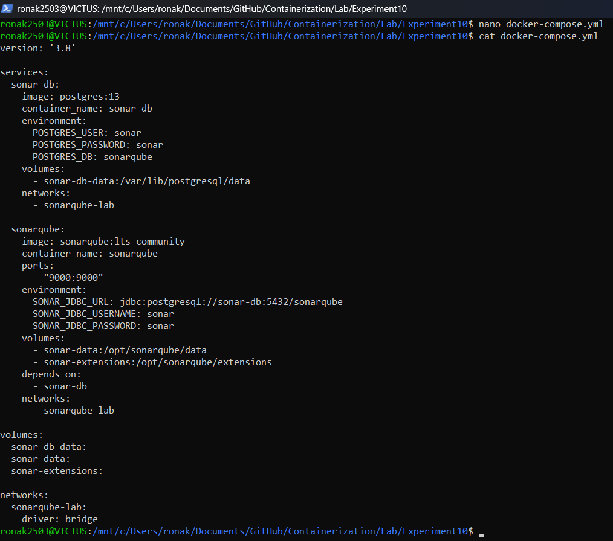


**Step-2:- Start Compose**
```bash
docker-compose up -d
```
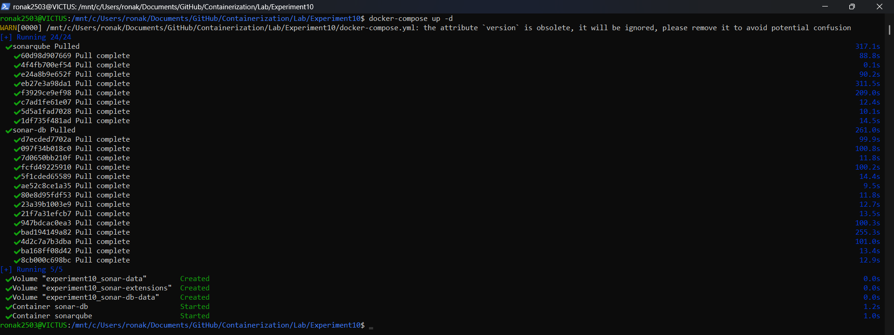


**Step-3:- Verify SonarQube is running via Logs**
```bash
docker-compose logs -f sonarqube
```
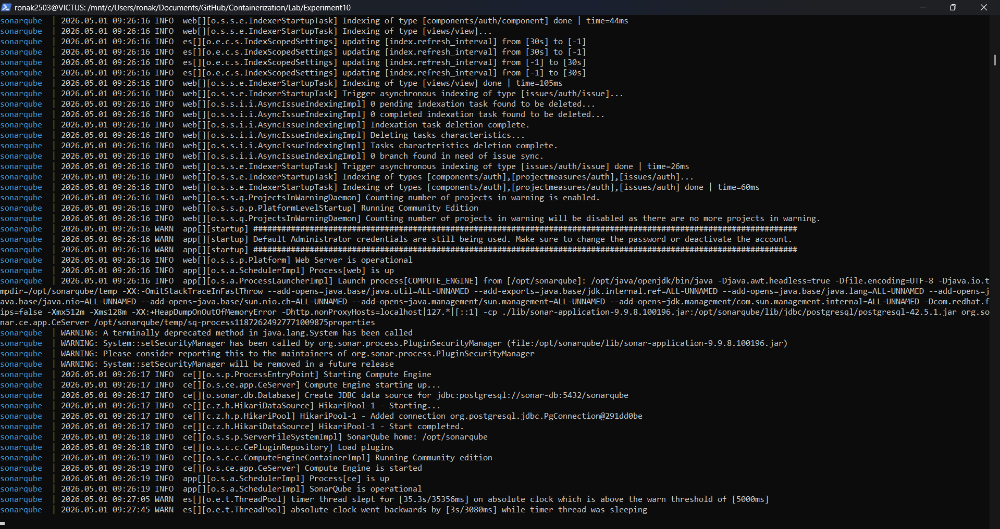


**Step-4:- Login SonarQube**
```bash
http://localhost:9000
```
- username: admin
- password: admin
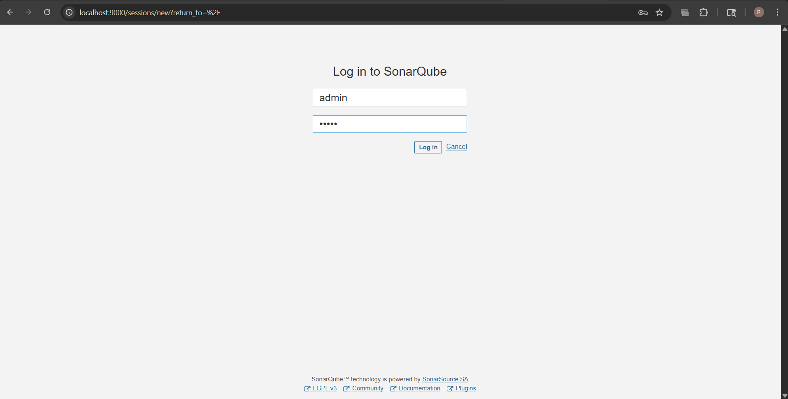


**Step-5:- HomePage**
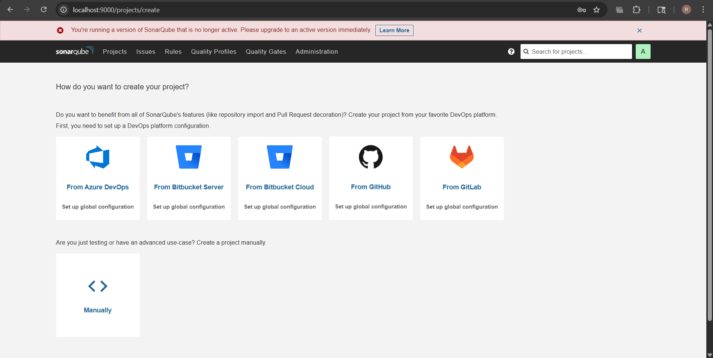


**Step-6:- Create Sample Java App**
```bash
mkdir -p sample-java-app/src/main/java/com/example
cd sample-java-app
```
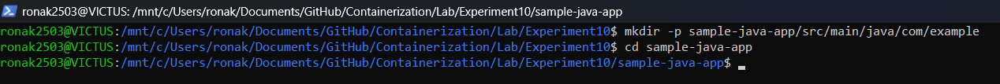


**Step-7:- Create `Calculator.java`**
```bash
nano src/main/java/com/example/Calculator.java
```
```java
package com.example;

public class Calculator {

    public int divide(int a, int b) {
        return a / b;
    }

    public int add(int a, int b) {
        int result = a + b;
        int unused = 100;
        return result;
    }

    public String getUser(String userId) {
        String query = "SELECT * FROM users WHERE id = " + userId;
        return query;
    }

    public int multiply(int a, int b) {
        int result = 0;
        for (int i = 0; i < b; i++) {
            result = result + a;
        }
        return result;
    }

    public int multiplyAlt(int a, int b) {
        int result = 0;
        for (int i = 0; i < b; i++) {
            result = result + a;
        }
        return result;
    }

    public String getName(String name) {
        return name.toUpperCase();
    }

    public void riskyOperation() {
        try {
            int x = 10 / 0;
        } catch (Exception e) {
        }
    }
}
```
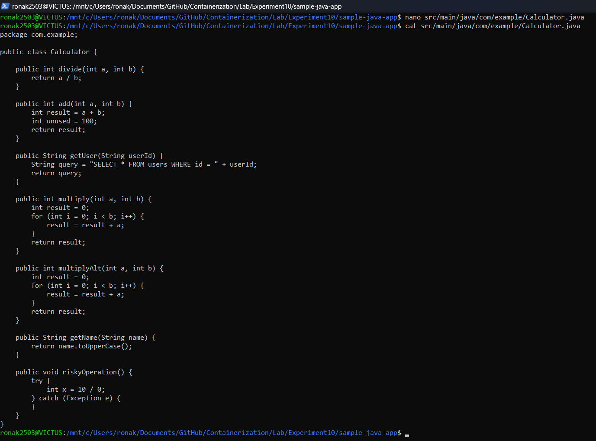


**Step-8:- Create `pom.xml`**
```bash
nano pom.xml
```
```xml
<project xmlns="http://maven.apache.org/POM/4.0.0">
    <modelVersion>4.0.0</modelVersion>

    <groupId>com.example</groupId>
    <artifactId>sample-app</artifactId>
    <version>1.0-SNAPSHOT</version>

    <properties>
        <sonar.projectKey>sample-java-app</sonar.projectKey>
        <sonar.host.url>http://localhost:9000</sonar.host.url>
        <sonar.login>YOUR_TOKEN</sonar.login>
    </properties>

    <build>
        <plugins>
            <plugin>
                <groupId>org.sonarsource.scanner.maven</groupId>
                <artifactId>sonar-maven-plugin</artifactId>
                <version>3.9.1.2184</version>
            </plugin>
        </plugins>
    </build>
</project>
```
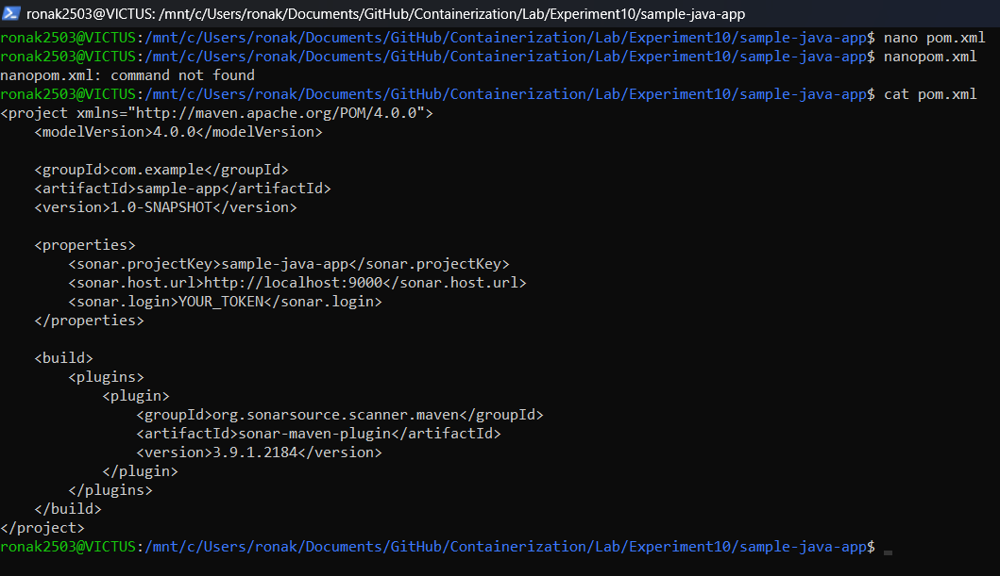


**Step-9:- Create Tokens**
Profile -> My Account -> Security -> TokenName: `scanner-token` -> Generate
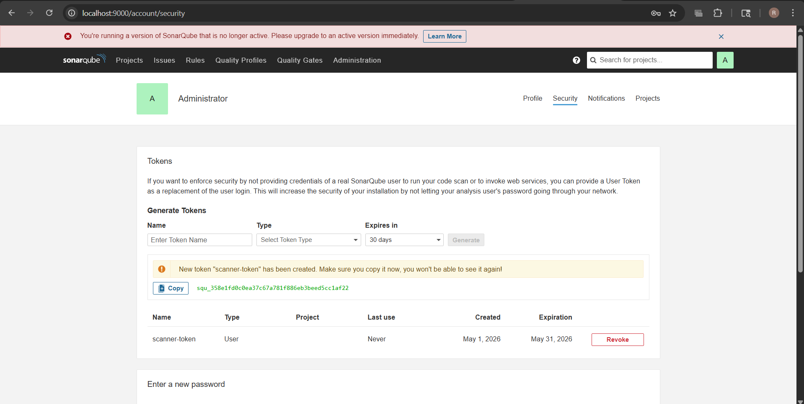


**Step-10:- Run Scanner**
```bash
mvn sonar:sonar -Dsonar.login=YOUR_TOKEN
```
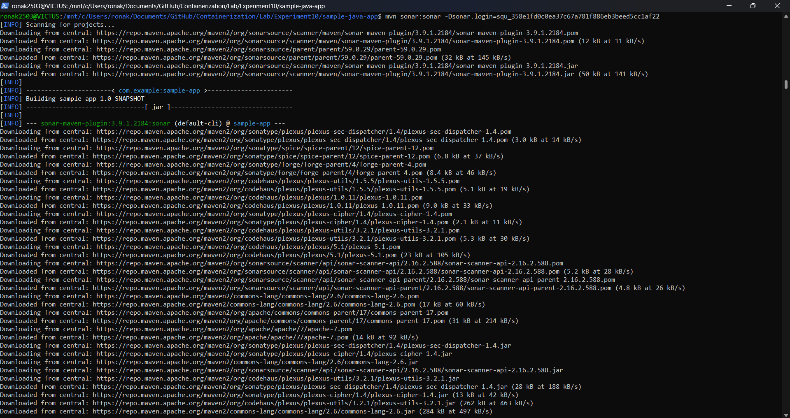


**Step-11:- Scroll down to view Build Success**
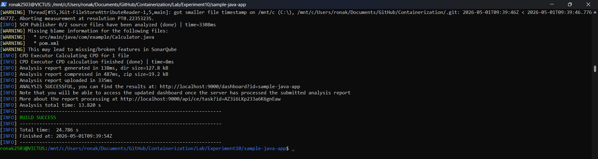


**Step-12:- On Browser test will be Listed**
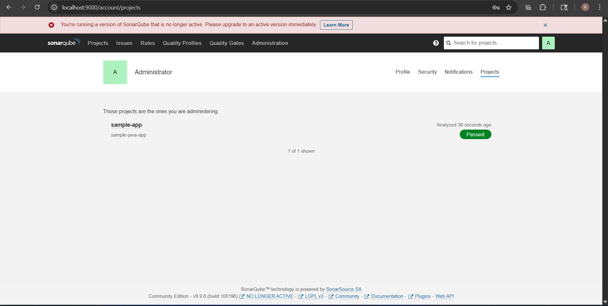


**Step-13:- View Report**
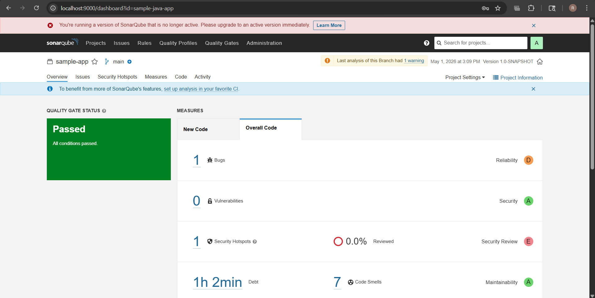


