## Experiment 11:  Orchestration via Docker Swarm 

### Introduction

#### The Progression Path

```
docker run  →  Docker Compose  →  Docker Swarm  →  Kubernetes
   │               │                  │                │
Single container  Multi-container    Orchestration    Advanced
                 (single host)       (basic)         orchestration
```

> **This experiment focuses on:** Moving from Compose → Swarm


### Hands-On


**Step-1:- Create a `docker-compose.yml`**
```bash
nano docker-compose.yml
```
Paste This:
```yml

version: '3.9'

services:
  db:
    image: mysql:5.7
    restart: always
    environment:
      MYSQL_ROOT_PASSWORD: rootpass
      MYSQL_DATABASE: wordpress
      MYSQL_USER: wpuser
      MYSQL_PASSWORD: wppass
    volumes:
      - db_data:/var/lib/mysql

  wordpress:
    image: wordpress:latest
    depends_on:
      - db
    ports:
      - "8080:80"
    restart: always
    environment:
      WORDPRESS_DB_HOST: db:3306
      WORDPRESS_DB_USER: wpuser
      WORDPRESS_DB_PASSWORD: wppass
      WORDPRESS_DB_NAME: wordpress
    volumes:
      - wp_data:/var/www/html

volumes:
  db_data:
  wp_data:


```
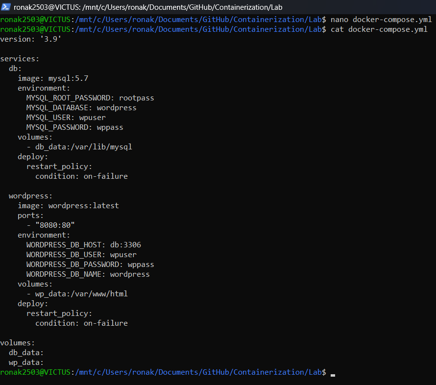


**Step-2:- Initialize Swarm**
```bash
docker swarm init
```
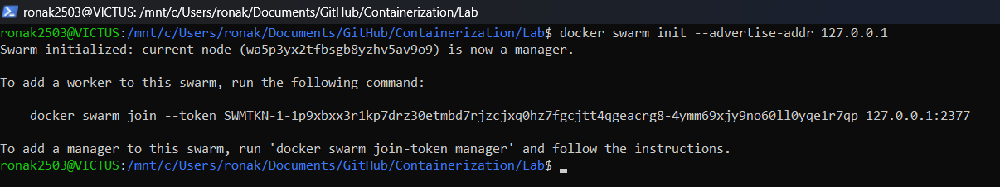


**Step-3:- Verify Swarm is Active**
```bash
docker node ls
```
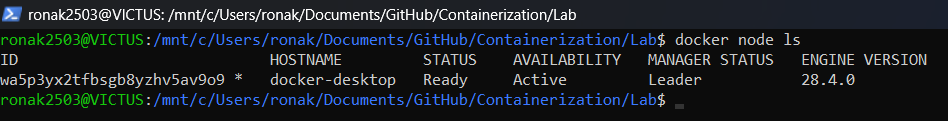


**Step-4:- Deploy as a stack**
```bash
docker stack deploy -c docker-compose.yml wpstack
```
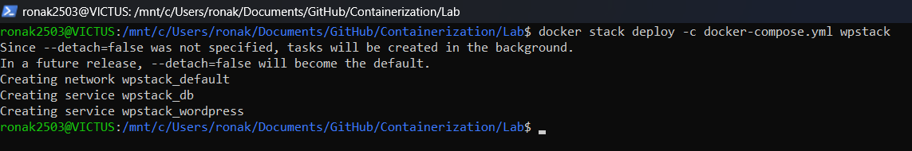


**Step-5:- Verify by listing Services**
```bash
docker service ls
```
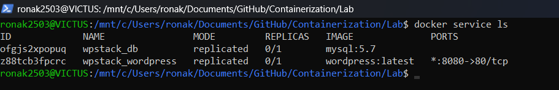


**Step-6:- Details for container service**
```bash
docker service ps wpstack_wordpress
```
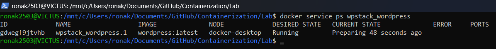


**Step-7:- List Containers**
```bash
docker ps
```
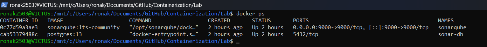


**Step-8:- Verify application on Containers**
```bash
http://localhost:8080/
```
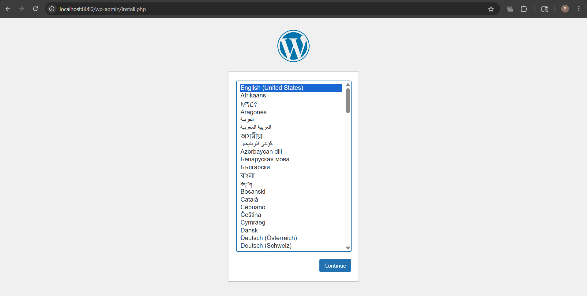


**Step-9:- Scale application Containers**
```bash
docker service scale wpstack_wordpress=3
```
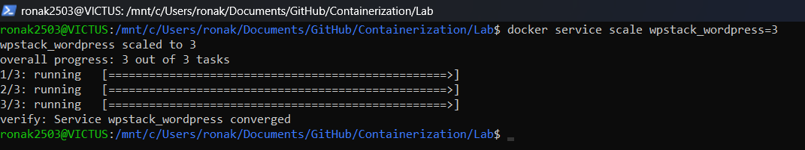


**Step-10:- Verify Scalling**
```bash
docker service ls
```
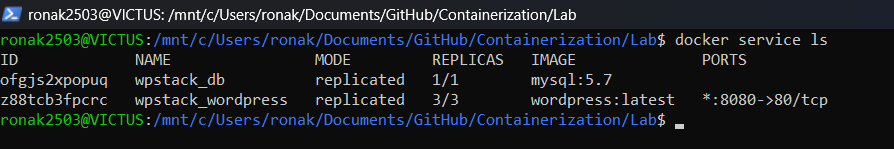


**Step-11:- List Wordpress Containers**
```bash
docker ps | grep wordpress
```
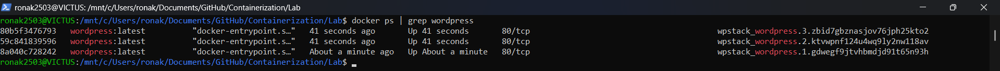


**Step-12:- Kill any Container**
```bash
docker kill <container-id>
```
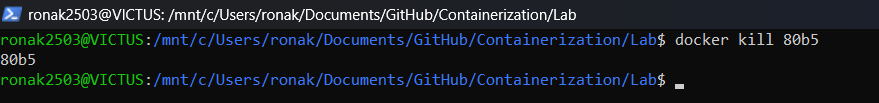


**Step-13:- Watch Swarm Recreating Contrainer**
```bash
docker service ps wpstack_wordpress
```
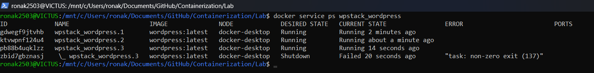


**Step-14:- Verify Container running**
```bash
docker ps | grep wordpress
```
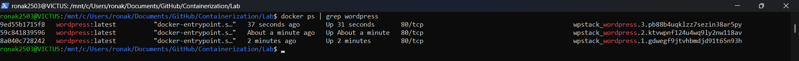


**Step-15:- Remove Stack**
```bash
docker stack rm wpstack
```
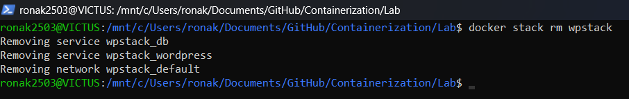


**Step-16:- Verify Service Removal**
```bash
docker service ls
docker ps
```


### Conclusion


#### Summary

| You started with | You can now do |
|------------------|----------------|
| Single container (`docker run`) | Multi-container (Compose) |
| Manual scaling | One-command scaling (`scale`) |
| Manual recovery | Automatic self-healing |
| Single host | Multi-host cluster ready |

#### Final Takeaway

> **Compose defines the application. Swarm runs it reliably.**

---

#### Quick Reference Card

```bash
# Initialize Swarm
docker swarm init

# Deploy stack
docker stack deploy -c docker-compose.yml <stack-name>

# List services
docker service ls

# Scale service
docker service scale <stack-name_service-name>=<replicas>

# See service tasks
docker service ps <service-name>

# Remove stack
docker stack rm <stack-name>

# Leave Swarm (if needed)
docker swarm leave --force
```


