## Experiment 9: Working with Ansible

### Introduction

#### **What is Ansible?**
- Ansible is an open-source **automation tool** for **configuration management**, **application deployment**, and **orchestration**.
- It follows an **agentless** architecture, using SSH for Linux and WinRM for Windows.
- Uses YAML-based **playbooks** to define automation tasks.

> Ansible is software that enables cross-platform automation and orchestration at scale and has become the standard choice among enterprise automation solutions.


#### Key Concepts

| Component       | Description |
|----------------|------------|
| **Control Node**|  Machine with Ansible installed | 
| **Managed Nodes**|  Target servers (no Ansible agent needed) | 
| **Inventory** | Defines the list of managed nodes (EC2 instances, servers, etc.). `inventory.ini` |
| **Playbooks** | YAML files containing a sequence of automation steps. |
| **Tasks** | Individual actions in playbooks (e.g., installing a package). |
| **Modules** | Built-in functionality to perform tasks (e.g., `yum`, `apt`, `service`). |
| **Roles** | Pre-defined reusable automation scripts. |


#### **Benefits of using Ansible**

*   A free and open-source community project with a huge audience.
*   Battle-tested over many years as the preferred tool of IT wizards.
*   Easy to start and use from day one, without the need for any special coding skills.
*   Simple deployment workflow without any extra agents.
*   Includes some sophisticated features around modularity and reusability that come in handy as users become more proficient.
*   Extensive and comprehensive official documentation that is complemented by a plethora of online material produced by its community.

> To sum up, Ansible is simple yet powerful, agentless, community-powered, predictable, and secure.


### Hands-On


**Step-1:- Install Ansible in WSL**
```bash
sudo apt install ansible -y
```
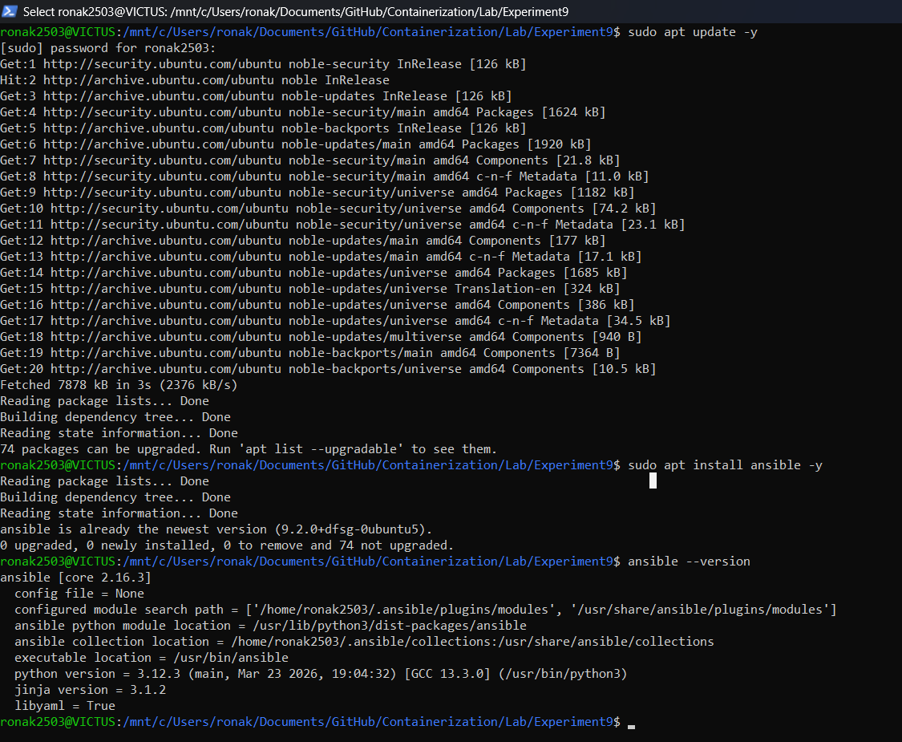


**Step-2:- Verify Installation**
```bash
ansible --version
```
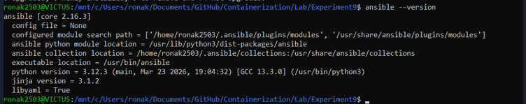


**Step-3:- Ping Localhost**
```bash
ansible localhost -m ping
```
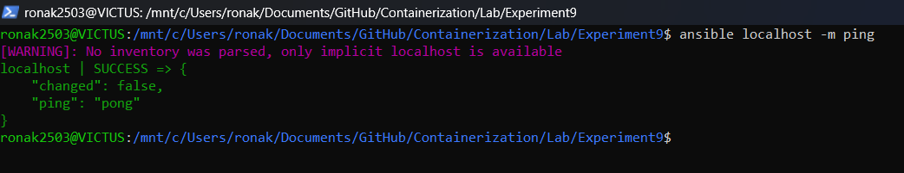


**Step-4:- Generate `ssh` Keys**
```bash
ssh -keygen -t rsa -b 4096
```
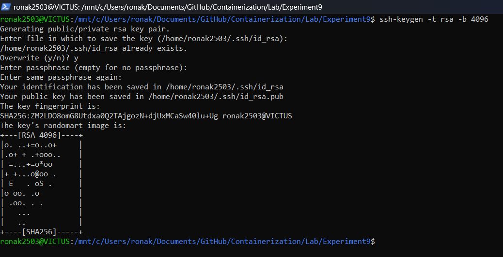


**Step-5:- Copy keys in `id_rsa`**
```bash
#Copy in current Directory
cp ~/.ssh/id_rsa.pub .
cp ~/.ssh/id_rsa .
```
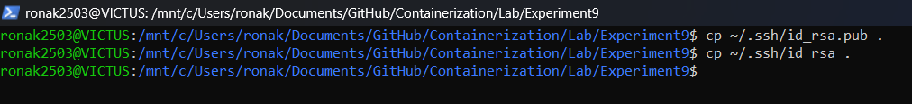


**Step-6:- Create Dockerfile**
```Dockerfile
FROM ubuntu


RUN apt update -y
RUN apt install -y python3 python3-pip openssh-server
RUN mkdir -p /var/run/sshd

# Configure SSH
RUN mkdir -p /run/sshd && \
    echo 'root:password' | chpasswd && \
    sed -i 's/#PermitRootLogin prohibit-password/PermitRootLogin yes/' /etc/ssh/sshd_config && \
    sed -i 's/#PasswordAuthentication yes/PasswordAuthentication no/' /etc/ssh/sshd_config && \
    sed -i 's/#PubkeyAuthentication yes/PubkeyAuthentication yes/' /etc/ssh/sshd_config


# Create .ssh directory and set proper permissions
RUN mkdir -p /root/.ssh && \
    chmod 700 /root/.ssh

# Copy SSH keys (note: this is not secure for production!)
COPY id_rsa /root/.ssh/id_rsa
COPY id_rsa.pub /root/.ssh/authorized_keys

# Set proper permissions for keys
RUN chmod 600 /root/.ssh/id_rsa && \
    chmod 644 /root/.ssh/authorized_keys

# Fix for SSH login
RUN sed -i 's@session\s*required\s*pam_loginuid.so@session optional pam_loginuid.so@g' /etc/pam.d/sshd

# Expose SSH port
EXPOSE 22

# Start SSH service when container starts
CMD ["/usr/sbin/sshd", "-D"]

```
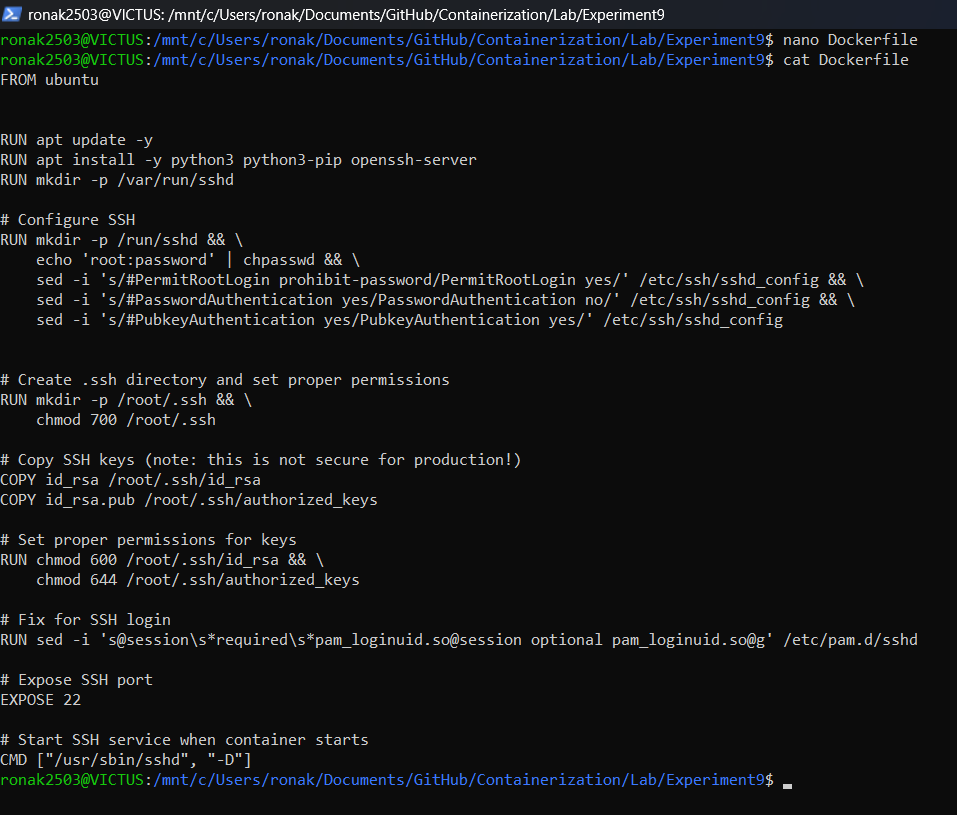


**Step-7:- Build Image**
```bash
docker build -t ubuntu-server
```
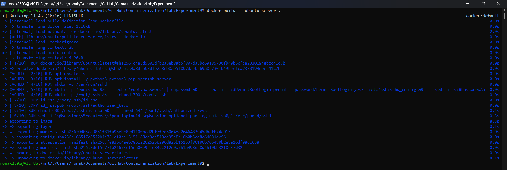


**Step-8:- Run container from build Image**
```bash
docker run -d -p --rm 2222:22 -p 8221:8221 --name ssh-test-server ubuntu-server
```
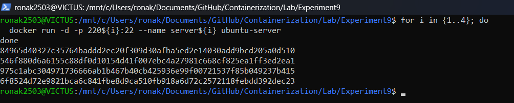


**Step-9:- Find Container IP Address**
```bash
docker inspect -f '{{range.NetworkSettings.Networks}}{{.IPAddress}}{{end}}' ssh-test-server
```
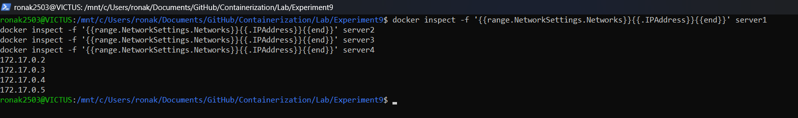


**Step-10:- Test SSH connection via Conatiner IP**
```bash
# with key
ssh -i ~/.ssh/id_rsa root@172.17.0.2
```
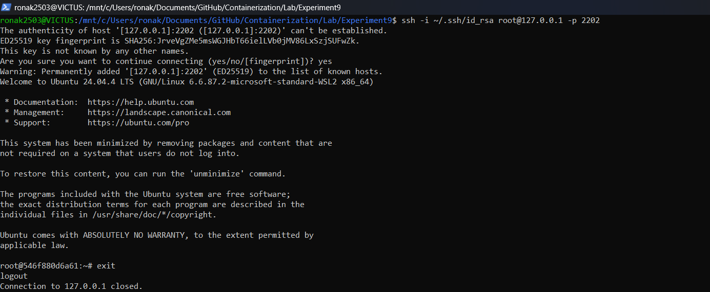


**Step-11:- Start Multiple Conatiners**
```bash
for i in {1..4}; do
  echo -e "\n Creating server${i}\n"
  docker run -d --rm -p 220${i}:22 --name server${i} ubuntu-server
  echo -e "IP of server${i} is $(docker inspect -f '{{range.NetworkSettings.Networks}}{{.IPAddress}}{{end}}' server${i})"
done
```
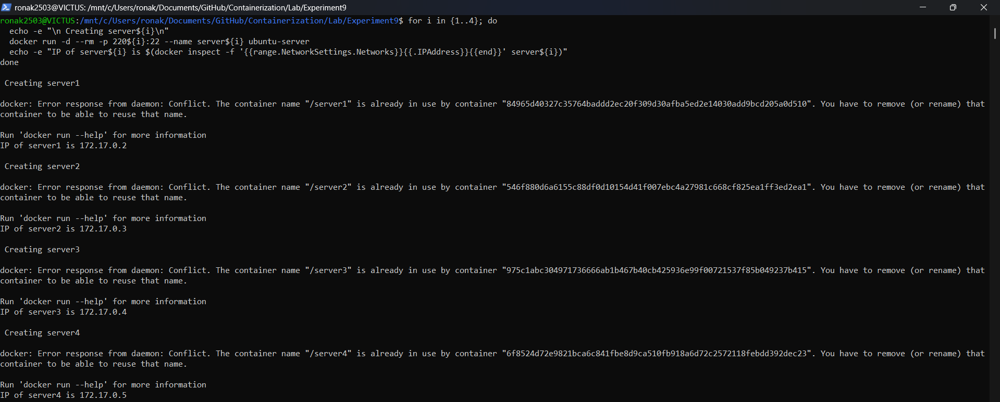


**Step-12:- Create `inventory.ini`**
```bash
# Get container IPs
echo "[servers]" > inventory.ini
for i in {1..4}; do
  docker inspect -f '{{range.NetworkSettings.Networks}}{{.IPAddress}}{{end}}' server${i} >> inventory.ini
done

# Add inventory variables
cat << EOF >> inventory.ini

[servers:vars]
ansible_user=root
; ansible_ssh_private_key_file=./id_rsa
ansible_ssh_private_key_file=~/.ssh/id_rsa
ansible_python_interpreter=/usr/bin/python3
EOF
```
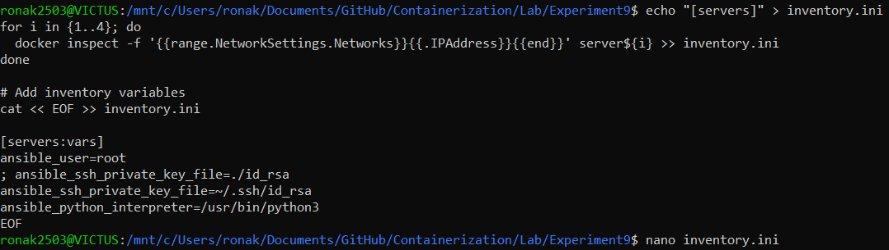


**Step-13:- Verify `inventory.ini`**
```bash
cat inventory.ini
```
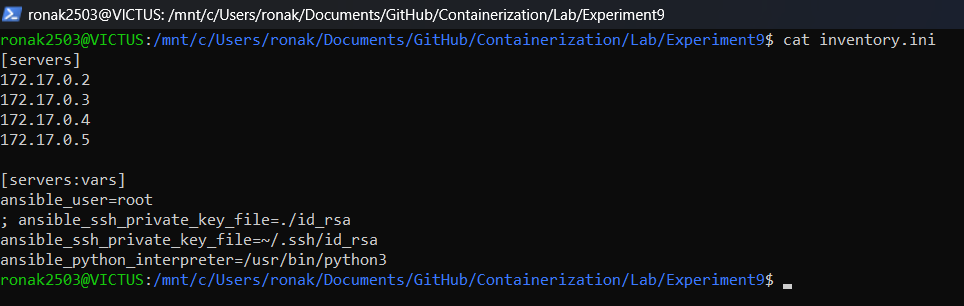


**Step-14:- Test Connectivity**
```bash
ssh -i ~/.ssh/id_rsa root@172.17.0.3 
```

****

**Step-15:- Create Playbook `playbook1.yml`**
```yaml
--- # it should start with three dash only
- name: Update and configure servers
  hosts: all
  become: yes

  tasks:
    - name: Update apt packages
      apt:
        update_cache: yes
        upgrade: dist

    - name: Install required packages
      apt:
        name: ["vim", "htop", "wget"]
        state: present

    - name: Create test file
      copy:
        dest: /root/ansible_test.txt
        content: "Configured by Ansible on {{ inventory_hostname }}"

```
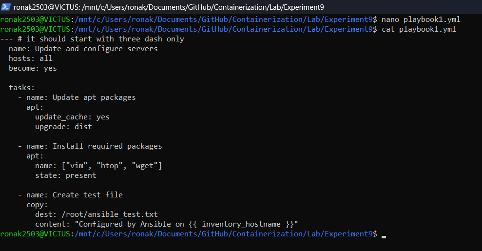

**Step-16:- Run Playbook**
```bash
ansible-playbook -i inventory.ini playbook1.yml
```
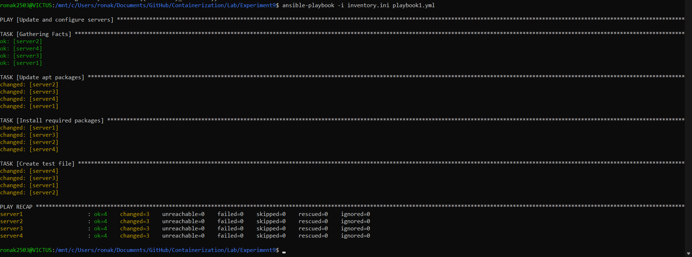


**Step-17:- Ansible Ping Test**
```bash
ansible all -i inventory.ini -m ping
```
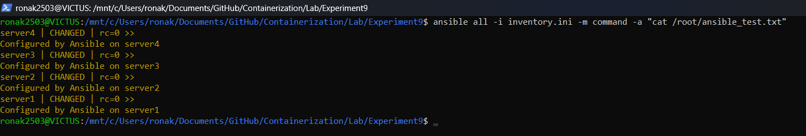


**Step-18:- CleanUp**
```bash
for i in {1..4}; do docker rm -f server${i}; done
```
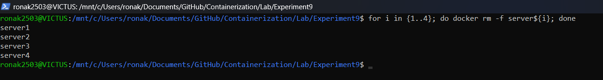


