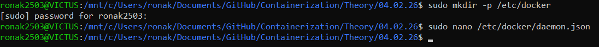
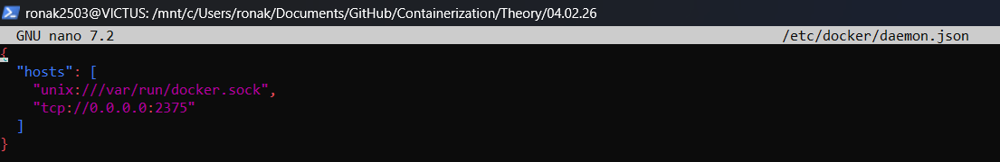
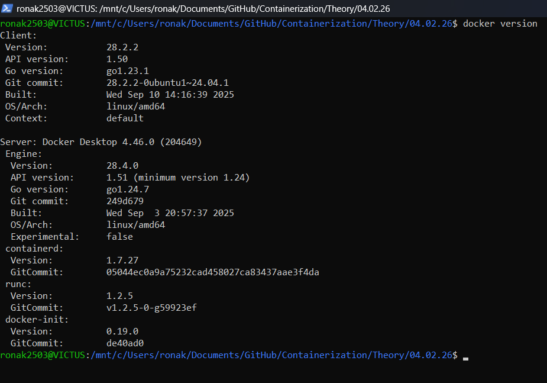
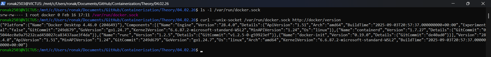

# Docker Daemon Access on Windows

**Date:** 04.02.26

---

##

Docker is a widely used containerization platform that allows applications to run in isolated environments called containers. The working of Docker depends on the underlying operating system on which it is installed.

On Windows, Docker does not run directly on the Windows host in the traditional Linux-native way. Instead, Docker Desktop is used, which internally runs Docker inside a lightweight Linux Virtual Machine (WSL 2 backend).

---

## Docker Architecture on Windows

Docker Desktop manages a Linux-based virtual machine using WSL 2 (Windows Subsystem for Linux) where the Docker Engine runs. The Docker CLI installed on Windows communicates with this Docker Engine through a secure mechanism.

On Windows, Docker Desktop runs Docker inside the WSL 2 Linux environment and exposes the Docker API through a Unix domain socket (/var/run/docker.sock) inside the Linux environment. Therefore, Linux-style socket checks must be performed inside WSL, not PowerShell.

---

## Docker Configuration File

The Docker daemon configuration file is generally located at:

```bash
/etc/docker/daemon.json
```

A sample configuration file is shown below:

```json
{
    "hosts": [
      "unix:///var/run/docker.sock",
      "tcp://0.0.0.0:2375"  
    ]
}
```



### Restarting Docker on Windows

Unlike Linux systems, Windows does not use systemctl to manage Docker Desktop. Docker must be restarted using Docker Desktop.

Method 1: PowerShell
```bash
Stop-Process -Name "Docker Desktop" -Force
Start-Process "Docker Desktop"
```

Method 2:Using Docker Desktop UI (Recommended)

- Open Docker Desktop

- Click Troubleshoot

- Click Restart Docker Desktop

This restarts the Docker Engine running inside WSL 2.

## Verifying Docker Installation

To verify that Docker is installed and running correctly, the following command is used:
```bash
docker version
```

This command displays both the Docker Client and Docker Server information. Successful output confirms that Docker Desktop and the Docker Engine are running properly.



### Docker Unix Socket on Windows
Docker Desktop exposes a Unix domain socket inside the WSL Linux environment that enables communication between the Docker CLI and the Docker Engine.

```bash
/var/run/docker.sock
```


To verify the socket, the following command is used:
```bash 
ls -l /var/run/docker.sock
```

This confirm the existence and linkage of the Docker socket.


Accessing Docker API Using Unix Socket

Since Docker Desktop on Windows does not expose the Docker API over TCP port 2375 by default, the API is accessed using the Unix socket inside WSL.

The following command is used to access the Docker API:
```bash
curl --unix-socket /var/run/docker.sock http://docker/version
```


This command returns Docker version information in JSON format, confirming that the Docker API is accessible through the Unix socket.




## Conclusion

Docker on Windows operates differently compared to native Linux systems. Docker Desktop uses the WSL 2 backend to run the Docker Engine inside a lightweight Linux virtual machine.

Docker functionality on Windows can be verified using docker version in PowerShell and Unix socket-based commands inside WSL. This approach ensures better compatibility, security, and performance when working with Docker on Windows.