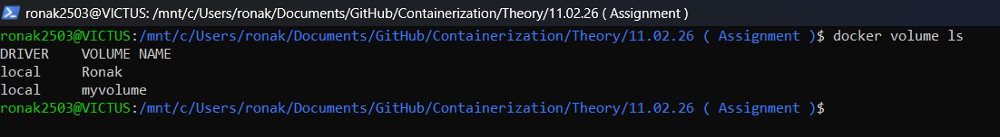
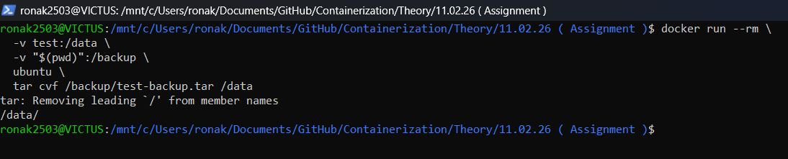
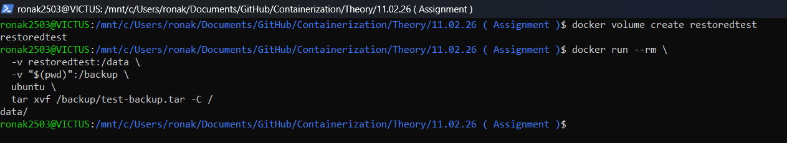
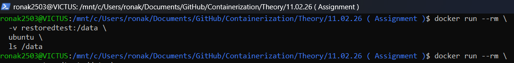
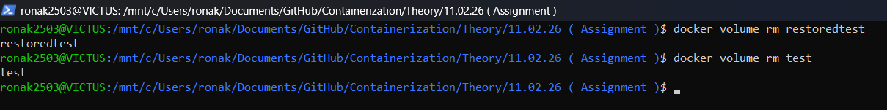

# Assignment (11.02.26): Backup, Share and Remove Docker Volume
---

## Aim
To learn how to:

- Backup a Docker volume
- Share volume data using backup files
- Restore volume from backup
- Remove Docker volumes safely

---

## Step 1: List Docker Volumes

```bash
docker volume ls
```


Example: 
local       Ronak
local       myvolume

## Step 2: Backup Docker Volume
Backup volume test into a tar file:
```bash
docker run --rm \
  -v test:data \
  -v $(pwd):/backup \
  ubuntu \
  tar cvf /backup/test-backup.tar /data
  ```
  
  Backup file created:

  test-backup.tar

  Verify:
  ```bash
  ls test-backup.tar
  ```
  ## Step 3: Share Volume Backup
  The volume is shared by transferring the backup file:

  **test-backup.tar**
  This file can be uploaded to Google Drive, GitHub, or copied to another system.
  
  ## Step 4: Restore Backup into New Volume
  Create a new volume:
  
  ```bash
  docker volume create restoredtest
  ```
  Restore backup:
  ```bash
  docker run --rm \
  -v restoredtest:/data \
  -v "$(pwd)":/backup \
  ubuntu \
  tar xvf /backup/test-backup.tar -C /
  ```
  


  ## Step 5: Verify Restored Data
  List files:

  ```bash
  docker run --rm \
  -v restoredtest:/data \
  ubuntu \
  ls /data
  ```

  Check content:
  ```bash
  docker run --rm \
    -v restoredtest:/data \
    ubuntu \
    cat /data/sapid.txt
```


## Step 6: Remove Docker Volume
Remove volume (only if not in use):
```bash
docker volume rm test
```


## Conclusion
Docker volumes can be backed up as tar files, shared across systems, restored into new volumes, and removed safely. This ensures persistent and portable container data management.

