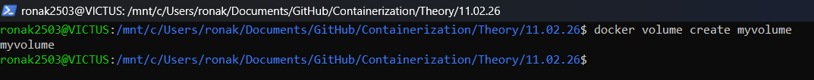
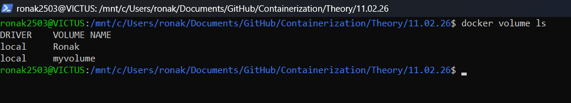
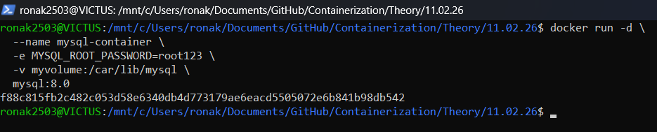
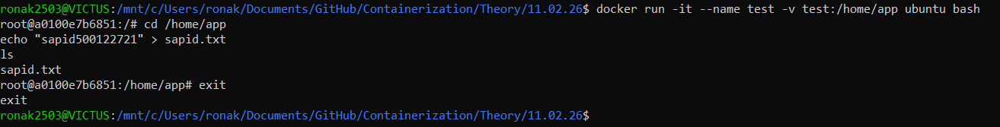
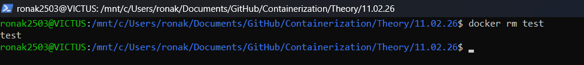
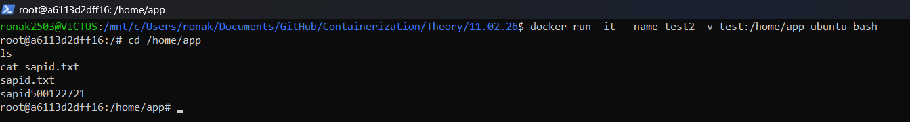

**Date:** 11.02.26

---

## Aim
To study Docker Volumes and prove that data persists even after container removal

---

## Step 1: Create Docker Volume

```bash
docker volume create myvolume
```
Output:


## Step 2: List Docker Volumes
```bash
docker volume ls
```
Output:

## Step 3: Run MySQL Container with Volume
```bash
docker run -d \
  --name mysql-container \
  -e MYSQL_ROOT_PASSWORD=root123 \
  -v myvolume:/car/lib/mysql \
  mysql:8.0
```


## Step 4: Run Ubuntu Container and Create File in Volume
```bash
docker run -it --name test -v test:/home/app ubuntu bash
```
Inside container:
```bash
cd /home/app
echo "sapid500119552" > sapid.txt
ls
```
Output:


Exit:
```bash
exit
```

## Step 5: Remove the Container
``` bash
docker rm test 
```
Output:


## Step 6: Run New Container and Verify Data Persistence
```bash
docker run -it --name test2 -v test:/home/app ubuntu bash
```
Inside container:
```bash
cd /home/app
ls
cat sapid.txt
```
Output:


File persisted even after deleting the first container.

## Conclusion
Docker volumes provide persistent storage outside the container lifecycle.
Data remains safe even if containers are removed or recreated.
