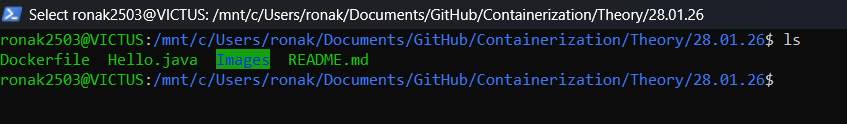
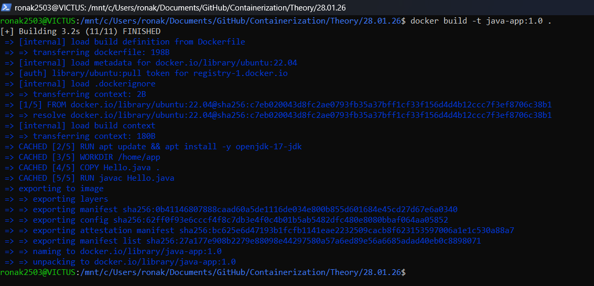
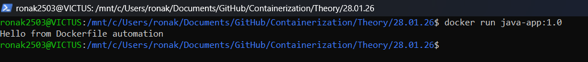
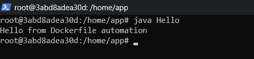
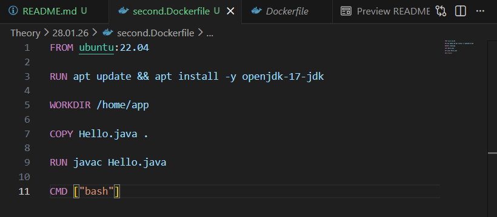
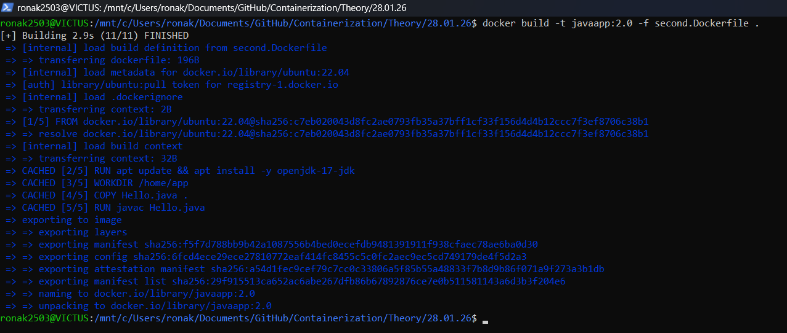
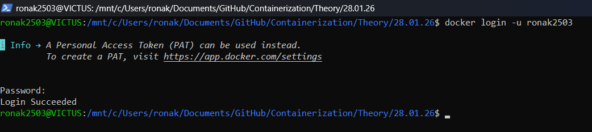
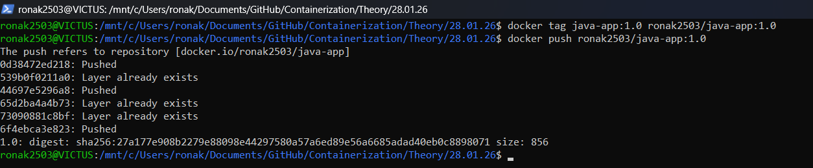

# 30-01-2026

## Topic: Docker Image Creation, Versioning, and Docker Hub Push

--- 

## Objective
To build Docker images using Dockerfile, run containers, modify Dockerfile to create new image versions, and push Docker images to Docker Hub.

---

## Tools Used
- Docker 
- Docker Desktop
- Windows Powershell Terminal
- Java (OpenJDK 17)
- Docker Hub

---

## Theory
Docker allows applications to be packaged into images using a Dockerfile. These images can be versioned, executed as containers, and shared using Docker Hub. Versioning helps maintain multiple builds of the same application. Docker Hub acts as a centralized repository to store and distribute Docker images.

---

## Procedure

### Step 1: View Project Files
The Project directory containing `Dockerfile` and `Hello.java` was verified.

```bash
ls
```


---

### Step 2: Build Docker Image (Version 1.0)

```bash
docker build -t java-app:1.0 .
```


### Step 3: Run Docker Image (Version 1.0)
The Docker image build in the previous was executed to verify its output.

```bash
docker run java-app:1.0
```

The container executed successfully and printed output.

### Step 4: Run Container in Interactive Mode
```bash
docker run -it java-app:1.0 bash
```

The container was accessed using an interactive shell.

### Step 5: Modify Dockerfile

The Dockerfile was edited to change the default command and application output.

### Step 6: Build Docker Image (Version 2.0)
```bash
docker build -t javaapp:2.0 -f second.Dockerfile .
```


A new version of the Docker image was created.

### Step 7: Run Docker Image Version 2.0
```bash
docker run javaapp:2.0
```
The output confirmed execution of the updated version.

### Step 8: Push Docker Image to Docker Hub
```bash
docker login 
docker tag java-app:1.0 username/java-app:1.0
docker push username/java-app:1.0
```



The Docker image was successfully pushed to Docker Hub and later pulled.