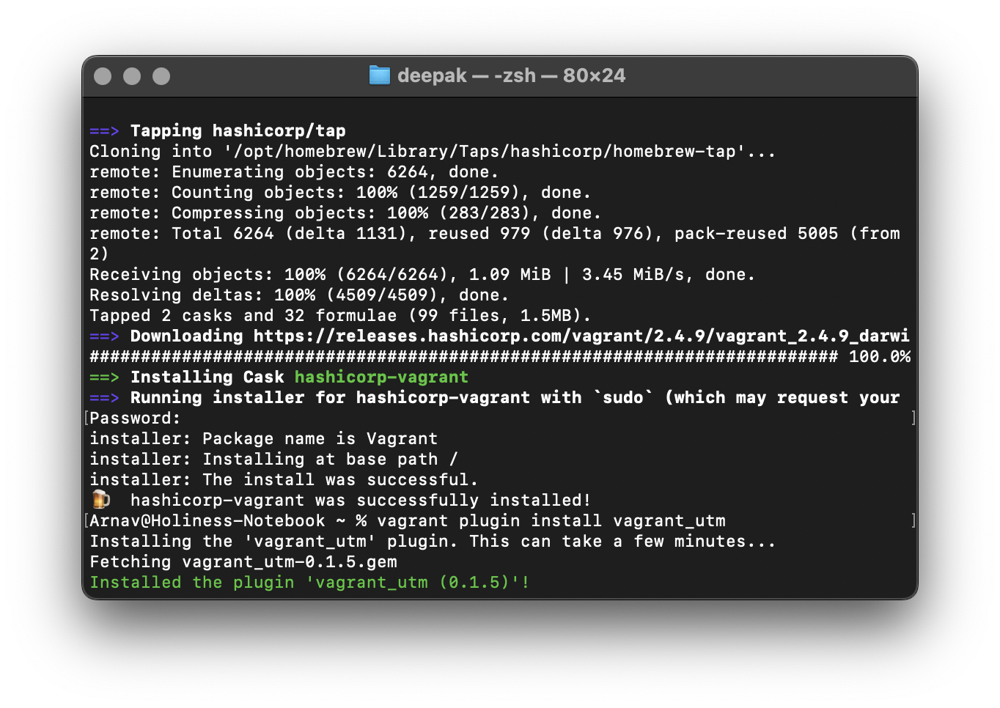
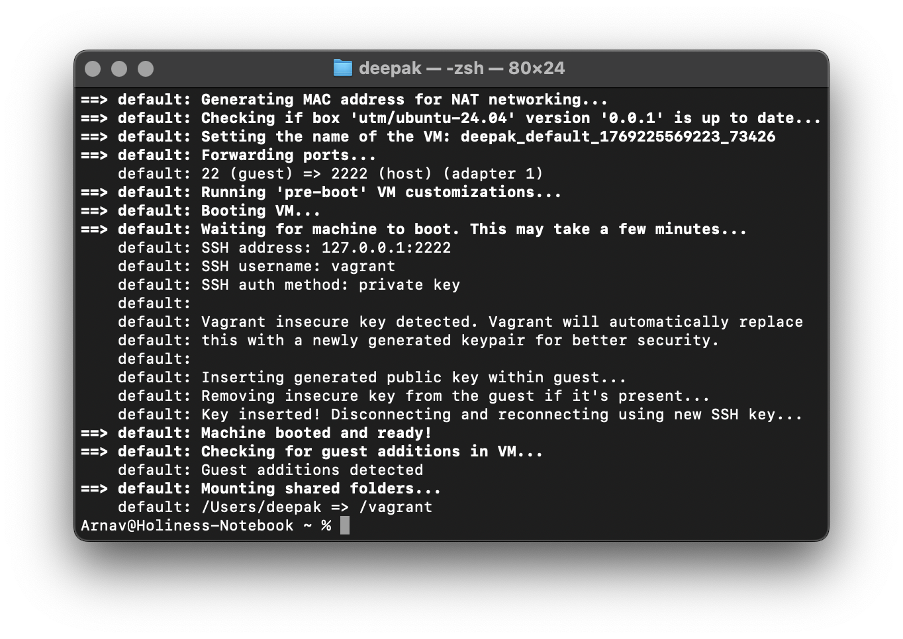
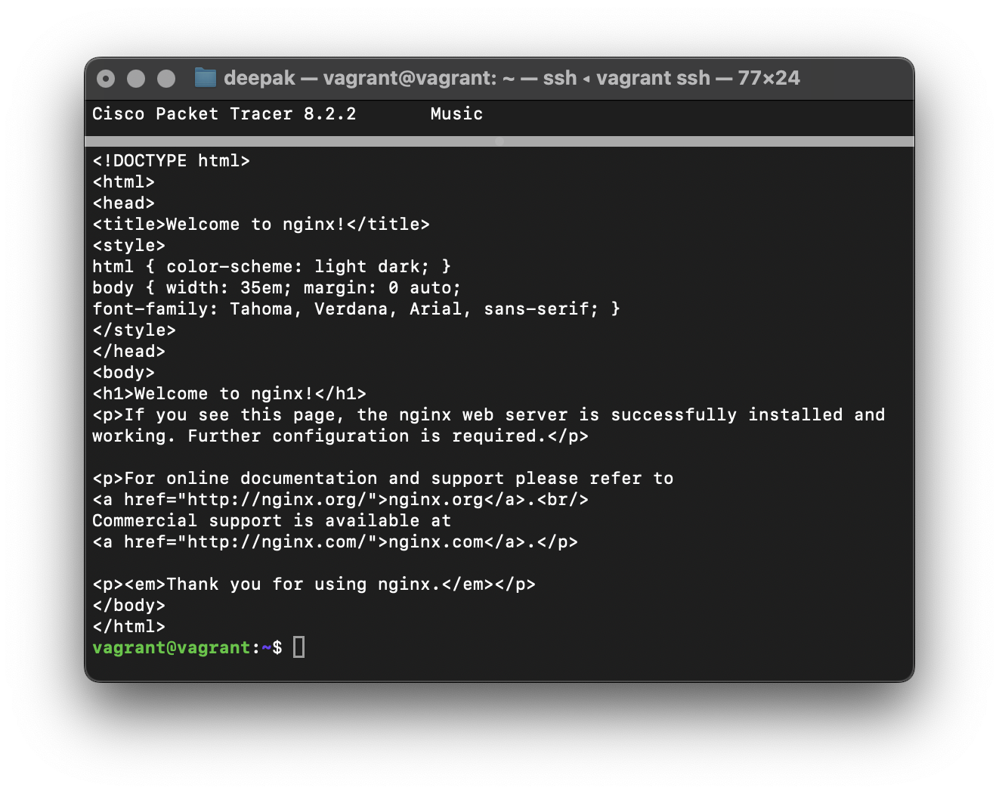
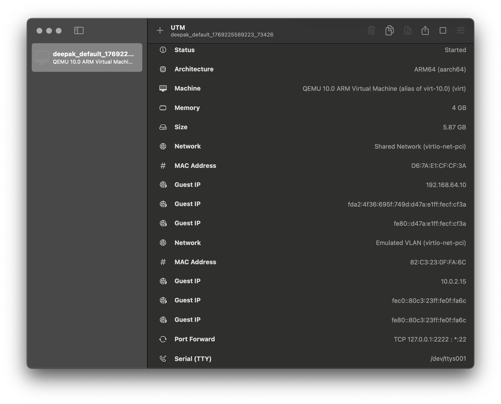
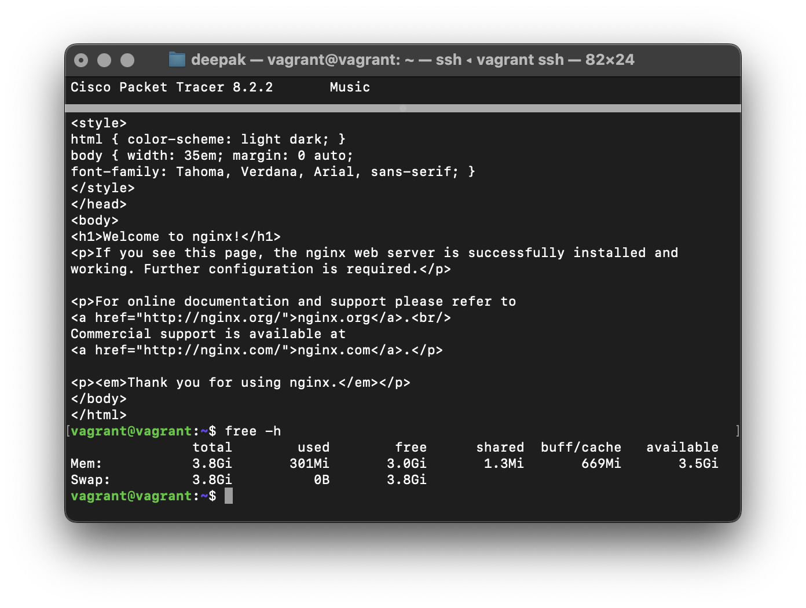
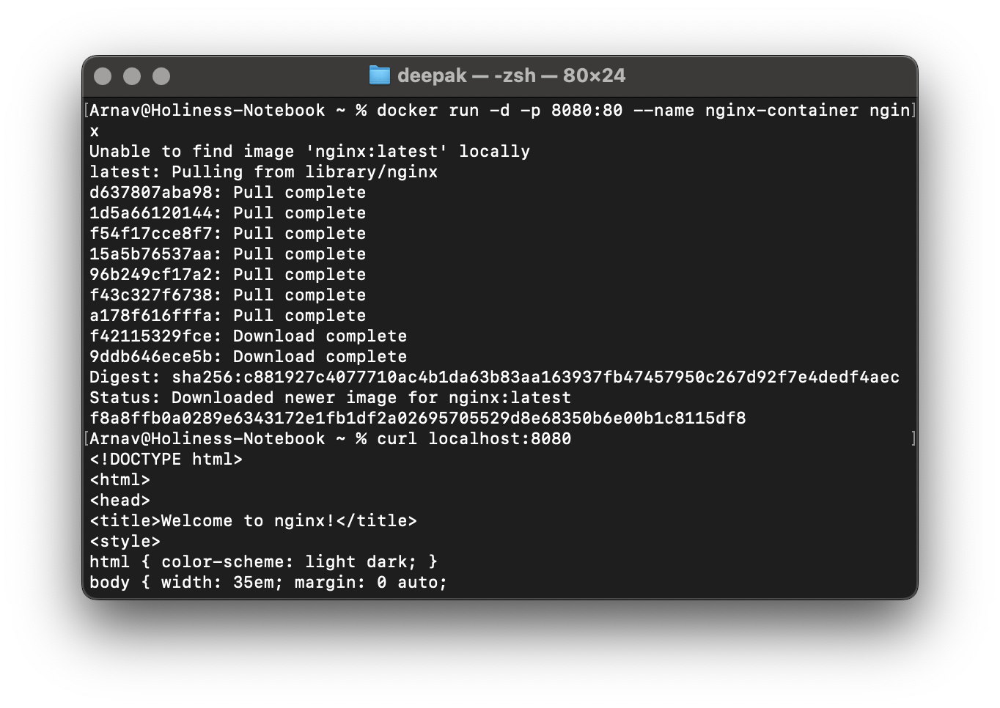
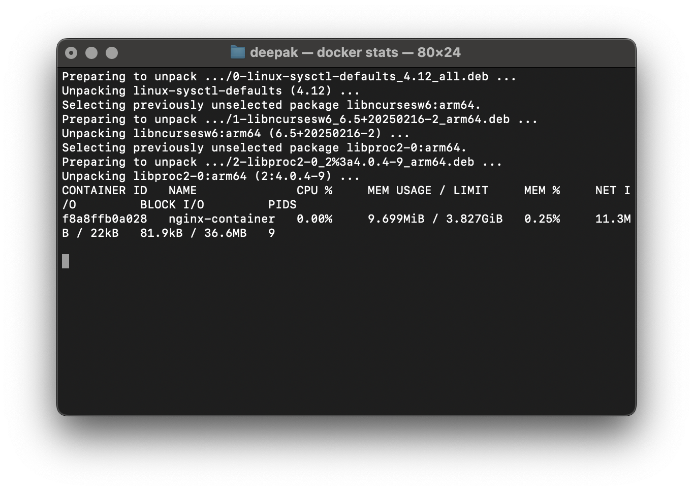

# Experiment 1: Comparion between Virtual Machines (VMs) and Conatiners using
Ubuntu and Nginx

## Steps Taken

- Installing  Vagrant and UTM plugin for mac
 
**Vagrant** is an open-source tool for building, configuring, and managing portable virtual software development environments.  It simplifies the setup of consistent development environments across teams by automating the creation and configuration of virtual machines (VMs) or containers using a declarative configuration file called a Vagrantfile.

- Initializing Vagrant with UTM specific Ubuntu box

Using the Vagrant init command *utm/ubuntu-24.04* this will also create a Vagrantfile in the respective directory

- Starting the VM and accessing it and installing Nginx

Using the *up* command to start the VM and *ssh* command to log into the VM. Then installing Nginx inside the VM.

 

- Checking the amount of space that the VM is taking in the hard disk and then destroying the VM

Stoping the VM using *halt* command and then removing it using *destroy*

- Running Ubuntu Docker container with Nginx

Using Docker *run* command and verify Nginx

- Checking space consumed by the Docker container

- Drawing a comparison

As you can see the Ubuntu VM is consuming 5.87 GB of disk space where as the Docker Ubuntu container  consumes 9.699 MB with a limit of 3.827 GB. This stark contrast is why we prefer containers over fully virtualized VMs where the OS is shared. Along with being smaller in size they are generally also faster to run.

