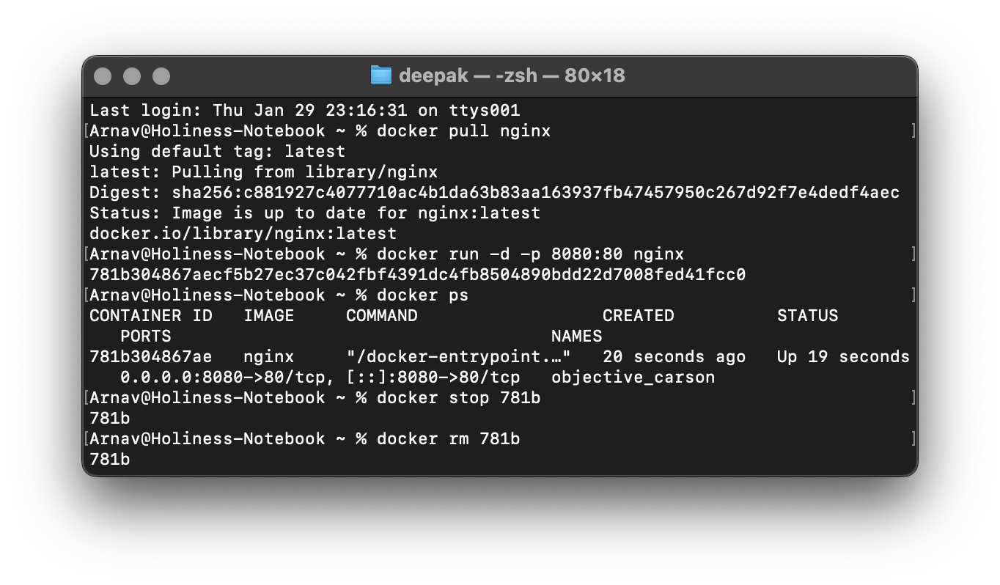
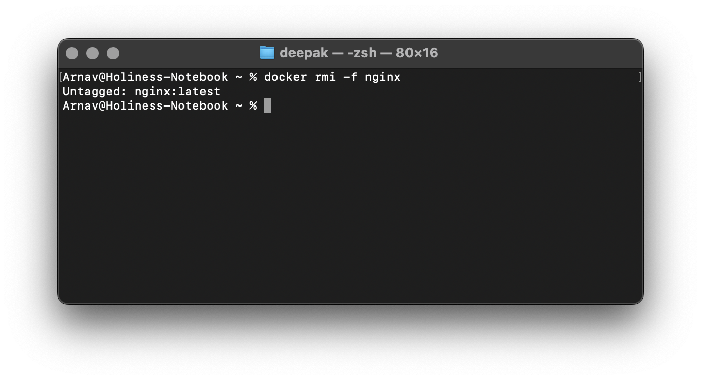

# Experiment 2: Docker Installation, Configuration, and Running Images

## Steps Taken

- Container Lifecycle 

Pulling Nginx image using *pull* command. After image is pulled running container. Using the *ps* command to show running containers. Then stopping the container using *stop*. Removing the container using *rm*.

- Forcefully removing the image

Using the *rmi* command along with the *-f* flag to completely remove the image from the device.

- Succussfully depicted pulling of image, executing container and container lifecycle.
