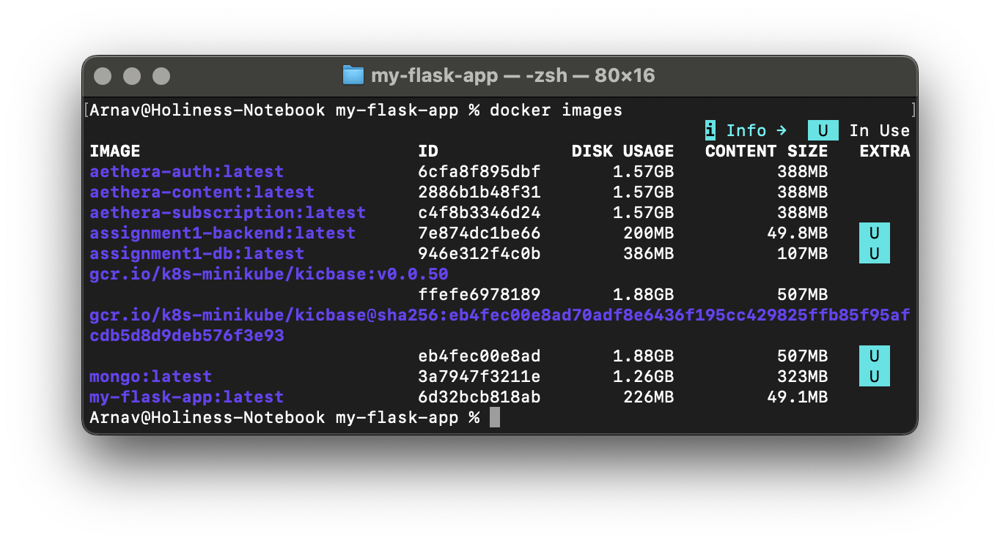
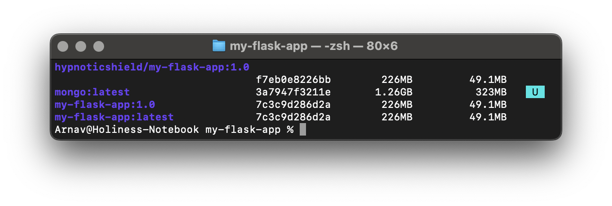
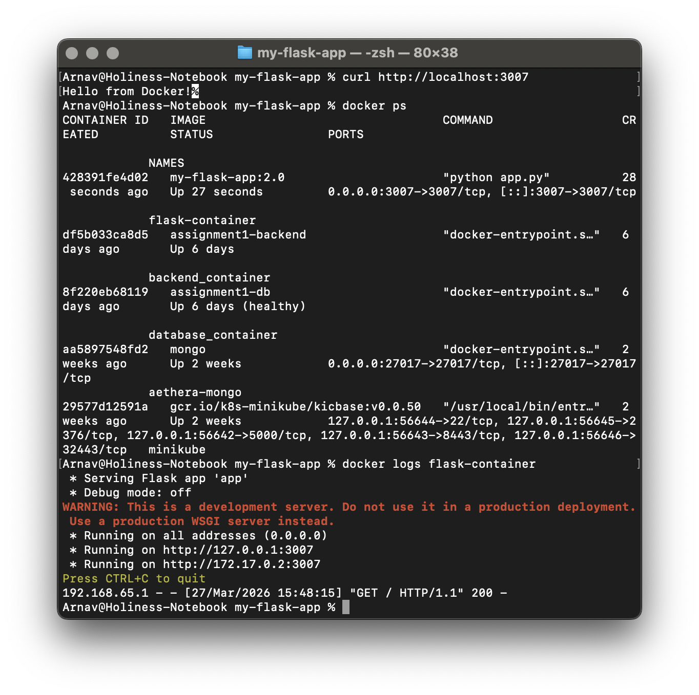
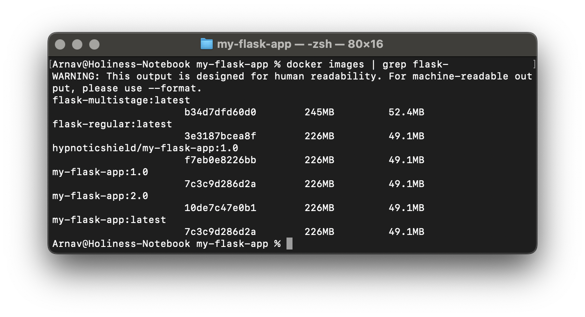
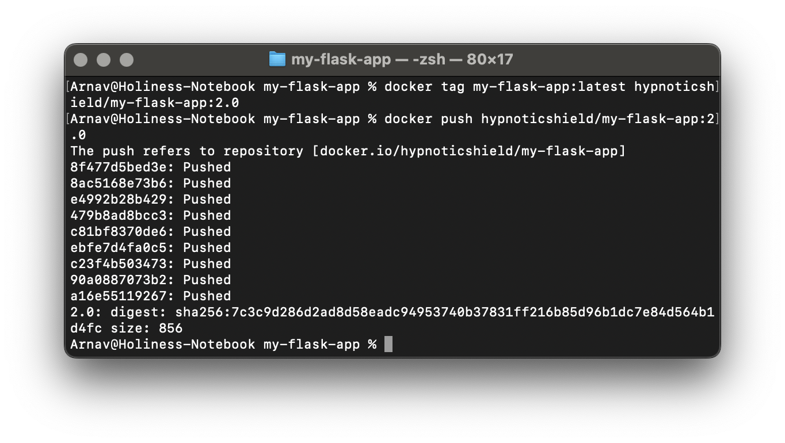
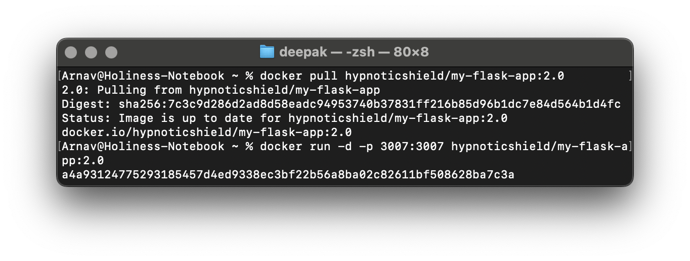
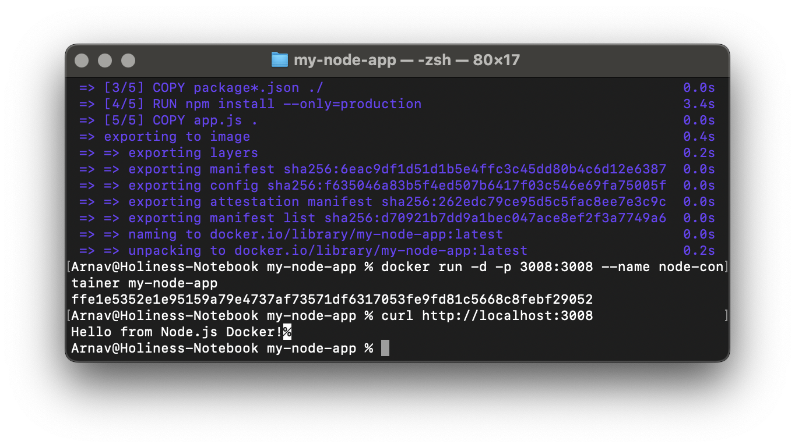

# Experiment 4: Docker Essentials

## Steps Taken

- Create a simple flask application and create a *Dockerfile* using a slim python image so that an image can be built easily.

- Create a *.dockerignore* and put everything not necessarily required in the final image to reduce image size, improve build speed and also increase security.

- Build image from the *Dockerfile* 

- Tagging image 

- History of the image

- Run container on the port 3007 naming it as flask-container and also showing the logs

- Stopping and removing the container

- Multistage Dockerfile build to reduce image size and separate build and runtime environments

Here, the size of the multistage build is more than the regular one because of not having a *.dockerignore* file and also the **COPY** command grabbing everything from the folder.

- After tagging the image for Docker Hub, we psuh the image to Docker Hub in the repository named after the user.

- Image pulled from Docker Hub and container ran successfully.

- Doing the same, create and app but with *node.js*, built an image from the *Dockerfile* and then running a container from that image.

- Concluding, *Dockerfile* will define how to build the image, *.dockerignore* omits unnecessary details, using multistage builds for efficiency and using Docker Hub to share your images.   
