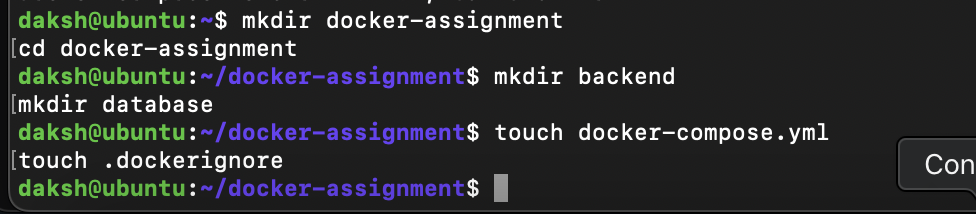
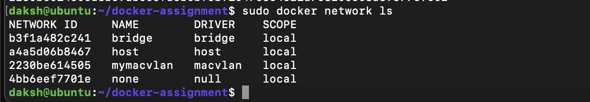
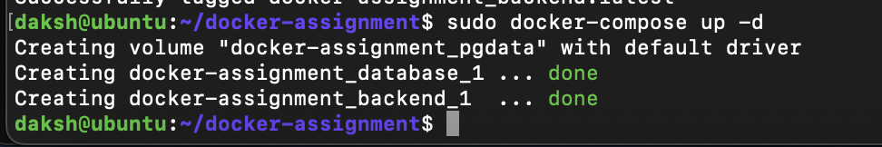
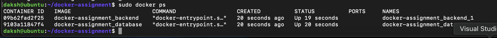
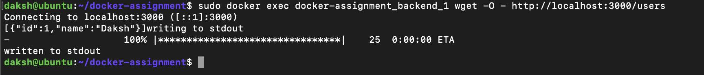
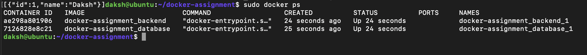
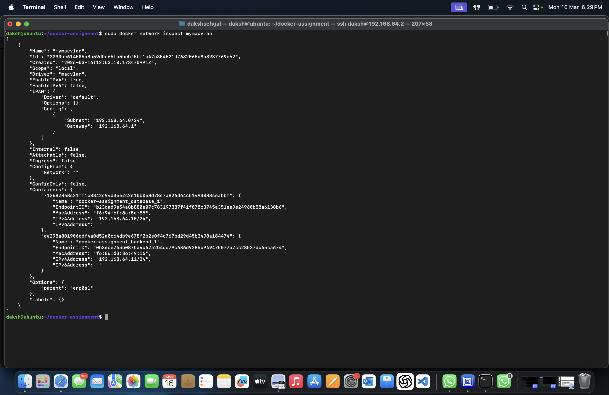
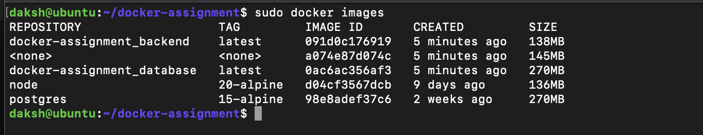
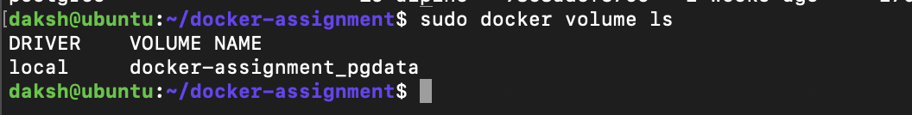
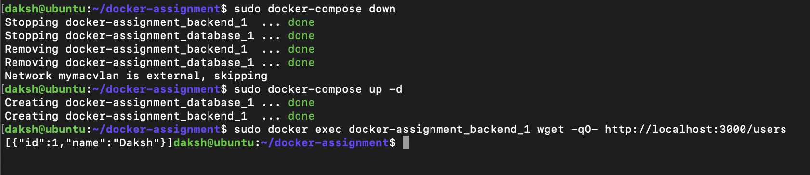

# Containerized Web Application with PostgreSQL using Docker Compose and Macvlan
University of Petroleum and Energy Studies

Course: Containerization and DevOps
Assignment: Containerized Web Application with PostgreSQL using Docker Compose and Macvlan

## Project Overview

This project demonstrates how to design, containerize, and deploy a web application using Docker.

The application consists of:

Backend API: Node.js + Express

Database: PostgreSQL

Orchestration: Docker Compose

Networking: Docker Macvlan

Storage: Docker Named Volume

Containers communicate using a Macvlan network, allowing each container to have its own static IP address within the LAN.

Architecture
Network Design Diagram
```bash 
Mac Host (macOS)
        │
        ▼
Ubuntu VM (UTM)
IP: 192.168.64.2
        │
        ▼
Docker Engine
        │
        ▼
Macvlan Network
Subnet: 192.168.64.0/24
Gateway: 192.168.64.1
        │
 ┌──────┴─────────┐
 ▼                ▼
Backend           PostgreSQL
Container         Container
192.168.64.11     192.168.64.10
``` 
## Repository Structure:
```bash
docker-assignment
│
├── backend
│   ├── Dockerfile
│   ├── app.js
│   └── package.json
│
├── database
│   ├── Dockerfile
│   └── init.sql
│
├── docker-compose.yml
└── .dockerignore
```


### backend/app.js
```bash
const express = require("express");
const { Pool } = require("pg");

const app = express();
app.use(express.json());

const pool = new Pool({
  host: process.env.DB_HOST,
  user: process.env.POSTGRES_USER,
  password: process.env.POSTGRES_PASSWORD,
  database: process.env.POSTGRES_DB,
  port: 5432
});

app.get("/health", (req, res) => {
  res.send("OK");
});

app.post("/users", async (req, res) => {
  const { name } = req.body;

  const result = await pool.query(
    "INSERT INTO users(name) VALUES($1) RETURNING *",
    [name]
  );

  res.json(result.rows[0]);
});

app.get("/users", async (req, res) => {
  const result = await pool.query("SELECT * FROM users");
  res.json(result.rows);
});

app.listen(3000, () => {
  console.log("Server running");
});
```
### backend/package.json
```bash
{
  "name": "backend",
  "version": "1.0.0",
  "main": "app.js",
  "dependencies": {
    "express": "^4.18.2",
    "pg": "^8.11.3"
  },
  "scripts": {
    "start": "node app.js"
  }
}
```
### backend/Dockerfile (Multi-stage Build)
```bash
FROM node:20-alpine AS builder

WORKDIR /app

COPY package.json .
RUN npm install

COPY . .

FROM node:20-alpine

WORKDIR /app

COPY --from=builder /app /app

RUN addgroup -S appgroup && adduser -S appuser -G appgroup

USER appuser

EXPOSE 3000

CMD ["npm","start"]
```

### database/init.sql
```bash
CREATE TABLE IF NOT EXISTS users(
 id SERIAL PRIMARY KEY,
 name TEXT
);
```

### database/Dockerfile
```bash
FROM postgres:15-alpine

ENV POSTGRES_DB=mydb
ENV POSTGRES_USER=myuser
ENV POSTGRES_PASSWORD=mypassword

COPY init.sql /docker-entrypoint-initdb.d/

EXPOSE 5432
```
### docker-compose.yml
```bash
version: "3.9"

services:

  database:
    build: ./database
    restart: always
    environment:
      POSTGRES_DB: mydb
      POSTGRES_USER: myuser
      POSTGRES_PASSWORD: mypassword

    volumes:
      - pgdata:/var/lib/postgresql/data

    networks:
      mymacvlan:
        ipv4_address: 192.168.64.10

  backend:
    build: ./backend
    restart: always

    depends_on:
      - database

    environment:
      DB_HOST: 192.168.64.10
      POSTGRES_DB: mydb
      POSTGRES_USER: myuser
      POSTGRES_PASSWORD: mypassword

    networks:
      mymacvlan:
        ipv4_address: 192.168.64.11

    ports:
      - "3000:3000"

networks:
  mymacvlan:
    external: true

volumes:
  pgdata:
```
### .dockerignore
```bash
node_modules
.git
.gitignore
Dockerfile
npm-debug.log
```

## Create Macvlan Network
Create the macvlan network required for container communication.
```bash
docker network create -d macvlan \
--subnet=192.168.64.0/24 \
--gateway=192.168.64.1 \
-o parent=enp0s1 \
mymacvlan
```


## Build and Run
### Build images
```bash
Build and Run
```
### Start Containers
```bash
docker-compose up -d
```
### Check running containers
```bash
docker ps 
```



## Test API 
### Health Check 
```bash
sudo docker exec docker-assignment_backend_1 wget -O - http://localhost:3000/health
```


### Insert Record
```bash
sudo docker exec docker-assignment_backend_1 wget \
--header="Content-Type: application/json" \
--post-data='{"name":"Daksh"}' \
-O - http://localhost:3000/users
```

### Fetch users
```bash
sudo docker exec docker-assignment_backend_1 wget -O - http://localhost:3000/users
```


## Verify containers
```bash
sudo docker ps
```


## Verify Network
```bash
docker network inspect mymacvlan
```


## Verify Images
```bash
docker images
```


## Verify Volumes
```bash
docker volume ls
```


## Verify Volume Persistence

This project uses a Docker named volume (pgdata) to ensure that PostgreSQL data persists even if containers are stopped or restarted.

### Step 1 — Insert Data into Database

Insert a record through the backend API.
```bash
sudo docker exec docker-assignment_backend_1 wget \
--header="Content-Type: application/json" \
--post-data='{"name":"Daksh"}' \
-O - http://localhost:3000/users
```

### Step 2 — Retrieve Stored Data

Verify that the data has been stored in the database.

```bash
sudo docker exec docker-assignment_backend_1 wget -O - http://localhost:3000/users
```
Output:
```bash
[
  {"id":1,"name":"Daksh"}
]
```

### Step 3 — Stop Containers

Stop and remove the running containers.
```bash
docker-compose down
```

### Step 4 — Restart Containers

Start the containers again.
```bash
docker-compose up -d
```

### Step 5 — Verify Data Persistence

Retrieve the stored data again to confirm that it still exists.
```bash
sudo docker exec docker-assignment_backend_1 wget -O - http://localhost:3000/users
```
Output:
```bash
[
  {"id":1,"name":"Daksh"}
]
```
### Step 6 — Verify Docker Volume

Check the Docker volumes to confirm the persistent storage.
```bash
docker volume ls
```
