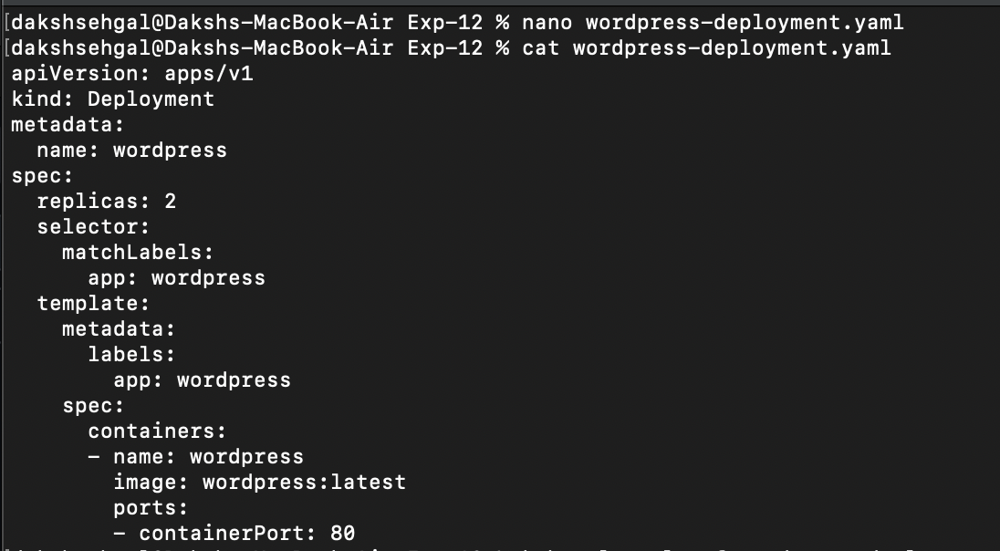
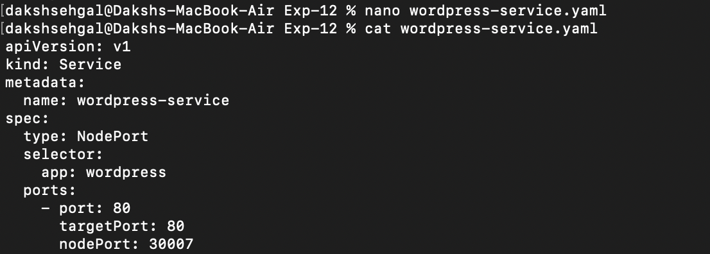
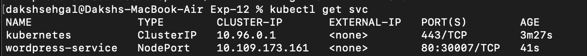
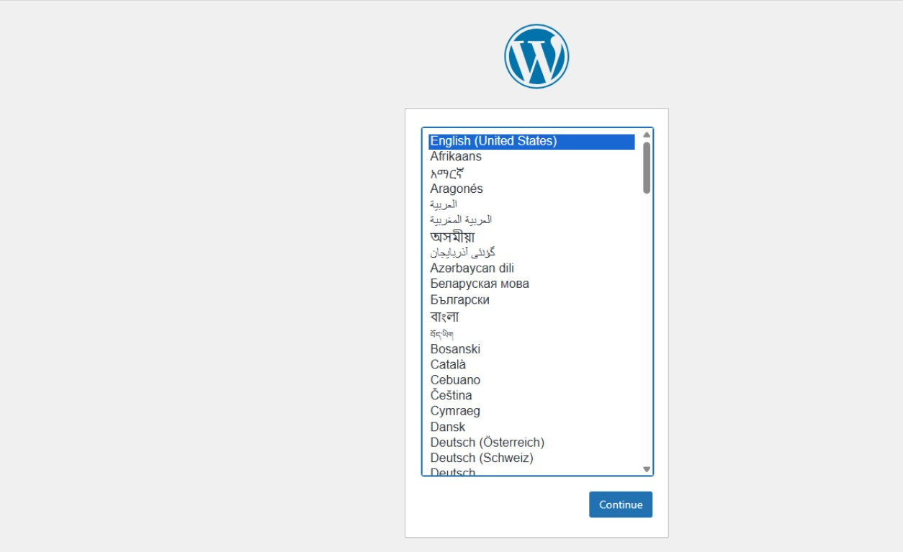
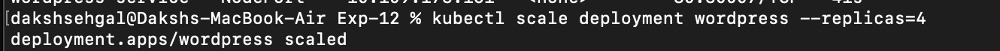
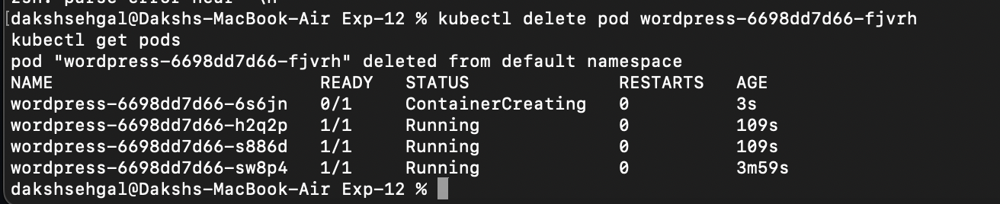

## Experiment 12: Kubernetes

---

### Introduction

---

#### Why Kubernetes over Docker Swarm?

| Reason | Explanation |
|--------|------------|
| Industry standard | Most companies use Kubernetes |
| Powerful scheduling | Automatically decides where to run your app |
| Large ecosystem | Many tools and plugins available |
| Cloud-native support | Works on AWS, Google Cloud, Azure, etc. |

---

#### Core Kubernetes Concepts (Simple Explanation)

| Docker Concept | Kubernetes Equivalent | What it means |
|---------------|----------------------|--------------|
| Container | **Pod** | A pod is a group of one or more containers. Smallest unit in K8s. |
| Compose service | **Deployment** | Describes how your app should run (e.g., 2 copies, which image to use) |
| Load balancing | **Service** | Exposes your app to the outside world or other pods |
| Scaling | **ReplicaSet** | Ensures a certain number of pod copies are always running |

---

### Hands-On

---

### Step-1: Create a `wordpress-deployment.yaml`

```bash
nano wordpress-deployment.yaml
```
Paste This:
```yml

apiVersion: apps/v1         
kind: Deployment            
metadata:
  name: wordpress           
spec:
  replicas: 2               
  selector:
    matchLabels:
      app: wordpress        
  template:                 
    metadata:
      labels:
        app: wordpress      
    spec:
      containers:
      - name: wordpress
        image: wordpress:latest  
        ports:
        - containerPort: 80      

```



**Step-2:- Apply Deployment**
```bash
kubectl apply -f wordpress-deployment.yaml
```


**Step-3:- Create `wordpress-service.yaml`**
```bash
nano wordpress-service.yaml
```
Paste this:- 
```yml
apiVersion: v1
kind: Service
metadata:
  name: wordpress-service
spec:
  type: NodePort      
  selector:
    app: wordpress    
  ports:
    - port: 80        
      targetPort: 80  
      nodePort: 30007 

```




**Step-4:- Deploy Service**
```bash
kubectl apply -f wordpress-service.yaml

```


**Step-5:- Get pods**
```bash
kubectl get pods
```


**Step-6:- Check service**
```bash
kubectl get svc
```



**Step-7:- Verify On Browser**
```bash
http://localhost:8080/
```



**Step-8:- Scale Deployment**
```bash
kubectl scale deployment wordpress --replicas=4
```



**Step-9:- Get Pods**
```bash
kubectl get pods
```


**Step-10:- Delete Pods to check Self-healing**
```bash
kubectl delete pod <pod-name>
kubectl get pods
```


### Insights
####  When to Use Which Tool

| Tool     | Best for                          |
|----------|-----------------------------------|
| **k3d**  | Quick learning on your laptop     |
| **Minikube** | Single-node cluster testing    |
| **kubeadm**  | Real, production-style cluster |


#### Summary of Commands (Cheat Sheet)

| Goal | Command |
|------|---------|
| Apply a YAML file | `kubectl apply -f file.yaml` |
| See all pods | `kubectl get pods` |
| See all services | `kubectl get svc` |
| Scale a deployment | `kubectl scale deployment <name> --replicas=N` |
| Delete a pod | `kubectl delete pod <pod-name>` |
| See all nodes | `kubectl get nodes` |

